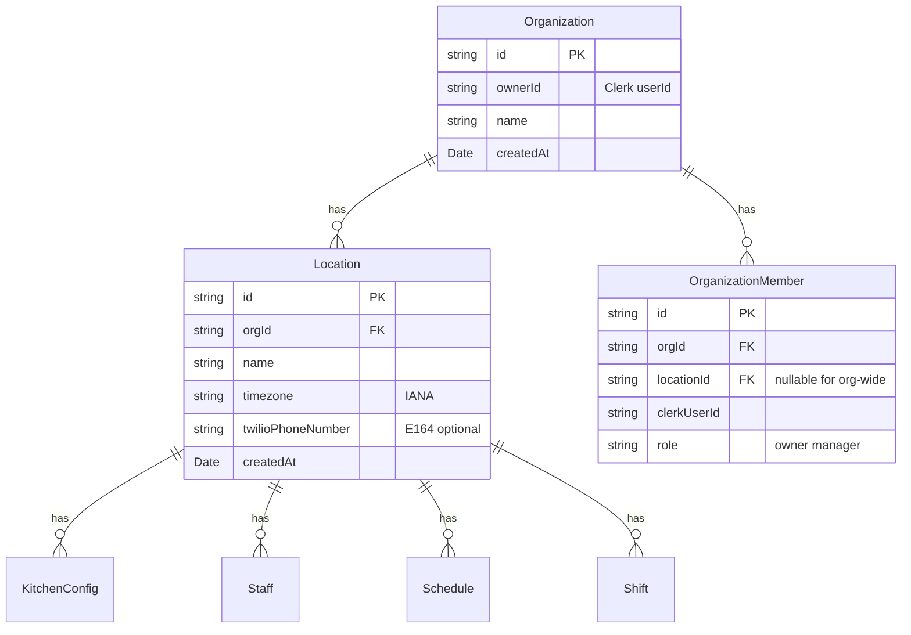

# Multi-Location Scoping Refactor (Pre-Phase 3)

This refactoring introduces `orgId` and `locationId` scoping across all data models to future-proof for enterprise multi-location support. The MVP UX remains single-location (one auto-created location per user).

## Data Model Changes



## Files to Create

### New Models

- `src/server/models/Organization.ts` - tenant container
- `src/server/models/Location.ts` - kitchen location
- `src/server/models/OrganizationMember.ts` - user-to-location membership

### New Services

- `src/server/services/organization.service.ts`
- `src/server/services/location.service.ts`
- `src/server/services/organization-member.service.ts`

### New Types

- `src/types/organization.ts`
- `src/types/location.ts`
- `src/types/organization-member.ts`

### New Validation Schemas

- `src/lib/validations/organization.schema.ts`
- `src/lib/validations/location.schema.ts`

### New Actions

- `src/server/actions/organization.actions.ts`
- `src/server/actions/location.actions.ts`

### New Utility

- `src/lib/auth/get-location-context.ts` - resolve orgId + locationId from Clerk session

## Files to Modify

### Models (add orgId + locationId, update indexes)

- [src/server/models/KitchenConfig.ts](src/server/models/KitchenConfig.ts)
  - Add `orgId: string` (required, indexed)
  - Add `locationId: ObjectId` (required, ref: Location)
  - Change unique index: `{ orgId, locationId }` instead of `{ userId }`
  - Remove `userId` field (replaced by orgId)

- [src/server/models/Staff.ts](src/server/models/Staff.ts)
  - Add `orgId: string` (required, indexed)
  - Add `locationId: ObjectId` (required, ref: Location)
  - Change unique index: `{ orgId, locationId, email }` instead of `{ userId, email }`
  - Add index: `{ orgId, locationId, phone }` for SMS lookup
  - Remove `userId` field

- [src/server/models/Schedule.ts](src/server/models/Schedule.ts)
  - Add `orgId: string` (required, indexed)
  - Add `locationId: ObjectId` (required, ref: Location)
  - Change unique index: `{ orgId, locationId, weekStartDate }` instead of `{ userId, weekStartDate }`
  - Remove `userId` field

- [src/server/models/Shift.ts](src/server/models/Shift.ts)
  - Add `orgId: string` (required, indexed)
  - Add `locationId: ObjectId` (required, ref: Location)
  - Update indexes to include `orgId, locationId`
  - Remove `userId` field

### Services (update method signatures)

- [src/server/services/kitchen-config.service.ts](src/server/services/kitchen-config.service.ts)
  - Change all methods from `userId` to `(orgId, locationId)` parameters
  - `getByUserId(userId)` → `getByLocation(orgId, locationId)`
  - `upsert(userId, data)` → `upsert(orgId, locationId, data)`

- [src/server/services/staff.service.ts](src/server/services/staff.service.ts)
  - Change all methods from `userId` to `(orgId, locationId)` parameters

- [src/server/services/schedule.service.ts](src/server/services/schedule.service.ts)
  - Change all methods from `userId` to `(orgId, locationId)` parameters

- [src/server/services/shift.service.ts](src/server/services/shift.service.ts)
  - Change all methods from `userId` to `(orgId, locationId)` parameters

### Actions (resolve location context, update service calls)

- [src/server/actions/kitchen-config.actions.ts](src/server/actions/kitchen-config.actions.ts)
- [src/server/actions/staff.actions.ts](src/server/actions/staff.actions.ts)
- [src/server/actions/schedule.actions.ts](src/server/actions/schedule.actions.ts)
- [src/server/actions/shift.actions.ts](src/server/actions/shift.actions.ts)

Pattern change for all actions:

```typescript
// Before
const { userId } = await auth();
const result = await SomeService.method(userId, data);

// After
const { userId } = await auth();
const ctx = await getLocationContext(userId); // returns { orgId, locationId }
const result = await SomeService.method(ctx.orgId, ctx.locationId, data);
```

### Types (update interfaces and DTOs)

- [src/types/kitchen-config.ts](src/types/kitchen-config.ts) - replace `userId` with `orgId` + `locationId`
- [src/types/staff.ts](src/types/staff.ts) - replace `userId` with `orgId` + `locationId`
- [src/types/schedule.ts](src/types/schedule.ts) - replace `userId` with `orgId` + `locationId`
- [src/types/shift.ts](src/types/shift.ts) - replace `userId` with `orgId` + `locationId`

## Location Context Resolution

New utility `src/lib/auth/get-location-context.ts`:

```typescript
export interface LocationContext {
  orgId: string;
  locationId: string;
  role: "owner" | "manager";
}

export async function getLocationContext(
  clerkUserId: string,
): Promise<LocationContext> {
  // 1. Find OrganizationMember by clerkUserId
  // 2. If not found, auto-create Organization + Location + Member (MVP bootstrap)
  // 3. Return { orgId, locationId, role }
}
```

MVP behavior: First-time users get auto-created org + location. Future: location switcher UI.

## Database Migration Strategy

For existing data (if any):

1. Create default Organization for each unique `userId`
2. Create default Location for each Organization
3. Backfill `orgId` and `locationId` on all documents
4. Drop old indexes, create new ones

## Documentation Updates

### ARCHITECTURE.md

- Update Data Models section to show `orgId` + `locationId` on all models
- Add Organization, Location, OrganizationMember to model list
- Update service patterns to show `(orgId, locationId)` parameters
- Add "Multi-Tenancy" section explaining scoping rules

### .cursorrules

- Update Server Actions example to use `getLocationContext()`
- Update Service Layer example to show `(orgId, locationId)` signature
- Add note about multi-location scoping rules

### MASTER_ROADMAP.md

- Add "Phase 2.5: Multi-Location Foundation" section documenting this refactor
- Update all Phase 3+ model schemas to include `orgId` + `locationId`
- Update Context for Cursor blocks to mention location scoping

## Execution Order

1. Create new models (Organization, Location, OrganizationMember)
2. Create new services for new models
3. Create `getLocationContext()` utility
4. Update existing models (add fields, update indexes)
5. Update existing services (change signatures)
6. Update existing actions (use location context)
7. Update types/DTOs
8. Create migration script for existing data (if needed)
9. Update documentation
10. Test all existing functionality still works
