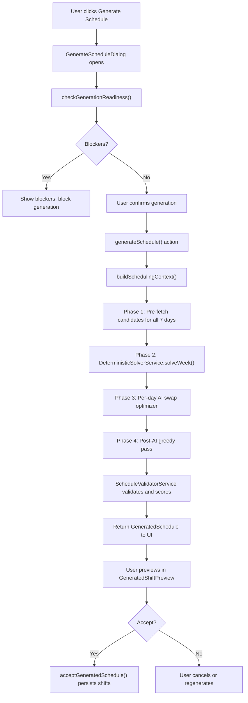

# Schedule Generator -- How It Works

This document explains the complete schedule generation pipeline in Sous. It covers every phase from when a user clicks "Generate Schedule" to when shifts are persisted in the database. The goal is to give any developer a thorough understanding of what happens, why it happens, and where the code lives.

---

## Table of Contents

1. [High-Level Overview](#1-high-level-overview)
2. [Data Inputs](#2-data-inputs)
3. [Candidate Filtering (Hard Filter Layer)](#3-candidate-filtering-hard-filter-layer)
4. [Deterministic Solver](#4-deterministic-solver)
5. [AI Swap Optimizer](#5-ai-swap-optimizer)
6. [Post-AI Greedy Pass](#6-post-ai-greedy-pass)
7. [Validation and Quality Scoring](#7-validation-and-quality-scoring)
8. [Server Actions Layer](#8-server-actions-layer)
9. [UI Flow](#9-ui-flow)
10. [Output Data Structures](#10-output-data-structures)
11. [Key Design Decisions](#11-key-design-decisions)

---

## 1. High-Level Overview

The schedule generator creates a full week of shift assignments for a restaurant kitchen. It uses a **hybrid architecture** that combines a fast deterministic solver with an AI optimizer:

- **Phase 1 (Deterministic Solver):** A pure TypeScript constraint-satisfaction solver produces a guaranteed-valid base schedule in milliseconds. It uses greedy assignment sorted by constraint tightness, followed by hill-climbing local search. This ensures there is always a working schedule, even if the AI is unavailable.

- **Phase 2 (AI Swap Optimizer):** An LLM (GPT-4o) receives the base schedule and suggests specific staff swaps to improve preference alignment and hour fairness. Each swap is independently validated -- invalid swaps are skipped, and the system falls back to the deterministic base if the AI cannot improve the score.

This hybrid approach guarantees that every generated schedule is valid. The AI can only make things better, never worse.

### End-to-End Pipeline



### File Map

| File | Lines | Role |
|------|-------|------|
| `src/server/services/ai/scheduling-agent.service.ts` | ~1,614 | Main orchestrator -- builds context, coordinates all phases |
| `src/server/services/ai/prompts/schedule-generation.ts` | ~507 | AI prompt templates for the swap optimizer |
| `src/server/services/deterministic-solver.service.ts` | ~1,526 | Pure TypeScript greedy + hill-climbing solver |
| `src/server/services/candidate.service.ts` | ~586 | Hard filter layer -- filters valid candidates before solving |
| `src/server/services/schedule-validator.service.ts` | ~964 | Validates schedules and scores quality |
| `src/server/actions/schedule-generation.actions.ts` | ~534 | Server actions (auth, orchestration, persistence) |
| `src/types/ai-scheduling.ts` | ~456 | All TypeScript type definitions |
| `src/app/(dashboard)/dashboard/schedule/_components/GenerateScheduleDialog.tsx` | ~691 | Multi-step generation UI dialog |

---

## 2. Data Inputs

The generator gathers data from six services before any scheduling logic runs. All fetching happens inside `SchedulingAgentService.buildSchedulingContext()` and `CandidateService.getCandidatesForDay()`.

### 2.1 Staff

**Source:** `StaffService.list(orgId, locationId)`

Provides every active staff member for the location. Each staff record includes:

- **Skills:** Which stations they can work (e.g., "Grill", "Prep") and their proficiency level (1-5) at each.
- **Preferred stations:** Stations the staff member prefers to work. The system tries to match these for higher satisfaction.
- **Min/max hours per week:** Constraints on weekly scheduling. `maxHoursPerWeek` is a hard cap; `minHoursPerWeek` is a soft target the system tries to meet.
- **Hourly rate:** Used in readiness checks but not in scheduling logic itself.

Only staff with `isActive: true` are considered.

### 2.2 Availability

**Source:** `StaffAvailabilityService.getByDayOfWeek(orgId, locationId, dayOfWeek)` and `StaffAvailabilityService.getAvailableStaff(orgId, locationId, dayOfWeek, startTime, endTime)`

Each staff member has recurring weekly availability patterns. An availability record specifies:

- **Day of week:** Which day this applies to (0 = Sunday through 6 = Saturday).
- **Time range:** `availableFrom` and `availableTo` in HH:MM format -- the window during which the person can work.
- **Preference level:** `"preferred"` (they want to work this time), `"available"` (they can work), or `"unavailable"` (they cannot work).

A staff member is only eligible for a slot if their availability window fully covers the slot's start-to-end time range.

### 2.3 Time-Off Requests

**Source:** `TimeOffRequestService.getStaffIdsWithApprovedTimeOff(orgId, locationId, date)`

Returns a set of staff IDs that have approved time-off on a specific date. Staff with approved time-off are completely excluded from that day's candidate pool, regardless of their availability pattern.

### 2.4 Labor Requirements

**Source:** `LaborRequirementService.list(orgId, locationId)`

Labor requirements define *what needs to be staffed*. Each requirement specifies:

- **Day of week:** Which day this slot exists on.
- **Station:** Which kitchen station (e.g., "Grill", "Prep", "Dish").
- **Time range:** `startTime` and `endTime` in HH:MM format.
- **Staff counts:** `minStaff` (minimum needed) and `preferredStaff` (ideal number). The solver targets `preferredStaff`.
- **Priority:** `"critical"`, `"high"`, `"normal"`, or `"low"`. Higher-priority slots get first pick of candidates.

### 2.5 Existing Shifts

**Source:** `ShiftService.getBySchedule(scheduleId)`

Any shifts already assigned for the week (e.g., manually created before generation). These are used for:

- **Overlap detection:** Candidates with existing shifts at overlapping times are excluded.
- **Hour tracking:** Hours from existing shifts count toward each staff member's weekly total.
- **Clopening detection:** Closing shifts from the previous day inform clopening gap calculations.

### 2.6 Kitchen Configuration

**Source:** `KitchenConfigService.getByLocation(orgId, locationId)`

Global configuration for the location, including:

- **Operating hours per day:** Which days the kitchen is open, and the open/close times for each day.
- **Stations and roles:** The available kitchen stations.
- **AI settings:** Configuration for AI-related features.

Days where the kitchen is closed are automatically skipped during generation.

### 2.7 Week Hours Accumulator

**Source:** Built in-memory during generation (initialized from existing shifts via `initWeekHoursFromShifts()`)

A `Map<string, number>` tracking each staff member's total scheduled hours for the week. This starts with hours from pre-existing shifts and is updated as the solver assigns new shifts, day by day. It is used for:

- **Max hours enforcement:** Preventing assignments that would push someone over their `maxHoursPerWeek`.
- **Hour balance scoring:** The quality score penalizes uneven hour distribution across staff.
- **Min hours targeting:** The solver tries to give under-scheduled staff more shifts.

---

## 3. Candidate Filtering (Hard Filter Layer)

**File:** `src/server/services/candidate.service.ts`

Before the solver or AI sees any candidates, the `CandidateService` applies a series of hard filters to ensure only truly valid candidates are considered for each slot. This is critical because it keeps the solver fast (fewer candidates to evaluate) and prevents the AI from suggesting impossible assignments.

### The Filter Pipeline

For each labor requirement slot on a given day, candidates pass through six sequential filters. A staff member must pass all six to be included:

```
All Active Staff
    |
    v
[1. Availability Filter] -- Does their weekly availability cover this slot's time range?
    |
    v
[2. Time-Off Filter] -- Do they have approved time-off on this date?
    |
    v
[3. Skills Filter] -- Do they have a skill entry for the required station?
    |
    v
[4. Existing Shifts Filter] -- Do they have an overlapping shift already?
    |
    v
[5. Clopening Filter] -- Would this create a <10h close-to-open gap?
    |
    v
[6. Max Hours Filter] -- Would this push them over maxHoursPerWeek?
    |
    v
Valid Candidates for Slot
```

#### Filter 1: Availability

Checks that the staff member's recurring weekly availability for this day of week has a time window (`availableFrom` to `availableTo`) that fully covers the slot's `startTime` to `endTime`. Staff with `preference: "unavailable"` or no availability record for the day are excluded.

#### Filter 2: Time-Off

Removes any staff member who has an approved time-off request on the target date. Uses a single batch query (`getStaffIdsWithApprovedTimeOff`) to avoid N+1 queries.

#### Filter 3: Skills

Removes staff who do not have a skill entry for the slot's required station. For example, if the slot is for the "Grill" station, only staff with a "Grill" skill entry are kept.

#### Filter 4: Existing Shifts

Removes staff who already have a shift that overlaps with the proposed slot's time range on the same day. Overlap is detected using standard interval overlap logic: `existing.start < proposed.end AND existing.end > proposed.start`.

#### Filter 5: Clopening

Removes staff who closed the previous day and would start too soon the next morning. "Clopening" = close + opening. The threshold is 10 hours -- if the gap between a staff member's closing shift end time (previous day) and the proposed slot's start time is less than 10 hours, they are excluded.

The gap calculation accounts for the day boundary:
```
gap = (minutes remaining in closing day) + (minutes into opening day)
```

#### Filter 6: Max Hours

Removes staff who would exceed their `maxHoursPerWeek` if assigned to this slot. Calculates `currentWeekHours + slotDuration` and compares against `maxHoursPerWeek`. This is a hard filter -- the validator would reject these 100% of the time, so excluding them early saves prompt tokens and avoids unfixable AI errors.

### Output

The output is an array of `SlotCandidates` -- one entry per labor requirement slot. Each entry contains:

- **`slot`:** The labor requirement metadata (station, times, staff counts, priority).
- **`candidates`:** Array of `CandidateDTO` objects that passed all six filters, sorted by preference ("preferred" first) then proficiency (highest first).
- **`hasSufficientCandidates`:** Whether `candidates.length >= minStaff`.

### Batch Optimization

The `getCandidatesForDay()` method is optimized to avoid N+1 queries. It fetches all staff, all day-of-week availability, and all time-off approvals in a single batch, then runs the pure filter functions per slot in memory.

---

## 4. Deterministic Solver

**File:** `src/server/services/deterministic-solver.service.ts`

The deterministic solver is a pure TypeScript constraint-satisfaction solver. It makes no database calls and no AI calls. Its job is to produce a valid base schedule as fast as possible (typically milliseconds). The schedule generator uses two solver modes: single-day (`solve()`) and week-level (`solveWeek()`).

### 4.1 Candidate Scoring Formula

When deciding which candidate to assign to a slot, the solver scores each one using a weighted formula:

| Factor | Weight | Description |
|--------|--------|-------------|
| Preferred station | +6 | Candidate lists this station as a preferred station |
| Preferred time | +4 | Candidate's availability preference is `"preferred"` (not just `"available"`) |
| Hours balance | +0 to +8 | Utilization-based ratio: `WEIGHT_HOURS_BALANCE * max(0, (targetHours - weekHours) / targetHours)` where `targetHours = (min + max) / 2`. Staff with more remaining capacity score higher. |
| Min-hours deficit | +0 to +5 | Bonus for staff below their `minHoursPerWeek`: `WEIGHT_MIN_HOURS_DEFICIT * ((min - weekHours) / min)`. Encourages scheduling under-utilized staff. |
| Proficiency | +0.5 per level | Proficiency level (1-5) for the target station, used as a tiebreaker |

The weights are designed to match the 3:2 station-to-time preference ratio used in the quality scoring formula (Section 7), ensuring the solver's greedy decisions align with how the final schedule will be evaluated.

### 4.2 Single-Day Solve (`solve()`)

Used when generating one day at a time (legacy mode). The week-level generator uses `solveWeek()` instead, but `solve()` is still called as a fallback if no pre-solved base is provided.

**Algorithm:**

1. **Sort slots by constraint tightness.** Slots with the fewest candidates are assigned first (most constrained first). Ties are broken by priority (critical > high > normal > low), then by `preferredStaff` count (smaller slots first).

2. **Greedy assignment.** For each slot in tightness order, filter out candidates already assigned to another slot today, score the remaining candidates, sort by score descending, and assign the top-scoring candidate(s) up to the `preferredStaff` count.

3. **Hill-climbing local search.** After greedy assignment, the solver iteratively improves the schedule:
   - **Pairwise swaps (Phase 1):** Try swapping staff between every pair of assignments. If both swapped staff are valid candidates for their new slots and the swap improves the overall score, keep it.
   - **Candidate replacements (Phase 2):** Try replacing each assigned staff member with an unassigned candidate. If the replacement is valid for the slot and improves the score, keep it.
   - The hill climber runs for up to 50 passes and stops when no single swap or replacement improves the score (local optimum reached).

### 4.3 Week-Level Solve (`solveWeek()`)

This is the primary solver used during generation. It considers all slots across all 7 days simultaneously, preventing a common problem with day-by-day solving: **late-week candidate starvation**, where early days use up all the best candidates and later days are left with poor options.

**Algorithm:**

#### Step 1: Flatten and Sort Globally

All slot-day pairs from all 7 days are collected into a single list and sorted by global constraint tightness (fewest candidates first, then priority, then slot size). This ensures the hardest-to-fill slot in the entire week -- regardless of which day it falls on -- gets first pick of the candidate pool.

#### Step 2: Unified Greedy Pass

Process each slot in global tightness order. For each slot:

1. Filter out candidates already assigned on this day (one-shift-per-day constraint).
2. Filter out candidates who would exceed `maxHoursPerWeek` with this assignment.
3. Check for clopening violations with adjacent-day assignments.
4. Score remaining candidates using `scoreCandidate()` with the solver's running `weekHoursUsed` totals (not the stale pre-fetch values).
5. Assign the top-scoring candidate(s) and update the tracking data structures:
   - `assignedPerDay`: which staff are assigned on which days.
   - `weekHoursUsed`: running total of hours per staff member.
   - `dayAssignmentIndex`: assignments grouped by day for hill-climbing lookups.

#### Step 3: Week-Level Hill Climbing

After the greedy pass, the solver runs a multi-phase hill climber that operates across the entire week:

**Phase 1 -- Within-Day Pairwise Swaps:**
Same as single-day hill climbing, but for each day independently. Swaps two assigned staff members within the same day if both are valid for their new slots and the week-level score improves.

**Phase 2 -- Within-Day Candidate Replacements:**
For each day, try replacing assigned staff with unassigned candidates. Respects `maxHoursPerWeek` and clopening constraints. Updates `weekHoursUsed` on each swap.

**Phase 3 -- Cross-Day Redistribution:**
Attempts to fill unfilled slots using three sub-strategies, tried in order:

- **3a -- Free candidates:** Find candidates not assigned on any day who are valid for the unfilled slot. Assign them directly.
- **3b -- Same-day reassignment:** If a candidate is assigned to a different slot on the same day, move them to the unfilled slot and find a replacement for their original slot.
- **3c -- Cross-day steal:** If a candidate is assigned on a different day, find a replacement for them on that day and move them to the unfilled slot on the target day.
- **3d -- Depth-2 chain:** A three-step chain: C1 is on Day B, R1 replaces C1 on Day B but R1 comes from Day C, and R2 (completely free) fills R1's slot on Day C. C1 moves to the unfilled slot on Day A.

Each redistribution is only accepted if it improves the week-level score.

**Phase 4 -- Min-Hours Redistribution:**
Identifies staff below their `minHoursPerWeek` (sorted by largest deficit) and tries to replace over-minimum staff with under-minimum staff in existing assignments. Only accepted if the replacement improves the score and the displaced staff member would still be above their own minimum.

The hill climber runs for up to 50 passes total and stops when no improvement is found.

### 4.4 Week-Level Scoring

The week-level scoring formula used during `solveWeek()` hill climbing is:

```
score = (+3 per preferred station match)
      + (+2 per preferred time match)
      - (0.3 * variance of remaining hours across ALL staff)
      - (0.5 * hours below minHoursPerWeek per staff)
      - (10 per unfilled slot)
```

The variance is calculated over ALL staff in `maxHoursLookup` (not just those with assignments), so completely unscheduled staff contribute their full remaining capacity. This makes omitting someone costly and encourages even distribution.

---

## 5. AI Swap Optimizer

**Files:** `src/server/services/ai/scheduling-agent.service.ts` (orchestration) and `src/server/services/ai/prompts/schedule-generation.ts` (prompt templates)

After the deterministic solver produces a valid base schedule, the AI swap optimizer attempts to improve it. The key design principle is that the AI suggests **swaps** (not a full schedule), and each swap is **independently validated**. This prevents the AI from creating invalid schedules.

### 5.1 When the Optimizer Runs

The optimizer runs once per day as part of `generateDaySchedule()`. It receives the week-level solver's output as a `presolvedBase` and attempts to improve it.

**Pre-check:** Before calling the AI, the system counts "free" candidates -- candidates that are valid for at least one slot but not assigned in the base schedule. If there are fewer than 2 free candidates, the optimizer is skipped entirely (there is nothing meaningful to swap).

### 5.2 Alias System

To prevent the LLM from hallucinating 24-character MongoDB ObjectIds, the system uses short sequential aliases. `buildAliasMap()` creates bidirectional maps:

- `idToAlias`: `"507f1f77bcf86cd799439011"` -> `"S1"`
- `aliasToId`: `"S1"` -> `"507f1f77bcf86cd799439011"`

All prompts use aliases. The AI's responses use aliases. After receiving the response, aliases are resolved back to real IDs.

### 5.3 Prompt Structure

#### System Prompt (`buildOptimizerSystemPrompt()`)

The system prompt tells the AI:

1. It is "Sous, a kitchen schedule optimizer."
2. It receives a valid base schedule already optimized by a deterministic solver with hill-climbing.
3. It must suggest swaps using exact alias values from the candidate lists.
4. It may ONLY use candidates from the "FREE" list (not "ASSIGNED" candidates).
5. The exact scoring formula: `+3 per preferred station`, `+2 per preferred time`, `-0.1 * variance of remaining hours`, `-10 per unfilled slot`.
6. A worked example showing why a seemingly good swap can actually lose points.
7. The required JSON output format.

#### User Prompt (`buildOptimizerUserPrompt()`)

The user prompt includes:

1. **Day header:** Day name, date, operating hours.
2. **Current score breakdown:** The base schedule's score decomposed into components (preferred stations, preferred times, hour balance penalty, unfilled penalty), plus the threshold the AI must beat.
3. **Current schedule:** Each assignment with the staff alias, name, and whether they are on a preferred station or preferred time.
4. **Valid slot keys:** An explicit list of slot identifiers the AI is allowed to reference.
5. **Swap opportunities:** Auto-detected cases where a staff member is not on their preferred station but a slot for that station exists.
6. **Candidates per slot:** For each slot, candidates are split into two groups:
   - **FREE candidates:** Not currently assigned -- usable for swaps. Each shows alias, name, proficiency, remaining hours, hours rank, and preference flags.
   - **ASSIGNED candidates:** Already working today -- listed for context but explicitly marked as unusable.

Candidates are capped at 10 per slot (`MAX_CANDIDATES_PER_SLOT = 10`) to manage prompt size.

#### Correction Prompt (`buildSwapCorrectionPrompt()`)

When the AI's first attempt is rejected (all swaps invalid or net score decreased), a correction prompt is sent explaining:

- Why the previous attempt was rejected (invalid swaps listed with reasons, or score comparison).
- The base schedule again as reference.
- The valid slot keys again.
- The candidate lists again (FREE/ASSIGNED split).
- An instruction to try different swaps or return an empty array if no improvements are possible.

### 5.4 AI Call Parameters

| Parameter | Value |
|-----------|-------|
| Model | `gpt-4o` |
| Temperature | 0.3 (first attempt), 0.2 (retries) |
| Max tokens | 2,000 |
| Response format | `{ type: "json_object" }` |
| Max attempts | 2 per day |

### 5.5 Swap Application (`applySwaps()`)

When the AI returns an `AISwapOutput` with a list of swaps, each swap is applied sequentially with independent validation:

For each swap, the function checks:

1. **Slot exists:** The slot key matches an assignment in the base schedule.
2. **Remove target correct:** The `removeStaffId` alias resolves to the person actually assigned to that slot.
3. **Assign target valid:** The `assignStaffId` alias resolves to a valid candidate for that slot (in the slot's candidate list).
4. **No double-booking:** The assign target is not already assigned to another slot today.
5. **No clopening:** The assign target would not create a <10h gap with adjacent-day shifts.

If any check fails, that individual swap is skipped and a reason is recorded. The remaining swaps continue to be processed. This "partial success" model means one bad swap does not invalidate the others.

After a swap is applied:
- The removed staff member is removed from the `assignedStaff` set.
- The assigned staff member is added to the `assignedStaff` set.
- The assignment is updated with the new staff ID, name, and reasoning.

### 5.6 Score-Based Acceptance

After applying all valid swaps, the swapped schedule is scored using `ScheduleValidatorService.scoreQuality()`. The result is compared against the base schedule's score:

- **Score improved:** The swapped schedule is accepted. The optimizer records the score delta and logs success.
- **Score did not improve:** The system falls through to greedy swap selection (Section 5.7).

### 5.7 Greedy Swap Selection (`greedySwapSelection()`)

When applying all swaps together lowers the score (or doesn't improve it), the system tries a fallback: apply each swap individually against the running schedule and keep only swaps that individually improve the score.

This works by:

1. Starting with the base schedule and its score.
2. For each swap in the AI's list:
   - Try applying just this one swap.
   - If it passes validation and improves the running score, keep it.
   - If not, skip it.
3. Return the schedule with only the individually-improving swaps applied.

If even greedy selection cannot improve the base, the deterministic base is used unchanged.

### 5.8 Retry Loop

If the first AI attempt fails (all swaps invalid or score didn't improve), the system sends a correction prompt (Section 5.3) with a lower temperature (0.2) and tries once more. The maximum total attempts per day is 2 (`MAX_OPTIMIZER_ATTEMPTS = 2`).

### 5.9 Fallback Behavior

The AI optimizer falls back to the deterministic base in these cases:

- All swaps were invalid on all attempts.
- The score did not improve on any attempt (including greedy selection).
- The AI service was unavailable (`AILimitExceededError` or `AIServiceUnavailableError`).
- Fewer than 2 free candidates were available (optimizer skipped entirely).

Fallback is always safe because the deterministic base is guaranteed valid.

### 5.10 Adjacent-Day Clopening in AI Swaps

When the AI suggests swaps, the system validates clopening against adjacent-day shifts:

- **Previous day:** Uses finalized shifts from `accumulatedShifts` (includes both pre-existing shifts and shifts generated for earlier days in the week).
- **Next day:** Uses the week-level solver's base assignments for the next day (converted to synthetic `ShiftDTO` objects). The AI has not optimized the next day yet, so these are approximate but prevent obvious violations.

---

## 6. Post-AI Greedy Pass

After all 7 days have been through the AI optimizer, a final lightweight pass (Phase 4 in `generateWeekSchedule()`) attempts to fill any remaining unfilled slots.

During AI optimization, some candidates may have been freed up by swaps (e.g., a swap removes staff member A from a slot, making A available). The post-AI greedy pass checks each unfilled slot across all days:

1. Find the original candidate list for the unfilled slot.
2. For each candidate in priority order:
   - Skip if already assigned today.
   - Skip if adding this shift would exceed `maxHoursPerWeek`.
   - Skip if it would create a clopening violation with adjacent days.
3. Assign the first eligible candidate and update the tracking structures.

This pass does not use AI -- it is a simple first-fit greedy fill. It typically fills only a small number of slots that were marginally unfilled.

---

## 7. Validation and Quality Scoring

**File:** `src/server/services/schedule-validator.service.ts`

The validator serves two purposes: (1) checking hard constraint violations and (2) computing a quality score for comparing schedules.

### 7.1 Hard Constraint Checks

The `validate()` method checks for six types of hard errors. Any of these makes a schedule invalid:

| Error Type | Description |
|------------|-------------|
| `invalid_staff_id` | Staff ID is not in any slot's candidate list for this day |
| `double_booking` | Same staff member assigned to overlapping time ranges on the same day |
| `multiple_shifts_same_day` | Same staff member assigned to more than one shift on the same day (stricter than `double_booking` -- catches non-overlapping double shifts too) |
| `unavailable_staff` | Staff member is not a valid candidate for the specific slot they are assigned to (they may be valid for other slots) |
| `max_hours_exceeded` | Staff member's total weekly hours (existing + all proposed) exceed their `maxHoursPerWeek` |
| `skill_mismatch` | Staff member does not have a skill entry for the station they are assigned to |
| `overlap` | Assignment overlaps with a pre-existing shift in the database |

Each error includes a `correctionHint` -- an actionable instruction that can be fed back to the AI if correction is needed.

### 7.2 Warnings (Soft Issues)

Warnings do not block the schedule but are surfaced to the user:

| Warning Type | Description |
|--------------|-------------|
| `overtime_risk` | Staff member would be at 90%+ of their `maxHoursPerWeek` after this day's assignments |
| `clopening_risk` | Staff member closed the previous day and opens today with less than 10 hours gap |
| `under_scheduled` | Staff member's total weekly hours are below their `minHoursPerWeek` (checked once after all days are finalized) |

### 7.3 Quality Scoring Formula

The `scoreQuality()` method computes a single numeric score for a day's schedule. Higher = better. This is the formula used everywhere -- by the deterministic solver, the AI optimizer acceptance logic, and the final week-level aggregate score:

```
score = (+3 × number of preferred station matches)
      + (+2 × number of preferred time matches)
      - (0.3 × variance of remaining weekly hours across assigned staff)
      - (0.5 × hours below minHoursPerWeek per under-scheduled staff)
      - (10 × number of unfilled slots)
```

**Component breakdown:**

- **Preferred station matches (+3 each):** For each assignment where the staff member lists the assigned station in their `preferredStations`, add 3 points.
- **Preferred time matches (+2 each):** For each assignment where the staff member's availability preference for this time slot is `"preferred"` (not just `"available"`), add 2 points.
- **Hour balance penalty (-0.3 * variance):** Calculate the remaining hours (`maxHoursPerWeek - currentWeekHours - slotDuration`) for each assigned staff member, compute the variance, and multiply by 0.3. This penalizes uneven distribution of hours.
- **Min-hours shortfall penalty (-0.5 per hour):** For staff below their `minHoursPerWeek`, penalize 0.5 points per hour of shortfall.
- **Unfilled slot penalty (-10 each):** Each unfilled slot is a heavy penalty, strongly incentivizing full coverage.

### 7.4 Detailed Score Breakdown

The `scoreQualityDetailed()` method returns the same score decomposed into a `QualityScoreBreakdown` object. This is used for:

- Logging score comparisons between base and AI schedules.
- Building the score breakdown in the AI user prompt so the AI understands the current score structure.
- Debug output in the terminal.

### 7.5 Week-Level Scoring

The `scoreWeek()` method sums `scoreQuality()` across all days, producing an aggregate quality metric for the entire week. This is the `weekScore` reported in the generation metadata.

### 7.6 Under-Scheduled Check

The `checkUnderScheduled()` method runs once after all days are finalized. It checks every active staff member against their `minHoursPerWeek` using the final `weekHoursAccumulator`. Staff with zero shifts or insufficient hours get `under_scheduled` warnings.

---

## 8. Server Actions Layer

**File:** `src/server/actions/schedule-generation.actions.ts`

Server actions are the bridge between the UI and the service layer. They handle authentication, input validation, and error wrapping. There are three actions:

### 8.1 `checkGenerationReadiness()`

Runs before the user can generate. Validates:

- **Kitchen config exists:** Blocker if missing.
- **AI usage limits:** Checks `AIUsageService.canGenerate()`. Blocker if monthly limit reached.
- **Active staff:** Blocker if zero active staff members.
- **Missing hourly rates:** Warning listing staff without hourly rates.
- **Availability completeness:** Warning if fewer than 50% of staff have availability set.
- **Labor requirements exist:** Blocker if no shift slots defined.
- **Requirements coverage:** Warning if open days have no shift slots, or if shift slots fall outside operating hours.
- **Skill coverage:** Warning if any station has zero qualified staff.

Returns a `ReadinessCheckResult` with a `canProceed` flag (true if no blockers) and a categorized list of issues.

### 8.2 `generateSchedule()`

The main generation action. Steps:

1. **Auth check:** `auth()` from Clerk.
2. **Input validation:** Zod schema (`generateScheduleSchema`).
3. **Location context:** `getLocationContext(userId)` provides `orgId` and `locationId`.
4. **AI usage limit:** `AIUsageService.canGenerate()`. Returns error if limit reached.
5. **Load schedule:** `ScheduleService.getById()` to get the week start date.
6. **Build context:** `SchedulingAgentService.buildSchedulingContext()` fetches all data inputs (Section 2).
7. **Generate:** `SchedulingAgentService.generateWeekSchedule(context)` runs the full pipeline (Sections 3-7).
8. **Log usage:** `AIUsageService.logUsage()` records token usage, model, duration, and success status.
9. **Return:** The `GeneratedSchedule` is returned for UI preview. Shifts are NOT persisted yet.

### 8.3 `acceptGeneratedSchedule()`

Persists the user-accepted shifts to the database. Steps:

1. **Auth check and validation.**
2. **Load schedule:** Verify it exists and belongs to the user's location.
3. **Convert shifts:** For each accepted shift, convert date strings and time strings into full `Date` objects using `parseDateString()` and `combineDateTime()`.
4. **Bulk create:** `ShiftService.bulkCreate()` creates all shifts in a single batch. It is overlap-safe -- shifts that conflict with existing ones are skipped.
5. **Return:** Count of created and failed shifts, plus any error details.

---

## 9. UI Flow

### 9.1 Trigger

**File:** `src/app/(dashboard)/dashboard/schedule/_components/ScheduleActions.tsx`

The schedule page has a "Generate Schedule" button that opens the `GenerateScheduleDialog`.

### 9.2 GenerateScheduleDialog

**File:** `src/app/(dashboard)/dashboard/schedule/_components/GenerateScheduleDialog.tsx`

A multi-step dialog with four states:

#### Step 1: Readiness

- Runs `checkGenerationReadiness()` via a TanStack Query `useQuery` (cached for 30 seconds).
- Shows three stat cards: active staff count, availability completeness %, and shift slot count.
- Displays AI generation usage (remaining / limit).
- Lists any issues found, categorized as blockers (red, prevent generation) or warnings (amber, allow proceeding).
- If all checks pass, shows a green "All checks passed" banner.
- The "Generate Schedule" button is disabled until readiness is loaded and no blockers exist.

#### Step 2: Generating

- Shows a spinner with the message "Analyzing staff, shift slots, and availability..."
- Displays an estimate: "This typically takes 30-90 seconds depending on schedule complexity."
- Runs the `generateSchedule()` mutation in the background.

#### Step 3: Preview

- Displayed when generation succeeds with a fill rate of 50% or higher.
- Renders the `GeneratedShiftPreview` component (a separate component) with the full `GeneratedSchedule` data.
- User can accept all shifts, regenerate, or cancel.

#### Step 4: Failure

- Displayed when generation fails entirely (error) or produces a fill rate below 50%.
- Shows what was generated (X of Y shifts filled, fill rate percentage).
- Lists unfilled slots with reasons.
- Offers recovery links: "Adjust Shift Slots" (labor page) and "Review Staff Availability" (staff page).
- If fill rate is 80%+ (near success), offers a "Save as Draft" button to persist the partial results.
- Always offers "Try Again" (regenerate) and "Cancel" buttons.

### 9.3 Accepting Shifts

When the user clicks "Accept All":

1. All assignments from all days are flattened into `AcceptedShift` objects.
2. The `acceptGeneratedSchedule()` mutation is called.
3. On success, the shift cache is invalidated to refresh the schedule grid, a toast confirms the count of created shifts, and the dialog closes.

---

## 10. Output Data Structures

**File:** `src/types/ai-scheduling.ts`

### 10.1 `GeneratedSchedule` (Top-Level Output)

The main output of the entire generation pipeline:

```typescript
interface GeneratedSchedule {
  days: GeneratedDaySchedule[];     // One entry per day (Mon-Sun)
  summary: string;                   // Human-readable summary
  metadata: GenerationMetadata;      // Process metrics
  warnings: ValidationWarning[];     // Aggregated warnings across all days
}
```

### 10.2 `GeneratedDaySchedule` (Per-Day Output)

Each day's results:

```typescript
interface GeneratedDaySchedule {
  date: string;                              // "YYYY-MM-DD"
  dayOfWeek: string;                         // "Monday", "Tuesday", etc.
  assignments: GeneratedShiftAssignment[];   // All assigned shifts
  unfilledSlots: UnfilledSlot[];             // Slots that couldn't be staffed
  notes: string;                             // Solver/AI reasoning
}
```

### 10.3 `GeneratedShiftAssignment` (Single Shift)

A single assigned shift:

```typescript
interface GeneratedShiftAssignment {
  staffId: string;      // MongoDB ObjectId of the staff member
  staffName: string;    // Display name
  station: string;      // Kitchen station (e.g., "Grill")
  startTime: string;    // "HH:MM" format
  endTime: string;      // "HH:MM" format
  reasoning: string;    // Why this person was assigned here
}
```

### 10.4 `UnfilledSlot`

A slot that could not be fully staffed:

```typescript
interface UnfilledSlot {
  station: string;     // Station name
  startTime: string;   // "HH:MM" format
  endTime: string;     // "HH:MM" format
  needed: number;      // Staff count needed
  assigned: number;    // Staff count actually assigned
  reason: string;      // Why it's unfilled
}
```

### 10.5 `GenerationMetadata`

Process metrics:

```typescript
interface GenerationMetadata {
  totalShiftsCreated: number;              // Total assignments across all days
  totalUnfilledSlots: number;              // Total unfilled slots across all days
  usedFallback: boolean;                   // True if AI was unavailable for any day
  aiImprovedDays: number;                  // Days where AI improved the base
  totalOptimizerDays: number;              // Days the optimizer ran on
  generationTimeMs: number;                // Total wall-clock time
  tokenUsage: TokenUsage;                  // Aggregated OpenAI token usage
  weekScore: number;                       // Aggregate quality score
  preferredStationMatches: number;         // Assignments on preferred stations
  totalAssignmentsWithPreference: number;  // Assignments where staff had preferences
}
```

### 10.6 `AISwapOutput` (AI Response Format)

What the LLM returns:

```typescript
interface AISwapOutput {
  swaps: Array<{
    slot: string;            // "Station HH:MM-HH:MM"
    removeStaffId: string;   // Alias of person to remove (e.g., "S1")
    assignStaffId: string;   // Alias of person to assign (e.g., "S3")
    reasoning: string;       // Brief explanation
  }>;
  notes: string;             // Summary of changes
}
```

### 10.7 Input Context Types

```typescript
// Full week context (built by buildSchedulingContext)
interface SchedulingContext {
  orgId: string;
  locationId: string;
  clerkUserId: string;
  weekStart: Date;
  config: KitchenConfigDTO;
  staff: StaffDTO[];
  laborRequirements: LaborRequirementDTO[];
  existingShifts: ShiftDTO[];
  schedule: ScheduleDTO;
}

// Single day context (built per-day during generation)
interface DaySchedulingContext {
  date: Date;
  dayOfWeek: number;
  dayName: string;
  slots: SlotCandidates[];              // Pre-filtered candidates per slot
  existingShifts: ShiftDTO[];           // Includes synthetic shifts from prior days
  previousDayClosingShifts: ShiftDTO[];
  kitchenContext: {
    operatingHours: { open: string; close: string } | null;
    totalStaffCount: number;
  };
}

// Week solver input (flattened across all days)
interface WeekSolverInput {
  days: WeekDayCandidates[];
  maxHoursLookup: Map<string, number>;
  minHoursLookup: Map<string, number>;
  existingWeekHours: Map<string, number>;
}
```

### 10.8 Validation Types

```typescript
// Hard constraint violation
interface ValidationError {
  type: ValidationErrorType;  // "double_booking" | "max_hours_exceeded" | etc.
  staffId: string;
  staffName: string;
  shiftIndex: number;
  message: string;
  correctionHint: string;     // Actionable fix instruction
}

// Soft issue
interface ValidationWarning {
  type: ValidationWarningType;  // "overtime_risk" | "clopening_risk" | "under_scheduled"
  staffId: string;
  staffName: string;
  shiftIndex: number;
  message: string;
}
```

---

## 11. Key Design Decisions

### 11.1 Hybrid Deterministic + AI Architecture

**Why:** Relying solely on an LLM to generate schedules is unreliable. LLMs can hallucinate invalid staff IDs, create double-bookings, and ignore constraints. By producing a valid base schedule deterministically and then letting the AI suggest improvements, the system guarantees a working schedule exists at all times. If the AI fails, is unavailable, or makes things worse, the deterministic base is used unchanged.

### 11.2 Swap-Based AI (Not Full Generation)

**Why:** Instead of asking the AI to generate an entire schedule from scratch, the AI suggests specific swaps to an existing valid schedule. This dramatically reduces failure modes:
- The AI cannot introduce invalid staff IDs (it can only reference candidates from the provided lists).
- Each swap is independently validated, so one bad suggestion does not ruin the others.
- The AI's task is simpler and more focused: "improve this schedule" vs. "create a schedule from nothing."

### 11.3 Independent Swap Validation

**Why:** Each swap is validated individually before being applied. If swap #3 out of 5 is invalid, swaps #1, #2, #4, and #5 can still be applied. This "partial success" model maximizes the benefit from AI suggestions, even when some are wrong.

### 11.4 Week-Level Solving

**Why:** Day-by-day solving caused "late-week candidate starvation." Monday and Tuesday would consume the best candidates, leaving Thursday and Friday with limited options. The week-level solver considers all 7 days simultaneously, sorting by global constraint tightness. The hardest-to-fill slot in the entire week gets first pick, regardless of which day it falls on.

### 11.5 Hard Filter Layer (CandidateService)

**Why:** Filtering candidates before the solver or AI sees them provides multiple benefits:
- **Correctness:** The solver and AI can only assign people who are actually valid, eliminating entire categories of errors.
- **Performance:** Fewer candidates means faster solver execution and smaller AI prompts.
- **Token efficiency:** Invalid candidates waste prompt tokens and can confuse the AI.

### 11.6 Greedy Swap Selection Fallback

**Why:** Sometimes the AI's swaps collectively hurt the score even though individual swaps are valid. For example, swap A improves the score by +3 but swap B decreases it by -5 -- the batch net is -2. Greedy swap selection tests each swap individually and keeps only those that improve the running score. This salvages good ideas from an overall bad batch.

### 11.7 Cross-Day Clopening Awareness

**Why:** Clopening (closing one night and opening the next morning with insufficient rest) is a real problem in restaurant scheduling. The system tracks adjacent-day shifts throughout generation. When processing Day N, it knows about finalized shifts from Day N-1 and week-level base assignments for Day N+1, and validates clopening gaps against both.

### 11.8 Consistent Quality Scoring

**Why:** The same scoring formula (+3 preferred station, +2 preferred time, -0.3*variance, -10 unfilled) is used everywhere: the deterministic solver's hill climber, the AI swap acceptance logic, the week-level aggregator, and the prompt shown to the AI. This consistency ensures all components are optimizing toward the same objective and prevents situations where the solver optimizes for one thing while the evaluator measures another.
