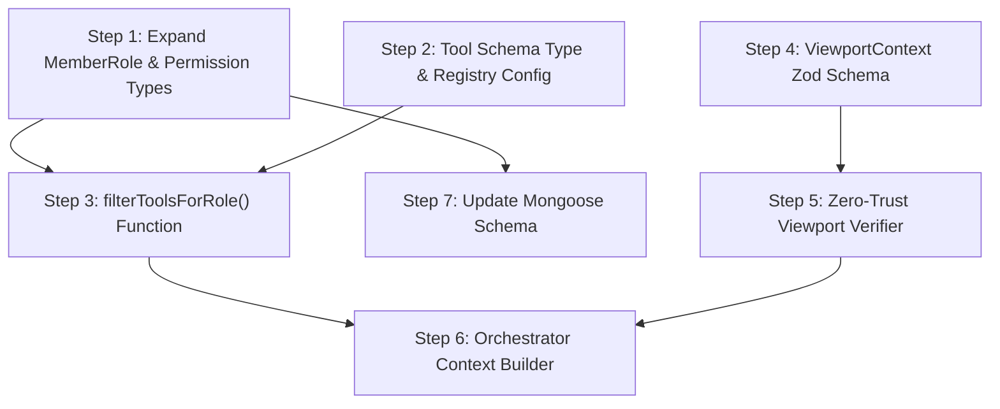

# Phase 1: Security, Identity, and Context Boundaries — Implementation Steps

**Objective:** Ensure the AI assistant only acts within the exact permissions of the authenticated user, and that frontend-provided UI context (viewport state) is never trusted for authorization.

**Prerequisites:** Clerk authentication is already functional. The `MemberRole` type (`"owner" | "manager"`), `LocationContext`, `getLocationContext()`, and `hasLocationAccess()` already exist and are used by all server actions.

> [!NOTE]
> These steps produce the **foundational security layer** consumed by Phase 2 (Tool Registry). Phase 2 will import the RBAC config and the `filterToolsForRole()` function built here to dynamically prune the tool list provided to the LLM.

---

## Step 1: Expand `MemberRole` and Define RBAC Permission Types

### 1. The Objective & Scope Boundary (The "Stop" Rule)

**Goal:** Extend the `MemberRole` union type to support the granularity required for tool filtering, and create the TypeScript interfaces that describe which permissions each role has.

**Boundary:** Do NOT build the tool filtering function itself, do NOT modify any UI, and do NOT touch the Mongoose schema validators yet—only define the types and the static permission map.

### 2. File Context & Target Architecture

**Files to Modify/Create:**
- `src/server/models/OrganizationMember.ts` — expand the `MemberRole` type and `MEMBER_ROLES` array
- `src/types/organization-member.ts` — re-exports will automatically pick up the new type
- `[NEW] src/lib/ai/rbac/permissions.ts` — static role-permission map and types

**Assumed Existing Files:**
- `src/server/models/OrganizationMember.ts` (contains `MemberRole = "owner" | "manager"`)
- `src/types/organization-member.ts` (re-exports `MemberRole`)

### 3. Data Contracts (Inputs & Outputs)

**Inputs Expected:**
```typescript
// Expanded MemberRole (in OrganizationMember.ts)
export type MemberRole = "owner" | "manager" | "shift_lead";
```

**Outputs Required:**
```typescript
// In src/lib/ai/rbac/permissions.ts

/** Granular permission identifiers for AI tool access */
export type AIPermission =
  | "schedule:read"
  | "schedule:write"
  | "schedule:generate"
  | "staff:read"
  | "staff:write"
  | "shift:read"
  | "shift:write"
  | "shift:swap"
  | "config:read"
  | "config:write"
  | "cost:read"
  | "cost:write";

/** Maps each MemberRole to its allowed AI permissions */
export const ROLE_PERMISSIONS: Record<MemberRole, readonly AIPermission[]> = {
  owner: [
    "schedule:read", "schedule:write", "schedule:generate",
    "staff:read", "staff:write",
    "shift:read", "shift:write", "shift:swap",
    "config:read", "config:write",
    "cost:read", "cost:write",
  ],
  manager: [
    "schedule:read", "schedule:write", "schedule:generate",
    "staff:read", "staff:write",
    "shift:read", "shift:write", "shift:swap",
    "config:read",
    "cost:read",
  ],
  shift_lead: [
    "schedule:read",
    "staff:read",
    "shift:read", "shift:swap",
  ],
};

/** Check if a role has a specific permission */
export function hasPermission(role: MemberRole, permission: AIPermission): boolean;
```

### 4. Security & Error Handling Guardrails

**Resilience Rules:**
- The `ROLE_PERMISSIONS` map must be frozen (`as const` / `Object.freeze`) to prevent runtime mutation.
- `hasPermission()` must return `false` (not throw) for any unknown role string to prevent escalation via bad data.
- The `MEMBER_ROLES` array in the Mongoose schema must stay in sync with the `MemberRole` type.

**Required Error Messages:**
- None at this step (no runtime flow changes yet).

### 5. The "Definition of Done" (Verification)

**Testing Requirement:**
Create a temporary script or inline test:
```typescript
// /tmp/test-permissions.ts (run with ts-node or tsx)
import { ROLE_PERMISSIONS, hasPermission } from "@/lib/ai/rbac/permissions";

console.assert(hasPermission("owner", "cost:write") === true);
console.assert(hasPermission("shift_lead", "cost:write") === false);
console.assert(hasPermission("shift_lead", "shift:swap") === true);
console.assert(hasPermission("manager", "config:write") === false);
// Unknown role should not throw
console.assert(hasPermission("hacker" as any, "cost:write") === false);
console.log("✅ All permission assertions passed");
```

Also verify the TypeScript build compiles cleanly: `npx tsc --noEmit`

---

## Step 2: Define the AI Tool Schema Type and Tool Registry Config

### 1. The Objective & Scope Boundary (The "Stop" Rule)

**Goal:** Create the TypeScript type that describes a single AI tool definition (name, description, required permission, Zod parameter schema), and create a static registry config that maps tool names to their required `AIPermission`.

**Boundary:** Do NOT build any tool execution handlers. Do NOT build the filtering function. Only define the shape of a tool entry and a placeholder registry array that Phase 2 will populate with real tool definitions.

### 2. File Context & Target Architecture

**Files to Modify/Create:**
- `[NEW] src/lib/ai/tools/tool-registry.types.ts` — the `AIToolDefinition` interface
- `[NEW] src/lib/ai/tools/tool-registry.ts` — the registry array (starts with a small set of placeholder tool names and their required permissions)

**Assumed Existing Files:**
- `src/lib/ai/rbac/permissions.ts` (from Step 1)
- `zod` package installed

### 3. Data Contracts (Inputs & Outputs)

**Inputs Expected:**
None — this step defines foundational types only.

**Outputs Required:**
```typescript
// In src/lib/ai/tools/tool-registry.types.ts
import { z, ZodTypeAny } from "zod";
import type { AIPermission } from "@/lib/ai/rbac/permissions";

export interface AIToolDefinition<TParams extends ZodTypeAny = ZodTypeAny> {
  /** Unique tool identifier (matches the function_call name sent to the LLM) */
  name: string;
  /** Human-readable description passed to the LLM */
  description: string;
  /** The AIPermission required to include this tool in the LLM context */
  requiredPermission: AIPermission;
  /** Zod schema for parameter validation */
  parameters: TParams;
  /**
   * Execution handler — Phase 2 will implement these.
   * Accepts validated params + a context object and returns a JSON result.
   */
  execute?: (params: z.infer<TParams>, context: ToolExecutionContext) => Promise<unknown>;
}

export interface ToolExecutionContext {
  orgId: string;
  locationId: string;
  clerkUserId: string;
  role: MemberRole;
}
```

```typescript
// In src/lib/ai/tools/tool-registry.ts
import type { AIToolDefinition } from "./tool-registry.types";

/**
 * Master tool registry. Phase 2 will add full tool implementations.
 * For Phase 1, this is the source of truth for permission-gating.
 */
export const TOOL_REGISTRY: AIToolDefinition[] = [
  // Placeholder entries — enough to test RBAC filtering
];

export function getToolRegistry(): readonly AIToolDefinition[] {
  return TOOL_REGISTRY;
}
```

### 4. Security & Error Handling Guardrails

**Resilience Rules:**
- `getToolRegistry()` must return a shallow-frozen copy to prevent callers from mutating the master list.
- Each `AIToolDefinition.name` must be unique. Add a dev-time assertion (or a startup check) that throws if duplicates are detected.

**Required Error Messages:**
- `"TOOL_REGISTRY integrity error: duplicate tool name '${name}' detected"` — thrown at import time if duplicates exist.

### 5. The "Definition of Done" (Verification)

**Testing Requirement:**
```typescript
import { getToolRegistry } from "@/lib/ai/tools/tool-registry";

const tools = getToolRegistry();
const names = tools.map(t => t.name);
console.assert(new Set(names).size === names.length, "No duplicate tool names");
console.log(`✅ Tool registry has ${tools.length} entries, no duplicates`);
```

Build check: `npx tsc --noEmit`

---

## Step 3: Build the `filterToolsForRole()` RBAC Filtering Function

### 1. The Objective & Scope Boundary (The "Stop" Rule)

**Goal:** Implement a pure function that takes a `MemberRole` and the full tool registry, and returns only the tools the role is permitted to use. This is the core of the "Dynamic RBAC Tool Filtering" concept.

**Boundary:** Do NOT integrate this into the orchestrator API route yet (that is Step 5). Do NOT modify any existing server actions.

### 2. File Context & Target Architecture

**Files to Modify/Create:**
- `[NEW] src/lib/ai/rbac/filter-tools.ts`

**Assumed Existing Files:**
- `src/lib/ai/rbac/permissions.ts` (Step 1 — `hasPermission()`, `ROLE_PERMISSIONS`)
- `src/lib/ai/tools/tool-registry.types.ts` (Step 2 — `AIToolDefinition`)
- `src/lib/ai/tools/tool-registry.ts` (Step 2 — `getToolRegistry()`)

### 3. Data Contracts (Inputs & Outputs)

**Inputs Expected:**
```typescript
function filterToolsForRole(
  role: MemberRole,
  tools: readonly AIToolDefinition[]
): AIToolDefinition[];
```

**Outputs Required:**
- Returns a new array containing only the `AIToolDefinition` entries whose `requiredPermission` is included in the role's permission set.
- Must also export a convenience wrapper:
```typescript
/** Convenience: filters the global registry for a given role */
function getToolsForRole(role: MemberRole): AIToolDefinition[];
```

### 4. Security & Error Handling Guardrails

**Resilience Rules:**
- Must never mutate the input array.
- If `role` is not found in `ROLE_PERMISSIONS`, return an empty array (fail-closed, never fail-open).
- Log a warning (`console.warn`) when an unknown role is encountered to aid debugging, but do not throw.

**Required Error Messages:**
- Console warning: `"[RBAC] Unknown role '${role}' — returning empty tool set (fail-closed)"`

### 5. The "Definition of Done" (Verification)

**Testing Requirement:**
Add 3 dummy tools to the registry (one requiring `"cost:write"`, one requiring `"shift:read"`, one requiring `"schedule:generate"`) and run:
```typescript
import { filterToolsForRole } from "@/lib/ai/rbac/filter-tools";
import type { AIToolDefinition } from "@/lib/ai/tools/tool-registry.types";
import { z } from "zod";

const mockTools: AIToolDefinition[] = [
  { name: "update_cost_weights", description: "...", requiredPermission: "cost:write", parameters: z.object({}) },
  { name: "get_shift_roster",    description: "...", requiredPermission: "shift:read",  parameters: z.object({}) },
  { name: "generate_schedule",   description: "...", requiredPermission: "schedule:generate", parameters: z.object({}) },
];

const ownerTools = filterToolsForRole("owner", mockTools);
console.assert(ownerTools.length === 3, "Owner gets all 3 tools");

const shiftLeadTools = filterToolsForRole("shift_lead", mockTools);
console.assert(shiftLeadTools.length === 1, "Shift lead gets only shift:read tool");
console.assert(shiftLeadTools[0].name === "get_shift_roster");

const unknownTools = filterToolsForRole("hacker" as any, mockTools);
console.assert(unknownTools.length === 0, "Unknown role gets 0 tools (fail-closed)");

console.log("✅ filterToolsForRole assertions passed");
```

---

## Step 4: Define the `ViewportContext` Zod Schema and Validation Utility

### 1. The Objective & Scope Boundary (The "Stop" Rule)

**Goal:** Define a strict Zod schema for the "Viewport Context" payload that the frontend will send alongside each chat message. Build a validation + sanitization function that parses this payload and returns a typed result.

**Boundary:** Do NOT build the authorization verification logic (that is Step 5). Do NOT modify any frontend components. Only define the schema and the parser.

### 2. File Context & Target Architecture

**Files to Modify/Create:**
- `[NEW] src/lib/validations/viewport-context.schema.ts`
- `[NEW] src/lib/ai/context/viewport.ts` — parse & validate function

**Assumed Existing Files:**
- `zod` package installed
- `src/lib/auth/get-location-context.ts` (for `hasLocationAccess`)

### 3. Data Contracts (Inputs & Outputs)

**Inputs Expected:**
```typescript
// The raw JSON the frontend sends alongside each chat message
// In src/lib/validations/viewport-context.schema.ts
import { z } from "zod";

export const viewportContextSchema = z.object({
  /** The location/restaurant the user is currently viewing */
  locationId: z.string().min(1, "locationId is required"),
  /** The active week's schedule ID (if viewing a schedule) */
  scheduleId: z.string().optional(),
  /** The specific staff member selected (if any) */
  staffId: z.string().optional(),
  /** The day-of-week in focus (0-6), if applicable */
  focusedDay: z.number().int().min(0).max(6).optional(),
  /** The current page/view name in the UI */
  activeView: z.enum([
    "schedule",
    "staff",
    "settings",
    "dashboard",
    "availability",
  ]).optional(),
});

export type ViewportContext = z.infer<typeof viewportContextSchema>;
```

**Outputs Required:**
```typescript
// In src/lib/ai/context/viewport.ts
import type { ViewportContext } from "@/lib/validations/viewport-context.schema";

export interface ValidatedViewportContext {
  /** The parsed viewport data (safe to use as conversational context) */
  viewport: ViewportContext;
  /** Whether the user's access to viewport.locationId was verified */
  accessVerified: false; // Always false at this layer — Step 5 verifies
}

/** Parse raw input into a ViewportContext. Throws a structured error on failure. */
export function parseViewportContext(raw: unknown): ViewportContext;
```

### 4. Security & Error Handling Guardrails

**Resilience Rules:**
- The Zod schema must `.strip()` unknown keys so the frontend cannot inject unexpected fields.
- If the input is `null`, `undefined`, or invalid, `parseViewportContext()` must throw a user-friendly error — not leak Zod internals.
- All string fields must be trimmed before validation.

**Required Error Messages:**
- `"Invalid viewport context: ${humanReadableIssues}"` — a single string with comma-separated field errors.
- If input is entirely missing: `"Viewport context is required but was not provided."`

### 5. The "Definition of Done" (Verification)

**Testing Requirement:**
```typescript
import { parseViewportContext } from "@/lib/ai/context/viewport";

// Valid input
const valid = parseViewportContext({
  locationId: "abc123",
  scheduleId: "sched456",
  activeView: "schedule",
});
console.assert(valid.locationId === "abc123");

// Extra fields stripped
const stripped = parseViewportContext({
  locationId: "abc123",
  malicious: "payload",
});
console.assert(!("malicious" in stripped));

// Missing locationId throws
try {
  parseViewportContext({});
  console.assert(false, "Should have thrown");
} catch (e: any) {
  console.assert(e.message.includes("locationId"), "Error mentions locationId");
}

// Null input throws
try {
  parseViewportContext(null);
  console.assert(false, "Should have thrown");
} catch (e: any) {
  console.assert(e.message.includes("required"), "Error mentions required");
}

console.log("✅ parseViewportContext assertions passed");
```

Build check: `npx tsc --noEmit`

---

## Step 5: Build the Zero-Trust Viewport Authorization Verifier

### 1. The Objective & Scope Boundary (The "Stop" Rule)

**Goal:** Implement the backend function that takes a validated `ViewportContext` plus the authenticated user's `clerkUserId`, and independently verifies that the user actually has access to the `locationId` (and optional `scheduleId`, `staffId`) claimed by the viewport. This enforces the "zero-trust" principle.

**Boundary:** Do NOT integrate this into an API route yet (that is Step 6). Do NOT modify any frontend components. This is a pure server-side utility.

### 2. File Context & Target Architecture

**Files to Modify/Create:**
- `[NEW] src/lib/ai/context/verify-viewport-access.ts`

**Assumed Existing Files:**
- `src/lib/auth/get-location-context.ts` (`hasLocationAccess()`)
- `src/lib/ai/context/viewport.ts` (Step 4 — `parseViewportContext()`, `ViewportContext`)
- `src/server/services/schedule.service.ts` (`ScheduleService.getById()`)
- `src/server/services/staff.service.ts` (`StaffService.getById()`)

### 3. Data Contracts (Inputs & Outputs)

**Inputs Expected:**
```typescript
interface VerifyViewportAccessInput {
  clerkUserId: string;
  viewport: ViewportContext;
  /** The user's already-authenticated LocationContext (from getLocationContext) */
  authenticatedContext: LocationContext;
}
```

**Outputs Required:**
```typescript
export interface VerifiedViewportContext {
  /** The original viewport data */
  viewport: ViewportContext;
  /** True only after server-side access checks pass */
  accessVerified: true;
  /**
   * If the viewport.locationId differs from the authenticated context's
   * locationId, this field explains the resolution.
   */
  locationResolution: "same_as_auth" | "cross_location_verified";
}

export async function verifyViewportAccess(
  input: VerifyViewportAccessInput
): Promise<VerifiedViewportContext>;
```

### 4. Security & Error Handling Guardrails

**Resilience Rules:**
- If `viewport.locationId` does not match `authenticatedContext.locationId`, the function must call `hasLocationAccess()` to verify cross-location access. If access is denied, throw immediately.
- If `viewport.scheduleId` is provided, verify the schedule belongs to the verified location. If not, strip it from the returned context (don't throw — treat as stale UI state) and log a warning.
- If `viewport.staffId` is provided, verify the staff member belongs to the verified location. If not, strip it (same logic as above).
- Never rely on any viewport field for database query scoping until verification passes.

**Required Error Messages:**
- `"Access denied: You do not have access to location '${viewport.locationId}'."`
- Console warning (not user-facing): `"[ViewportVerify] Schedule '${id}' not found in location '${locId}' — stripped from context"`
- Console warning: `"[ViewportVerify] Staff '${id}' not found in location '${locId}' — stripped from context"`

### 5. The "Definition of Done" (Verification)

**Testing Requirement:**
```typescript
import { verifyViewportAccess } from "@/lib/ai/context/verify-viewport-access";

// Test 1: Same location — should pass
const result = await verifyViewportAccess({
  clerkUserId: "user_test123",
  viewport: { locationId: "loc_abc" },
  authenticatedContext: { orgId: "org_1", locationId: "loc_abc", role: "manager" },
});
console.assert(result.accessVerified === true);
console.assert(result.locationResolution === "same_as_auth");

// Test 2: Different location without access — should throw
try {
  await verifyViewportAccess({
    clerkUserId: "user_test123",
    viewport: { locationId: "loc_xyz_unauthorized" },
    authenticatedContext: { orgId: "org_1", locationId: "loc_abc", role: "manager" },
  });
  console.assert(false, "Should have thrown");
} catch (e: any) {
  console.assert(e.message.includes("Access denied"));
}
```

Build check: `npx tsc --noEmit`

---

## Step 6: Build the Orchestrator Context Builder (Integration)

### 1. The Objective & Scope Boundary (The "Stop" Rule)

**Goal:** Create a single entry-point function (`buildOrchestratorContext`) that a future chat API route will call. It composes all Phase 1 outputs: (1) authenticates the user, (2) resolves their role and `LocationContext`, (3) filters the tool registry by role, (4) parses and verifies the viewport context. It returns a fully assembled, secure context object ready for the LLM orchestrator.

**Boundary:** Do NOT build the chat API route itself. Do NOT call the LLM. Do NOT build any streaming logic. This is the "last-mile" Phase 1 integration function — a single importable unit that Phase 2's orchestrator will consume.

### 2. File Context & Target Architecture

**Files to Modify/Create:**
- `[NEW] src/lib/ai/orchestrator/build-context.ts`

**Assumed Existing Files:**
- `src/lib/auth/get-location-context.ts` (Step 0 — existing)
- `src/lib/ai/rbac/permissions.ts` (Step 1)
- `src/lib/ai/rbac/filter-tools.ts` (Step 3)
- `src/lib/ai/context/viewport.ts` (Step 4)
- `src/lib/ai/context/verify-viewport-access.ts` (Step 5)
- `src/lib/ai/tools/tool-registry.ts` (Step 2)

### 3. Data Contracts (Inputs & Outputs)

**Inputs Expected:**
```typescript
export interface BuildContextInput {
  /** Clerk user ID from auth() */
  clerkUserId: string;
  /** Raw viewport context JSON from the frontend request body */
  rawViewportContext: unknown;
  /** The user's chat message (passed through, not processed here) */
  userMessage: string;
}
```

**Outputs Required:**
```typescript
export interface OrchestratorContext {
  /** Authenticated user identity */
  auth: {
    clerkUserId: string;
    orgId: string;
    locationId: string;
    role: MemberRole;
  };
  /** The RBAC-filtered tools this user is allowed to use */
  allowedTools: AIToolDefinition[];
  /** Verified viewport context (safe conversational context) */
  viewport: VerifiedViewportContext;
  /** The original user message */
  userMessage: string;
}

export async function buildOrchestratorContext(
  input: BuildContextInput
): Promise<OrchestratorContext>;
```

### 4. Security & Error Handling Guardrails

**Resilience Rules:**
- If `getLocationContext()` throws (user not provisioned), catch and re-throw with a user-friendly message — do not leak stack traces.
- If viewport parsing fails, return a structured error (do not swallow it).
- If viewport access verification fails, return the access-denied error.
- The function must never return an `OrchestratorContext` with an unverified viewport — `accessVerified` must be `true`.
- If the tool registry returns 0 tools for the role, the function should still succeed (the LLM will just have no tools available — it can still answer conversational questions).

**Required Error Messages:**
- `"Authentication failed: Unable to resolve your account. Please refresh and try again."` — if `getLocationContext` fails
- `"Invalid request: ${viewportParseError}"` — if viewport payload is malformed
- (Access denied message from Step 5 is re-thrown as-is)

### 5. The "Definition of Done" (Verification)

**Testing Requirement:**

Since this function requires database access, verification is a lightweight integration check. Create a test script that mocks the dependencies:

```typescript
// /tmp/test-build-context.ts
// This is a conceptual test — in practice, run it against a seeded dev DB
// or use jest mocks.

import { buildOrchestratorContext } from "@/lib/ai/orchestrator/build-context";

// Happy path (requires a valid Clerk user in dev DB)
const ctx = await buildOrchestratorContext({
  clerkUserId: "<your-dev-clerk-user-id>",
  rawViewportContext: {
    locationId: "<your-dev-location-id>",
    activeView: "schedule",
  },
  userMessage: "Show me next week's schedule",
});

console.assert(ctx.auth.role === "owner" || ctx.auth.role === "manager");
console.assert(ctx.allowedTools.length >= 0);
console.assert(ctx.viewport.accessVerified === true);
console.assert(ctx.userMessage === "Show me next week's schedule");
console.log("✅ buildOrchestratorContext returned valid context:", {
  role: ctx.auth.role,
  toolCount: ctx.allowedTools.length,
  locationResolution: ctx.viewport.locationResolution,
});
```

Final build check: `npx tsc --noEmit`

---

## Step 7: Update the Mongoose Schema Validator for `MemberRole`

### 1. The Objective & Scope Boundary (The "Stop" Rule)

**Goal:** Update the `OrganizationMember` Mongoose schema to include `"shift_lead"` in its `enum` validator, and ensure the Clerk webhook handler (which creates org members) can accept the new role.

**Boundary:** Do NOT change any UI components. Do NOT build role assignment UI. Only update the database schema validation and the webhook handler's role mapping logic.

### 2. File Context & Target Architecture

**Files to Modify/Create:**
- `src/server/models/OrganizationMember.ts` — add `"shift_lead"` to `MEMBER_ROLES`
- Inspect and (if needed) modify the Clerk webhook handler in `src/app/api/webhooks/` to handle the new role

**Assumed Existing Files:**
- `src/server/models/OrganizationMember.ts` (`MEMBER_ROLES` array)
- `src/app/api/webhooks/` (Clerk webhook route)

### 3. Data Contracts (Inputs & Outputs)

**Inputs Expected:**
- No new inputs. The `MEMBER_ROLES` array is updated from `["owner", "manager"]` to `["owner", "manager", "shift_lead"]`.

**Outputs Required:**
- The Mongoose model accepts `"shift_lead"` as a valid `role` value.
- Existing documents with `"owner"` or `"manager"` are unaffected (backward-compatible).

### 4. Security & Error Handling Guardrails

**Resilience Rules:**
- This is a non-breaking, additive change. Existing data is unaffected.
- If the webhook receives an Clerk organization role that doesn't map cleanly to `MemberRole`, default to `"manager"` (existing behavior) rather than throwing.

**Required Error Messages:**
- None new. Mongoose will throw its own validation error if an invalid role string is persisted, which is the desired behavior.

### 5. The "Definition of Done" (Verification)

**Testing Requirement:**

Verify with a MongoDB shell or Mongoose script:
```javascript
// In a Node REPL with the app's DB connection
const OrganizationMember = require("./src/server/models/OrganizationMember").default;

// Should succeed
const doc = new OrganizationMember({
  orgId: "000000000000000000000001",
  clerkUserId: "user_test",
  role: "shift_lead",
});
await doc.validate(); // Should not throw
console.log("✅ shift_lead role accepted by Mongoose validator");

// Should fail
const bad = new OrganizationMember({
  orgId: "000000000000000000000001",
  clerkUserId: "user_test",
  role: "hacker",
});
try {
  await bad.validate();
  console.assert(false, "Should have thrown");
} catch (e) {
  console.log("✅ Invalid role correctly rejected");
}
```

Also: `npx tsc --noEmit`

---

## Summary: Step Dependency Graph



**Phase 1 → Phase 2 handoff:** Phase 2 will import `buildOrchestratorContext()` from Step 6 inside the chat API route, then populate the `TOOL_REGISTRY` (Step 2) with real tool definitions and execution handlers.
