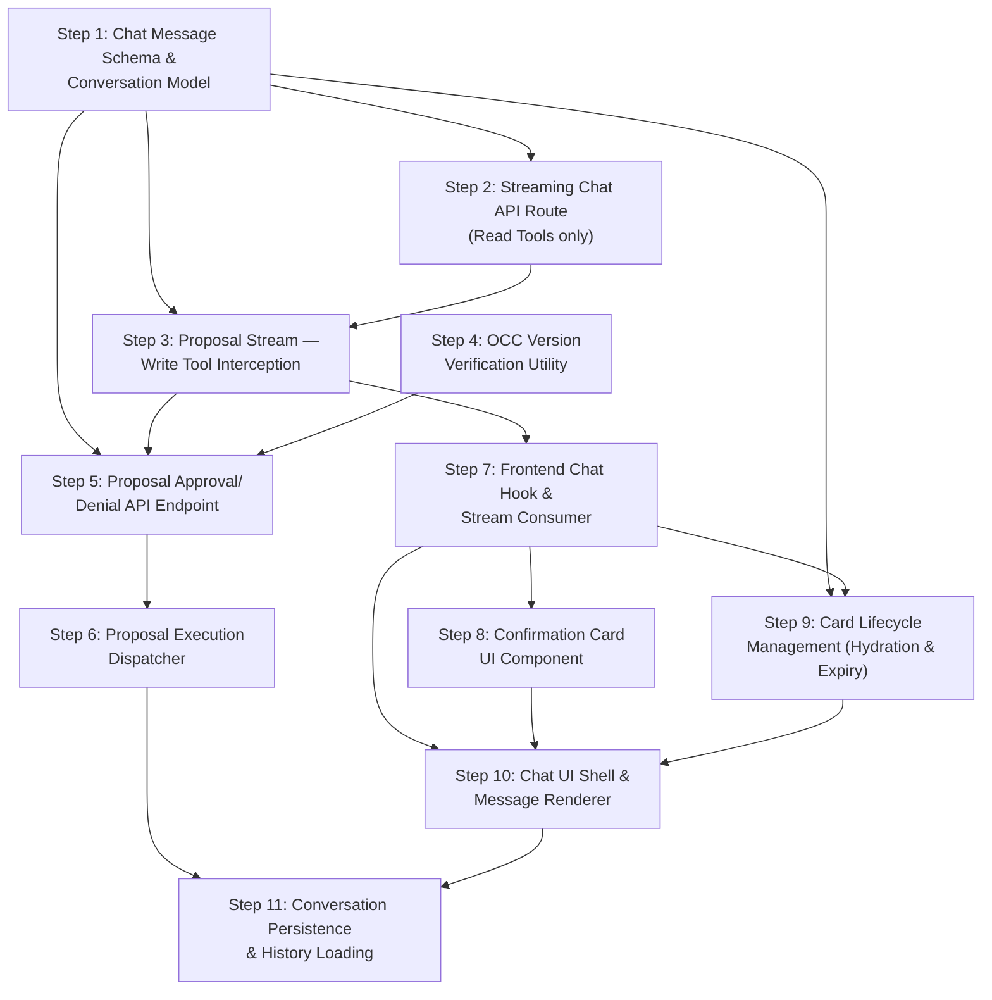

# Phase 3: The Generative UI & Human-in-the-Loop (HITL) Circuit — Implementation Steps

**Objective:** Detach the AI's intention to mutate data from the actual execution of that mutation, ensuring zero accidental data destruction. Build the streaming chat API, the interactive Confirmation Card UI, and the Optimistic Concurrency Control (OCC) circuit.

**Prerequisites:** Phases 1 and 2 are fully implemented. The following outputs are importable and functional:
- `src/lib/ai/orchestrator/build-context.ts` — `buildOrchestratorContext()`, `OrchestratorContext`
- `src/lib/ai/tools/ai-sdk-adapter.ts` — `toAISDKTools()`
- `src/lib/ai/orchestrator/system-prompt.ts` — `buildSystemPrompt()`
- `src/lib/ai/tools/tool-executor.ts` — `executeTool()`
- `src/lib/ai/tools/tool-result.types.ts` — `ToolResult`, `ToolProposal`
- `src/lib/ai/tools/tool-registry.ts` — all 6 tool definitions with `execute` handlers
- `ai` and `@ai-sdk/openai` packages installed

> [!NOTE]
> These steps produce the **streaming chat API and the HITL confirmation circuit** consumed by Phase 4 (Asynchronous Task Orchestration). Phase 4 will extend the chat route to handle long-running compute tasks (like the CP-SAT solver) by dispatching async jobs and waking the LLM with programmatic system messages upon completion.

---

## Step 1: Build the Chat Message Schema and Conversation Storage Model

### 1. The Objective & Scope Boundary (The "Stop" Rule)

**Goal:** Define the Zod schema for incoming chat messages (with embedded viewport context), the TypeScript interfaces for stored conversation messages (including tool proposals), and the Mongoose model for persisting chat conversations.

**Boundary:** Do NOT build the API route. Do NOT build any UI. Only define the data contracts and the database model for conversation persistence.

### 2. File Context & Target Architecture

**Files to Modify/Create:**
- `[NEW] src/lib/validations/chat-message.schema.ts` — Zod schema for the incoming chat request body
- `[NEW] src/server/models/Conversation.ts` — Mongoose model for storing chat conversations and their messages
- `[NEW] src/types/conversation.ts` — TypeScript interfaces for conversation messages, including proposal state

**Assumed Existing Files:**
- `src/lib/validations/viewport-context.schema.ts` (Phase 1 — `viewportContextSchema`)
- `zod` package
- `mongoose` package

### 3. Data Contracts (Inputs & Outputs)

**Inputs Expected:**
```typescript
// In src/lib/validations/chat-message.schema.ts
import { z } from "zod";
import { viewportContextSchema } from "./viewport-context.schema";

export const chatMessageSchema = z.object({
  /** The user's text message */
  message: z.string().min(1, "Message is required").max(4000, "Message too long"),
  /** The conversation ID (omit for a new conversation) */
  conversationId: z.string().optional(),
  /** Frontend viewport context */
  viewportContext: viewportContextSchema,
});

export type ChatMessageInput = z.infer<typeof chatMessageSchema>;
```

**Outputs Required:**
```typescript
// In src/types/conversation.ts

export type ProposalStatus = "pending" | "approved" | "denied" | "expired" | "stale";

export interface StoredProposal {
  proposalId: string;
  toolName: string;
  description: string;
  payload: Record<string, unknown>;
  dataVersion: string;
  status: ProposalStatus;
  createdAt: Date;
  resolvedAt: Date | null;
  /** The user who approved/denied, if resolved */
  resolvedBy: string | null;
}

export interface ConversationMessage {
  role: "user" | "assistant" | "system" | "tool";
  content: string;
  /** If this message contains a tool proposal, store it here */
  proposal?: StoredProposal;
  /** Tool call metadata (name, arguments) for tool messages */
  toolCall?: {
    toolName: string;
    arguments: Record<string, unknown>;
    result?: unknown;
  };
  timestamp: Date;
}

export interface ConversationDocument {
  _id: string;
  orgId: string;
  locationId: string;
  clerkUserId: string;
  messages: ConversationMessage[];
  /** Whether this conversation is still active (affects card interactivity) */
  isActive: boolean;
  createdAt: Date;
  updatedAt: Date;
}
```

```typescript
// In src/server/models/Conversation.ts — Mongoose schema matching ConversationDocument
// Must have indexes on: { orgId: 1, clerkUserId: 1, isActive: 1 }
// and a TTL index or manual cleanup strategy for old conversations.
```

### 4. Security & Error Handling Guardrails

**Resilience Rules:**
- The `chatMessageSchema` must `.strip()` unknown keys to prevent payload injection.
- `message` must be trimmed and have a max length of 4000 characters.
- `conversationId`, if provided, must be validated as a valid MongoDB ObjectId string format.
- The Mongoose schema must enforce `orgId` and `clerkUserId` as required fields — a conversation without ownership is a security hole.
- `StoredProposal.payload` must be stored as a generic `Mixed` type in Mongoose, but the TypeScript interface keeps it typed.

**Required Error Messages:**
- `"Message is required and must be between 1 and 4000 characters."` — when message validation fails
- `"Invalid conversation ID format."` — when conversationId is not a valid ObjectId

### 5. The "Definition of Done" (Verification)

**Testing Requirement:**
```typescript
// /tmp/test-chat-schema.ts
import { chatMessageSchema } from "@/lib/validations/chat-message.schema";

// Valid input
const valid = chatMessageSchema.safeParse({
  message: "Show me next week's schedule",
  viewportContext: { locationId: "loc_abc", activeView: "schedule" },
});
console.assert(valid.success === true, "Valid input should parse");

// Missing message
const noMsg = chatMessageSchema.safeParse({
  viewportContext: { locationId: "loc_abc" },
});
console.assert(noMsg.success === false, "Missing message should fail");

// Extra fields stripped
const stripped = chatMessageSchema.parse({
  message: "test",
  viewportContext: { locationId: "loc_abc" },
  malicious: "payload",
});
console.assert(!("malicious" in stripped), "Extra fields should be stripped");

console.log("✅ Chat message schema assertions passed");
```

Build check: `npx tsc --noEmit`

---

## Step 2: Build the Streaming Chat API Route

### 1. The Objective & Scope Boundary (The "Stop" Rule)

**Goal:** Create the `POST /api/ai/chat` API route that: (1) authenticates the user, (2) calls `buildOrchestratorContext()`, (3) converts tools via `toAISDKTools()`, (4) builds the system prompt via `buildSystemPrompt()`, and (5) uses the Vercel AI SDK's `streamText()` to stream the LLM response back to the client. This is the core orchestrator endpoint.

**Boundary:** Do NOT handle Write Tool proposals differently from Read Tool results yet — that is Step 3. Do NOT build any frontend UI. Do NOT persist conversations to the database yet. This step produces a working streaming chat endpoint that handles Read Tools only.

### 2. File Context & Target Architecture

**Files to Modify/Create:**
- `[NEW] src/app/api/ai/chat/route.ts` — the Next.js App Router POST handler

**Assumed Existing Files:**
- `src/lib/ai/orchestrator/build-context.ts` (Phase 1 — `buildOrchestratorContext()`)
- `src/lib/ai/tools/ai-sdk-adapter.ts` (Phase 2 — `toAISDKTools()`)
- `src/lib/ai/orchestrator/system-prompt.ts` (Phase 2 — `buildSystemPrompt()`)
- `src/lib/validations/chat-message.schema.ts` (Step 1)
- `ai` package (`streamText`, `openai`)
- `@ai-sdk/openai` package
- `@clerk/nextjs` (`auth()`)

### 3. Data Contracts (Inputs & Outputs)

**Inputs Expected:**
```typescript
// POST /api/ai/chat
// Request body: ChatMessageInput (Zod-validated)
// Headers: Clerk auth session token (handled by auth())
```

**Outputs Required:**
```typescript
// The route returns a Vercel AI SDK streaming response:
import { streamText } from "ai";
import { openai } from "@ai-sdk/openai";

// Inside the route handler:
const result = streamText({
  model: openai("gpt-4o"),
  system: buildSystemPrompt(orchestratorContext, locationTimezone),
  messages: conversationHistory, // CoreMessage[] from AI SDK
  tools: toAISDKTools(orchestratorContext.allowedTools, toolExecutionContext),
  maxSteps: 5, // Prevent infinite tool call loops
});

return result.toDataStreamResponse();
```

The response is a standard Vercel AI SDK data stream that the frontend's `useChat()` hook can consume directly.

### 4. Security & Error Handling Guardrails

**Resilience Rules:**
- The route must call `auth()` first and reject unauthenticated requests with `401`.
- The request body must be validated via `chatMessageSchema.safeParse()`. Invalid bodies return `400` with structured error messages.
- If `buildOrchestratorContext()` throws an access-denied error, return `403`.
- If `buildOrchestratorContext()` throws any other error, return `500` with a generic message — do not leak internal details.
- `maxSteps` must be set to `5` (or a configured constant) to prevent infinite tool call loops. The AI SDK enforces this automatically.
- The route must connect to the database (`connectToDatabase()`) before any tool execution occurs.

**Required Error Messages:**
- `401`: `{ error: "Authentication required." }`
- `400`: `{ error: "Invalid request: ${validationErrors}" }`
- `403`: `{ error: "Access denied: ${message}" }`
- `500`: `{ error: "An internal error occurred. Please try again." }`

### 5. The "Definition of Done" (Verification)

**Testing Requirement:**

Start the dev server and test with `curl`:
```bash
# Replace <YOUR_SESSION_TOKEN> with a valid Clerk session token from browser DevTools
curl -X POST http://localhost:3000/api/ai/chat \
  -H "Content-Type: application/json" \
  -H "Authorization: Bearer <YOUR_SESSION_TOKEN>" \
  -d '{
    "message": "How many staff do we have?",
    "viewportContext": {
      "locationId": "<YOUR_DEV_LOCATION_ID>",
      "activeView": "schedule"
    }
  }'
```

Expected: A streaming text response from the LLM. If the LLM calls `get_staff_summary`, the tool executes and the LLM summarizes the result in natural language.

Also test error cases:
```bash
# No auth — should return 401
curl -X POST http://localhost:3000/api/ai/chat \
  -H "Content-Type: application/json" \
  -d '{"message": "hello", "viewportContext": {"locationId": "loc_1"}}'

# Empty message — should return 400
curl -X POST http://localhost:3000/api/ai/chat \
  -H "Content-Type: application/json" \
  -H "Authorization: Bearer <TOKEN>" \
  -d '{"message": "", "viewportContext": {"locationId": "loc_1"}}'
```

Build check: `npx tsc --noEmit`

---

## Step 3: Server-Side Proposal Persistence and Write Tool Result Shaping

### 1. The Objective & Scope Boundary (The "Stop" Rule)

**Goal:** Ensure that when a Write Tool (`propose_*`) executes via the AI SDK's native tool execution, its `ToolProposal` result is (1) persisted server-side to the Conversation model with `status: "pending"`, and (2) shaped so that the sensitive `payload` field is stripped before the SDK streams the result to the frontend. The Vercel AI SDK **natively streams tool invocation results** to the frontend via the `message.toolInvocations` array in `useChat()` — no custom data annotations or manual streaming logic is needed.

**Boundary:** Do NOT build the Confirmation Card UI yet (that is Step 8). Do NOT implement the approval/denial endpoint (that is Step 5). Do NOT build any custom stream annotation logic — rely entirely on the AI SDK's native `toolInvocations` streaming. Only handle server-side persistence and result shaping.

> [!IMPORTANT]
> **Why no custom annotations?** The Vercel AI SDK's `useChat()` hook automatically provides a `toolInvocations` array on each assistant message. When the LLM calls `propose_shift_swap`, the SDK natively streams the tool name, arguments, and result to the frontend. The frontend simply checks `message.toolInvocations` to find proposals and render Confirmation Cards. This eliminates the need for `createDataStream()`, `data.append()`, or any custom `ProposalStreamPayload` type.

### 2. File Context & Target Architecture

**Files to Modify/Create:**
- `src/app/api/ai/chat/route.ts` — add `onFinish` callback to persist proposals; shape Write Tool results to strip `payload` before they reach the client
- `[NEW] src/lib/ai/orchestrator/proposal-handler.ts` — utility to detect proposals in tool results, persist them, and produce client-safe versions

**Assumed Existing Files:**
- `src/app/api/ai/chat/route.ts` (Step 2)
- `src/lib/ai/tools/tool-result.types.ts` (Phase 2 — `ToolProposal`)
- `src/server/models/Conversation.ts` (Step 1)

### 3. Data Contracts (Inputs & Outputs)

**Inputs Expected:**
```typescript
// In src/lib/ai/orchestrator/proposal-handler.ts
import type { ToolProposal } from "../tools/tool-result.types";
import type { StoredProposal } from "@/types/conversation";

/**
 * Check if a tool result object is a ToolProposal (from a Write Tool).
 */
export function isProposalResult(result: unknown): result is ToolProposal;

/**
 * Strip the sensitive `payload` field from a ToolProposal before it
 * reaches the frontend via the SDK's native toolInvocations stream.
 * The payload is stored server-side only (in the Conversation model).
 */
export function toClientSafeProposal(proposal: ToolProposal): ClientSafeProposal;

/**
 * Persist a proposal to the Conversation model with status: "pending".
 */
export async function persistProposal(
  conversationId: string,
  proposal: ToolProposal
): Promise<void>;
```

**Outputs Required:**
```typescript
/** What the frontend receives via toolInvocations[n].result — no mutation payload */
export interface ClientSafeProposal {
  type: "write";
  proposalId: string;
  toolName: string;
  description: string;
  /** Human-readable summary of what will change */
  summary: {
    action: string;       // e.g., "Shift Swap", "Schedule Generation"
    details: string[];    // e.g., ["From: Alice → To: Bob", "Shift: Monday 9AM-5PM"]
  };
  /** The data version hash (used by approval endpoint, not displayed) */
  dataVersion: string;
  /** ISO timestamp when this proposal was created */
  createdAt: string;
}
```

The Write Tool `execute` handlers (from Phase 2) already return `ToolProposal` objects. In the AI SDK adapter (`toAISDKTools`), the `execute` closure must call `toClientSafeProposal()` on the result before returning it — this is what the SDK streams to the frontend. The full `ToolProposal` (with `payload`) is persisted via `persistProposal()` in a fire-and-forget pattern.

### 4. Security & Error Handling Guardrails

**Resilience Rules:**
- The `ToolProposal.payload` must **never** reach the frontend. The `toClientSafeProposal()` function must destructure and omit it. The actual mutation payload is stored server-side in the Conversation model and retrieved only when the user clicks "Approve."
- `isProposalResult()` must check `result?.type === "write"` — do not rely on tool name string matching alone.
- If persisting the proposal to the Conversation model fails, log the error but do not throw — the approval endpoint will re-validate from scratch. Persistence is best-effort.
- Each proposal must be assigned a unique `proposalId` (UUID v4) at creation time (already done in Phase 2's Write Tool handlers).

**Required Error Messages:**
- Console error: `"[ProposalHandler] Failed to persist proposal '${proposalId}': ${error}"` — non-blocking, logged only.

### 5. The "Definition of Done" (Verification)

**Testing Requirement:**

Using the same `curl` command from Step 2, send a message that would trigger a Write Tool:
```bash
curl -X POST http://localhost:3000/api/ai/chat \
  -H "Content-Type: application/json" \
  -H "Authorization: Bearer <TOKEN>" \
  -d '{
    "message": "Swap the Monday morning grill shift from Alice to Bob",
    "viewportContext": {
      "locationId": "<LOC_ID>",
      "scheduleId": "<SCHED_ID>",
      "activeView": "schedule"
    }
  }'
```

Expected: The streamed response includes a tool invocation with the `ClientSafeProposal` as its result (no `payload` field). The frontend's `useChat()` hook will automatically surface this via `message.toolInvocations`.

Verify the proposal was persisted (with the full payload):
```javascript
// In a Node REPL with DB connection
const Conversation = require("./src/server/models/Conversation").default;
const conv = await Conversation.findOne({ "messages.proposal.status": "pending" });
console.assert(conv !== null, "Proposal should be persisted");
const stored = conv.messages.find(m => m.proposal)?.proposal;
console.assert(stored.payload !== undefined, "Server-side proposal has full payload");
console.log("✅ Proposal persisted:", stored);
```

Build check: `npx tsc --noEmit`

---

## Step 4: Build the Atomic OCC Filter Builder

### 1. The Objective & Scope Boundary (The "Stop" Rule)

**Goal:** Create the Optimistic Concurrency Control (OCC) utility that builds **atomic MongoDB query filters** embedding the `dataVersion` directly into the `findOneAndUpdate` condition. This eliminates the TOCTOU (Time-of-Check-to-Time-of-Use) race condition that would exist with a separate read-then-compare pattern.

**Boundary:** Do NOT build the approval API endpoint (that is Step 5). Do NOT build any frontend UI. Only build the filter builder utility and a shared hashing function.

> [!CAUTION]
> **Why atomic?** A two-step "check hash, then update" pattern is vulnerable to a race condition: if Manager B modifies a shift in the ~50ms between Manager A's OCC check and Manager A's database write, the stale data gets applied. By embedding the version directly into the Mongoose `findOneAndUpdate` filter (e.g., `{ _id: shiftId, updatedAt: expectedTimestamp }`), the check and mutation happen as a single atomic database operation. If the document was modified, the filter won't match, and Mongoose returns `null`.

### 2. File Context & Target Architecture

**Files to Modify/Create:**
- `[NEW] src/lib/ai/orchestrator/occ.ts` — atomic OCC filter builder and shared hashing utility

**Assumed Existing Files:**
- `src/types/conversation.ts` (Step 1 — `StoredProposal`)
- `src/server/services/shift.service.ts`
- `src/server/services/schedule.service.ts`
- `src/server/services/kitchen-config.service.ts`

### 3. Data Contracts (Inputs & Outputs)

**Inputs Expected:**
```typescript
// In src/lib/ai/orchestrator/occ.ts
import type { StoredProposal } from "@/types/conversation";
import type { FilterQuery } from "mongoose";

/**
 * Compute a deterministic version hash from one or more updatedAt timestamps.
 * Used by both the Phase 2 Write Tool handlers (to generate dataVersion)
 * and this OCC utility (to reconstruct expected filters).
 * Must use the SAME algorithm in both places.
 */
export function computeDataVersion(...timestamps: (Date | string)[]): string;
```

**Outputs Required:**
```typescript
export interface OCCFilterResult {
  /**
   * The Mongoose filter condition to use in findOneAndUpdate.
   * Includes the entity ID AND the expected updatedAt timestamp.
   * If the document was modified since proposal creation, this filter
   * returns no match and Mongoose returns null — the OCC check fails atomically.
   */
  filter: FilterQuery<unknown>;
  /** Human-readable description of what is being version-checked */
  description: string;
}

/**
 * Build atomic OCC filter conditions for a given proposal.
 *
 * For propose_shift_swap:
 *   Returns { _id: shiftId, updatedAt: expectedTimestamp }
 *
 * For propose_schedule_generation (composite):
 *   Returns filter conditions for the Schedule, KitchenConfig,
 *   and latest Staff documents. The caller must check all of them.
 */
export function buildOCCFilter(
  proposal: StoredProposal
): OCCFilterResult | OCCFilterResult[];

/**
 * Interpret a null result from findOneAndUpdate as an OCC failure.
 * Returns a human-readable stale reason.
 */
export function getStaleReason(proposal: StoredProposal): string;
```

The `computeDataVersion()` function must be **shared** — it is imported by both:
1. Phase 2's Write Tool handlers (to generate `dataVersion` at proposal time)
2. This OCC module (to reconstruct the expected `updatedAt` from `dataVersion`)

**Hashing strategy:** Store the raw `updatedAt` ISO string (or timestamp ms) as `dataVersion` for single-entity proposals (shift swap). For composite proposals (schedule generation), store `sha256(timestamp1 + timestamp2 + ...)`.

### 4. Security & Error Handling Guardrails

**Resilience Rules:**
- `computeDataVersion()` must be deterministic — identical inputs always produce identical outputs. Use `crypto.createHash("sha256")` for composite hashes.
- For single-entity proposals (shift swap), prefer storing the raw `updatedAt` ISO string as `dataVersion` since it can be used directly in the Mongoose filter without re-hashing. This is simpler and equally secure.
- For composite proposals (schedule generation), use `sha256` since multiple timestamps must be combined.
- `getStaleReason()` must never expose raw hashes or timestamps to the user — only human-readable messages.

**Required Error Messages:**
- `"The shift has been modified since this proposal was created. Please review the current schedule and try again."` — for stale shift swaps
- `"The schedule configuration or staff details have changed since this proposal was created. Please review and try again."` — for stale schedule generation
- `"The referenced shift no longer exists."` — when entity was deleted
- `"Unable to verify data currency. Please try again."` — fallback for unknown tool names

### 5. The "Definition of Done" (Verification)

**Testing Requirement:**
```typescript
// /tmp/test-occ.ts
import { computeDataVersion, buildOCCFilter, getStaleReason } from "@/lib/ai/orchestrator/occ";

// Test hash determinism
const ts = new Date("2026-03-16T01:00:00Z");
console.assert(
  computeDataVersion(ts) === computeDataVersion(ts),
  "Same input must produce same hash"
);

// Test filter building for shift swap
const shiftFilter = buildOCCFilter({
  proposalId: "test-1",
  toolName: "propose_shift_swap",
  description: "Swap shift",
  payload: { shiftId: "shift_123", targetStaffId: "staff_456" },
  dataVersion: ts.toISOString(),
  status: "pending",
  createdAt: new Date(),
  resolvedAt: null,
  resolvedBy: null,
});

// Single entity → single filter
console.assert(!Array.isArray(shiftFilter), "Shift swap returns single filter");
console.assert(shiftFilter.filter._id === "shift_123", "Filter includes shift ID");
console.assert(shiftFilter.filter.updatedAt !== undefined, "Filter includes updatedAt");

// Test stale reason
const reason = getStaleReason({ toolName: "propose_shift_swap" } as any);
console.assert(reason.includes("shift"), "Stale reason mentions shift");

console.log("✅ Atomic OCC filter builder assertions passed");
```

Build check: `npx tsc --noEmit`

---

## Step 5: Build the Proposal Approval/Denial API Endpoint

### 1. The Objective & Scope Boundary (The "Stop" Rule)

**Goal:** Create the `POST /api/ai/proposals/[proposalId]/resolve` API endpoint that handles user approval or denial of a pending proposal. On approval, it uses the **atomic OCC filter** (Step 4) to execute the database mutation in a single `findOneAndUpdate` call — if the filter returns `null`, the data is stale and the mutation is rejected. On denial, it simply marks the proposal as denied. On successful approval, the response includes an `executionSummary` that the frontend uses to trigger the **loop-back mechanism** (waking the LLM).

**Boundary:** Do NOT build the frontend Confirmation Card UI (that is Step 8). Do NOT build the shift swap or schedule generation mutation logic inline — call the existing service layer methods. Only build the API route and the orchestration logic.

### 2. File Context & Target Architecture

**Files to Modify/Create:**
- `[NEW] src/app/api/ai/proposals/[proposalId]/resolve/route.ts` — the approval/denial endpoint
- `[NEW] src/lib/ai/orchestrator/execute-proposal.ts` — the mutation dispatcher that maps tool names to actual service calls

**Assumed Existing Files:**
- `src/lib/ai/orchestrator/occ.ts` (Step 4 — `buildOCCFilter()`, `getStaleReason()`)
- `src/server/models/Conversation.ts` (Step 1)
- `src/types/conversation.ts` (Step 1 — `StoredProposal`, `ProposalStatus`)
- `src/server/services/shift.service.ts` — for executing shift swaps
- `src/server/services/schedule.service.ts` — for initiating schedule generation
- `@clerk/nextjs` (`auth()`)

### 3. Data Contracts (Inputs & Outputs)

**Inputs Expected:**
```typescript
// POST /api/ai/proposals/[proposalId]/resolve
import { z } from "zod";

export const resolveProposalSchema = z.object({
  /** "approve" or "deny" */
  action: z.enum(["approve", "deny"]),
});

export type ResolveProposalInput = z.infer<typeof resolveProposalSchema>;
```

**Outputs Required:**
```typescript
// Success response (approval executed):
{
  success: true,
  proposalId: string,
  action: "approved",
  result: unknown,  // The result of the mutation (e.g., updated shift document)
  /**
   * Human-readable summary for the loop-back mechanism.
   * The frontend appends this as a system message to wake the LLM:
   * "[SYSTEM: The user approved propose_shift_swap. {executionSummary}]"
   */
  executionSummary: string
}

// Success response (denial recorded):
{
  success: true,
  proposalId: string,
  action: "denied",
  /** The frontend appends: "[SYSTEM: The user denied propose_shift_swap.]" */
  executionSummary: string
}

// OCC failure (stale data — atomic filter returned null):
{
  success: false,
  proposalId: string,
  error: "stale_data",
  message: string  // Human-readable from getStaleReason()
}

// Proposal not found or already resolved:
{
  success: false,
  proposalId: string,
  error: "invalid_proposal",
  message: string
}
```

### 4. Security & Error Handling Guardrails

**Resilience Rules:**
- The endpoint must authenticate the user via `auth()` and verify they own the conversation containing the proposal. A user cannot approve another user's proposals.
- The proposal must be in `status: "pending"` to be resolved. If it's already `"approved"`, `"denied"`, or `"expired"`, return a `400` with a clear message.
- **Atomic OCC execution:** On approval, the endpoint calls `buildOCCFilter(proposal)` to get the Mongoose filter, then passes it directly to the service layer's `findOneAndUpdate()`. If Mongoose returns `null`, the OCC check failed atomically — return `409 Conflict` with `getStaleReason()`. There is **no separate verify step**.
- **On mutation failure:** If the `findOneAndUpdate` throws (not returns null), mark the proposal as `"failed"` and return `500`. Never leave a proposal marked approved if the mutation didn't succeed.
- **Atomicity:** The proposal status update happens only AFTER the mutation succeeds. Update status to `"approved"` + set `resolvedBy` and `resolvedAt` in one operation.
- The response must always include an `executionSummary` string that the frontend will use to trigger the loop-back mechanism (see Step 7).

**Required Error Messages:**
- `401`: `{ error: "Authentication required." }`
- `400`: `{ error: "invalid_proposal", message: "This proposal has already been ${status}." }`
- `404`: `{ error: "invalid_proposal", message: "Proposal not found." }`
- `409`: `{ error: "stale_data", message: "${staleReason}" }`
- `500`: `{ error: "execution_failed", message: "Failed to execute the approved action. The proposal has not been applied." }`

### 5. The "Definition of Done" (Verification)

**Testing Requirement:**

First, trigger a proposal via the chat endpoint (Step 3), note the `proposalId`, then:
```bash
# Approve a proposal
curl -X POST http://localhost:3000/api/ai/proposals/<PROPOSAL_ID>/resolve \
  -H "Content-Type: application/json" \
  -H "Authorization: Bearer <TOKEN>" \
  -d '{ "action": "approve" }'

# Expected: { success: true, proposalId: "...", action: "approved", result: { ... } }
```

```bash
# Deny a proposal
curl -X POST http://localhost:3000/api/ai/proposals/<PROPOSAL_ID>/resolve \
  -H "Content-Type: application/json" \
  -H "Authorization: Bearer <TOKEN>" \
  -d '{ "action": "deny" }'

# Expected: { success: true, proposalId: "...", action: "denied" }
```

```bash
# Try to approve an already-resolved proposal
curl -X POST http://localhost:3000/api/ai/proposals/<ALREADY_RESOLVED_ID>/resolve \
  -H "Content-Type: application/json" \
  -H "Authorization: Bearer <TOKEN>" \
  -d '{ "action": "approve" }'

# Expected: 400 { error: "invalid_proposal", message: "This proposal has already been approved." }
```

To test OCC rejection: modify the shift in the database (update its `updatedAt`), then attempt to approve the proposal — it should return `409`.

Build check: `npx tsc --noEmit`

---

## Step 6: Build the Proposal Execution Dispatcher (Mutation Mapping)

### 1. The Objective & Scope Boundary (The "Stop" Rule)

**Goal:** Implement the `executeProposal()` function that maps a validated, OCC-verified `StoredProposal` to the correct service layer method. This is the dispatch table that translates proposal `toolName` values (e.g., `"propose_shift_swap"`) into actual database mutations (e.g., calling `ShiftService.reassign()`).

**Boundary:** Do NOT modify the approval API route (it already calls this function). Do NOT build any new service methods — use existing service layer methods. Only build the dispatcher mapping.

### 2. File Context & Target Architecture

**Files to Modify/Create:**
- `src/lib/ai/orchestrator/execute-proposal.ts` — the mutation dispatcher (created as a placeholder in Step 5, now fully implemented)

**Assumed Existing Files:**
- `src/types/conversation.ts` (Step 1 — `StoredProposal`)
- `src/server/services/shift.service.ts`
- `src/server/services/schedule.service.ts`

### 3. Data Contracts (Inputs & Outputs)

**Inputs Expected:**
```typescript
// In src/lib/ai/orchestrator/execute-proposal.ts
import type { StoredProposal } from "@/types/conversation";

export interface ExecuteProposalInput {
  proposal: StoredProposal;
  orgId: string;
  locationId: string;
  clerkUserId: string;
}

export interface ExecuteProposalResult {
  success: boolean;
  /** Human-readable description of what was executed */
  executionSummary: string;
  /** The raw result from the service layer */
  data?: unknown;
  /** Error message if execution failed */
  error?: string;
}

export async function executeProposal(
  input: ExecuteProposalInput
): Promise<ExecuteProposalResult>;
```

**Outputs Required:**

The dispatcher must handle these tool names and map to service calls:

| `toolName` | Service Call | Payload Fields Used |
|---|---|---|
| `propose_shift_swap` | `ShiftService.reassign(shiftId, targetStaffId)` | `payload.shiftId`, `payload.targetStaffId` |
| `propose_schedule_generation` | Dispatch to async solver (Phase 4 will extend this) | `payload.weekStartDate`, `payload.templateScheduleId` |

For `propose_schedule_generation` in Phase 3, the dispatcher should return a placeholder result indicating the mutation was "queued" — Phase 4 will wire this to the actual async solver dispatch.

### 4. Security & Error Handling Guardrails

**Resilience Rules:**
- The dispatcher must validate that the `proposal.payload` contains the required fields for the given `toolName` before calling the service. If fields are missing, return `{ success: false, error: "Malformed proposal payload." }`.
- All service calls must be scoped to the provided `orgId` and `locationId`.
- If a `toolName` is not recognized by the dispatcher, return `{ success: false, error: "Unknown proposal type: ${toolName}" }` — do not throw.
- The dispatcher must catch all exceptions from service calls and wrap them in an `ExecuteProposalResult`.

**Required Error Messages:**
- `"Malformed proposal payload for '${toolName}': missing required field '${fieldName}'."` — when payload is incomplete
- `"Unknown proposal type: '${toolName}'. This proposal cannot be executed."` — when toolName is not in the dispatch table
- `"Shift swap failed: ${serviceError}"` — when ShiftService throws
- `"Schedule generation queued. Phase 4 will handle async execution."` — placeholder for schedule generation

### 5. The "Definition of Done" (Verification)

**Testing Requirement:**
```typescript
// /tmp/test-execute-proposal.ts
import { executeProposal } from "@/lib/ai/orchestrator/execute-proposal";

// Test shift swap execution
const swapResult = await executeProposal({
  proposal: {
    proposalId: "test-1",
    toolName: "propose_shift_swap",
    description: "Swap shift",
    payload: { shiftId: "<DEV_SHIFT_ID>", targetStaffId: "<DEV_STAFF_ID>" },
    dataVersion: "irrelevant-already-verified",
    status: "pending",
    createdAt: new Date(),
    resolvedAt: null,
    resolvedBy: null,
  },
  orgId: "<ORG_ID>",
  locationId: "<LOC_ID>",
  clerkUserId: "user_test",
});

console.assert(typeof swapResult.success === "boolean");
console.assert(typeof swapResult.executionSummary === "string");
console.log("✅ Proposal execution result:", swapResult);

// Test unknown tool name
const unknownResult = await executeProposal({
  proposal: {
    proposalId: "test-2",
    toolName: "propose_nuke_database",
    description: "Bad",
    payload: {},
    dataVersion: "x",
    status: "pending",
    createdAt: new Date(),
    resolvedAt: null,
    resolvedBy: null,
  },
  orgId: "<ORG_ID>",
  locationId: "<LOC_ID>",
  clerkUserId: "user_test",
});

console.assert(unknownResult.success === false);
console.assert(unknownResult.error?.includes("Unknown proposal type"));
console.log("✅ Unknown tool correctly rejected");
```

Build check: `npx tsc --noEmit`

---

## Step 7: Build the Frontend Chat Hook and Message Stream Consumer

### 1. The Objective & Scope Boundary (The "Stop" Rule)

**Goal:** Create the frontend React hook that connects to the `POST /api/ai/chat` endpoint using the Vercel AI SDK's `useChat()` hook. The hook leverages the SDK's **native `toolInvocations` array** on each message to detect proposals — no custom data annotation parsing needed. It also implements the **loop-back mechanism**: after a proposal is approved or denied, the hook appends a system message to the chat and triggers the LLM to respond, keeping the conversation alive.

**Boundary:** Do NOT build the Confirmation Card component yet (that is Step 8). Do NOT build the full chat UI layout. Only build the hook, the proposal state management, and the loop-back trigger. The hook must expose typed state for the chat UI to consume.

> [!IMPORTANT]
> **The Loop-Back Mechanism:** When a user approves a proposal (e.g., a shift swap), the LLM is "asleep" — it has no idea the approval happened. Without the loop-back, if the user asks "what's next?", the LLM won't know the swap was executed. The fix: after the resolve API returns success, the hook uses `useChat`'s `append()` function to silently inject a system message like `[SYSTEM: The user approved the propose_shift_swap tool. The shift has been reassigned from Alice to Bob.]`. This wakes the LLM, which then responds naturally: "All set! I've moved Alice's shift to Bob. Would you like me to run the schedule generator now?"

### 2. File Context & Target Architecture

**Files to Modify/Create:**
- `[NEW] src/hooks/use-ai-chat.ts` — custom hook wrapping `useChat()` with proposal awareness and loop-back
- `[NEW] src/types/ai-chat.ts` — frontend TypeScript types for chat messages and proposals

**Assumed Existing Files:**
- `ai/react` package (`useChat`)
- `src/types/conversation.ts` (Step 1 — `ProposalStatus`, `StoredProposal`)
- `src/lib/ai/orchestrator/proposal-handler.ts` (Step 3 — `ClientSafeProposal`)

### 3. Data Contracts (Inputs & Outputs)

**Inputs Expected:**
```typescript
// In src/types/ai-chat.ts
import type { ClientSafeProposal } from "@/lib/ai/orchestrator/proposal-handler";

export interface ChatProposal extends ClientSafeProposal {
  /** Local status — updated by the hook on resolve */
  status: ProposalStatus;
}
```

```typescript
// In src/hooks/use-ai-chat.ts

export interface UseAIChatOptions {
  /** The current viewport context to send with each message */
  viewportContext: ViewportContext;
  /** Conversation ID (undefined for new conversations) */
  conversationId?: string;
}

export interface UseAIChatReturn {
  /** The raw messages from useChat() — includes toolInvocations */
  messages: Message[];  // from "ai/react"
  /** Send a new user message */
  sendMessage: (content: string) => void;
  /** Whether the AI is currently generating a response */
  isLoading: boolean;
  /** Any error from the last request */
  error: string | null;
  /** All proposals extracted from toolInvocations, with local status tracking */
  proposals: Map<string, ChatProposal>;
  /**
   * Approve or deny a proposal.
   * On success, triggers the loop-back: appends a system message
   * and calls the LLM to generate a natural follow-up response.
   */
  resolveProposal: (proposalId: string, action: "approve" | "deny") => Promise<void>;
  /** Whether a proposal is currently being resolved */
  isResolving: boolean;
}
```

**Outputs Required:**
- `useAIChat()` returns the `UseAIChatReturn` interface.
- `sendMessage()` calls the chat API with the message and viewport context.
- The hook extracts proposals from `message.toolInvocations` — when a tool invocation has `state: "result"` and its result matches `ClientSafeProposal` (has `type: "write"`), the hook adds it to the `proposals` map with `status: "pending"`.
- `resolveProposal()` calls `POST /api/ai/proposals/[proposalId]/resolve`, updates the local proposal status, and on success **triggers the loop-back**:
  ```typescript
  // After successful resolve:
  append({
    role: "user",  // or "system" if the SDK supports it
    content: `[SYSTEM: The user ${action}d the ${toolName} tool. ${executionSummary}]`,
  });
  ```
  This causes `useChat` to send the system context to the LLM, which generates a follow-up response.
- On OCC rejection (`409`), `resolveProposal()` updates the proposal status to `"stale"` locally.

### 4. Security & Error Handling Guardrails

**Resilience Rules:**
- `sendMessage()` must disable re-submission while `isLoading` is `true` to prevent duplicate requests.
- If the stream disconnects mid-response, the hook must set an error state and allow retrying.
- `resolveProposal()` must be idempotent — calling it twice for the same proposal should not cause errors (the second call will get a "already resolved" response).
- Viewport context must be sent with every message but must not be displayed in the chat UI.

**Required Error Messages:**
- `error: "Failed to send message. Please try again."` — when the chat API returns a non-streaming error
- `error: "Failed to resolve proposal. Please try again."` — when the resolve endpoint returns `500`
- (OCC stale messages are returned from the resolve endpoint and surfaced to the UI via `ChatProposal.status`)

### 5. The "Definition of Done" (Verification)

**Testing Requirement:**

Create a minimal test page to verify the hook and loop-back work:
```typescript
// /tmp/test-page.tsx (or a temporary page in the app)
"use client";
import { useAIChat } from "@/hooks/use-ai-chat";

export default function TestChatPage() {
  const { messages, sendMessage, isLoading, proposals, resolveProposal, isResolving } = useAIChat({
    viewportContext: { locationId: "<LOC_ID>", activeView: "schedule" },
  });

  return (
    <div>
      {messages.map(m => (
        <div key={m.id}>
          {m.role}: {m.content}
          {m.toolInvocations?.map((t, i) => (
            <div key={i}>Tool: {t.toolName} — {t.state}</div>
          ))}
        </div>
      ))}
      {[...proposals.values()]
        .filter(p => p.status === "pending")
        .map(p => (
          <div key={p.proposalId}>
            PROPOSAL: {p.description}
            <button onClick={() => resolveProposal(p.proposalId, "approve")} disabled={isResolving}>
              Approve
            </button>
          </div>
        ))}
      <button onClick={() => sendMessage("Swap the Monday grill shift")}>Send</button>
      {isLoading && <div>Loading...</div>}
    </div>
  );
}
```

Verify:
1. Sending a message shows the user message immediately and streams the AI response.
2. Sending a message that triggers a Write Tool shows a proposal extracted from `toolInvocations`.
3. Clicking "Approve" on a proposal triggers the resolve API, updates the card, **and** the LLM responds with a natural follow-up (loop-back).
4. `isLoading` toggles correctly during both message sending and loop-back.

Build check: `npx tsc --noEmit`

---

## Step 8: Build the Confirmation Card UI Component

### 1. The Objective & Scope Boundary (The "Stop" Rule)

**Goal:** Build the `ConfirmationCard` React component that renders an interactive proposal card inside the chat history. The card displays the proposal summary, an "Approve" button, a "Deny" button, and handles all lifecycle states (pending, approved, denied, stale, expired).

**Boundary:** Do NOT build the full chat layout shell (that is Step 10). Do NOT modify the chat hook. Only build the self-contained Confirmation Card component with all its visual states.

### 2. File Context & Target Architecture

**Files to Modify/Create:**
- `[NEW] src/components/ai-chat/ConfirmationCard.tsx` — the interactive proposal card component
- `[NEW] src/components/ai-chat/ConfirmationCard.module.css` (or Tailwind classes) — styling for all card states

**Assumed Existing Files:**
- `src/types/ai-chat.ts` (Step 7 — `ChatProposal`)
- Existing UI components (Button, Card) from the design system / shadcn
- `tailwindcss` (user's stack)

### 3. Data Contracts (Inputs & Outputs)

**Inputs Expected:**
```typescript
// ConfirmationCard props
export interface ConfirmationCardProps {
  proposal: ChatProposal;
  /** Called when user clicks Approve or Deny */
  onResolve: (proposalId: string, action: "approve" | "deny") => Promise<void>;
  /** Whether the card's buttons should be disabled (e.g., during resolution) */
  isResolving: boolean;
  /** If OCC check failed, the stale reason to display */
  staleReason?: string;
}
```

**Outputs Required:**

The component must render differently based on `proposal.status`:

| Status | Visual Treatment | Buttons |
|---|---|---|
| `"pending"` | Active card with action gradient border | ✅ Approve, ❌ Deny (enabled) |
| `"approved"` | Muted card with green checkmark badge | Buttons hidden, "Approved" badge shown |
| `"denied"` | Muted card with red X badge | Buttons hidden, "Denied" badge shown |
| `"stale"` | Warning card with amber border | Buttons replaced with "Data has changed" message and optional "Refresh" link |
| `"expired"` | Fully muted/grayed out card | Buttons replaced with "Expired" label |

The card body always shows:
- `proposal.summary.action` as the card title (e.g., "Shift Swap")
- `proposal.summary.details` as a bulleted list of changes
- A subtle timestamp showing when the proposal was created

### 4. Security & Error Handling Guardrails

**Resilience Rules:**
- The Approve button must show a loading spinner during resolution (`isResolving` state) and prevent double-clicks.
- The Deny button must also be disabled during resolution.
- If `onResolve` throws, the card must show an inline error message (not a toast) and re-enable the buttons.
- The `dataVersion` must **never** be rendered in the UI — it is a hidden field used only by the backend.
- Buttons must be keyboard-accessible (standard `<button>` elements with proper `aria-label` attributes).

**Required Error Messages:**
- Inline error: `"Something went wrong. Please try again."` — when `onResolve` throws an unexpected error
- Stale card message: `"${staleReason} Please ask the assistant to try again."` — when status is `"stale"`
- Expired card message: `"This proposal has expired and can no longer be acted upon."` — when status is `"expired"`

### 5. The "Definition of Done" (Verification)

**Testing Requirement:**

Render the component in all 5 states using Storybook or a test page:
```typescript
// /tmp/test-confirmation-cards.tsx (temporary page)
"use client";
import { ConfirmationCard } from "@/components/ai-chat/ConfirmationCard";

const baseProposal = {
  proposalId: "prop-1",
  toolName: "propose_shift_swap",
  description: "Reassign Monday 9AM-5PM Grill from Alice to Bob",
  summary: {
    action: "Shift Swap",
    details: ["From: Alice Johnson", "To: Bob Smith", "Shift: Monday 9:00 AM – 5:00 PM (Grill)"],
  },
  dataVersion: "hidden",
  createdAt: new Date().toISOString(),
};

export default function TestCards() {
  return (
    <div style={{ display: "flex", flexDirection: "column", gap: 16, maxWidth: 480, margin: "auto" }}>
      <ConfirmationCard proposal={{ ...baseProposal, status: "pending" }} onResolve={async () => {}} isResolving={false} />
      <ConfirmationCard proposal={{ ...baseProposal, status: "approved" }} onResolve={async () => {}} isResolving={false} />
      <ConfirmationCard proposal={{ ...baseProposal, status: "denied" }} onResolve={async () => {}} isResolving={false} />
      <ConfirmationCard proposal={{ ...baseProposal, status: "stale" }} onResolve={async () => {}} isResolving={false} staleReason="The shift was modified by another manager." />
      <ConfirmationCard proposal={{ ...baseProposal, status: "expired" }} onResolve={async () => {}} isResolving={false} />
    </div>
  );
}
```

Verify visually that:
1. Pending cards have active, interactable buttons.
2. Approved/Denied cards show the correct badge and no buttons.
3. Stale cards show the warning message.
4. Expired cards are fully grayed out.
5. Clicking Approve on a pending card shows a loading state.

Build check: `npx tsc --noEmit`

---

## Step 9: Implement Card Lifecycle Management (Hydration & Expiration)

### 1. The Objective & Scope Boundary (The "Stop" Rule)

**Goal:** Implement the frontend logic that manages the lifecycle of Confirmation Cards across chat sessions. When a conversation is loaded (hydrated) from history, all previously resolved or expired proposals must have their interactive buttons disabled. When a chat session ends (user navigates away or starts a new conversation), all pending proposals in the old session must be marked as expired.

**Boundary:** Do NOT modify the Confirmation Card component itself (it already handles all status states from Step 8). Do NOT modify the chat API route. Only build the lifecycle management logic in the chat hook and a server-side expiration utility.

### 2. File Context & Target Architecture

**Files to Modify/Create:**
- `src/hooks/use-ai-chat.ts` — add hydration logic to initialize proposal states from conversation history
- `[NEW] src/lib/ai/orchestrator/expire-proposals.ts` — server-side utility to expire pending proposals in old/inactive conversations
- `src/app/api/ai/chat/route.ts` — call the expiration utility when loading conversation history for a new session

**Assumed Existing Files:**
- `src/hooks/use-ai-chat.ts` (Step 7)
- `src/server/models/Conversation.ts` (Step 1)
- `src/types/conversation.ts` (Step 1 — `ProposalStatus`)

### 3. Data Contracts (Inputs & Outputs)

**Inputs Expected:**
```typescript
// In src/lib/ai/orchestrator/expire-proposals.ts

/**
 * Expire all pending proposals in conversations that are no longer active.
 * Called when:
 * 1. A user starts a new conversation (old conversations become inactive).
 * 2. A conversation hasn't been interacted with for > PROPOSAL_TTL_MINUTES.
 */
export async function expirePendingProposals(
  orgId: string,
  clerkUserId: string,
  /** Optionally exclude a specific conversation (the currently active one) */
  excludeConversationId?: string
): Promise<{ expiredCount: number }>;
```

```typescript
// Constants
export const PROPOSAL_TTL_MINUTES = 30; // Proposals expire after 30 minutes
```

**Outputs Required:**
- `expirePendingProposals()` updates all `StoredProposal` entries with `status: "pending"` in inactive conversations to `status: "expired"`.
- It also expires proposals older than `PROPOSAL_TTL_MINUTES` even in the active conversation.
- Returns `{ expiredCount }` for logging.
- The chat hook's hydration logic must:
  1. When loading conversation history, set each `ChatProposal.status` based on the `StoredProposal.status` from the backend.
  2. Client-side time check: if a pending proposal's `createdAt` is older than `PROPOSAL_TTL_MINUTES`, display it as `"expired"` locally (belt-and-suspenders with the server-side check).

### 4. Security & Error Handling Guardrails

**Resilience Rules:**
- `expirePendingProposals()` must be scoped to the user's `orgId` and `clerkUserId` — never expire another user's proposals.
- If the MongoDB update operation fails, log the error but do not throw — stale proposals are a UX issue, not a security breach. The approval endpoint's OCC check is the ultimate safety net.
- The client-side TTL check is a UX optimization only — the backend is the source of truth. If a user somehow submits an expired proposal, the approval endpoint will reject it with `"invalid_proposal"`.
- Do not expire proposals from the backend during a server action that took too long — only expire on explicit user actions (new conversation, page load).

**Required Error Messages:**
- Console warning: `"[ProposalExpiry] Failed to expire proposals: ${error}"` — non-blocking
- Console info: `"[ProposalExpiry] Expired ${count} pending proposals for user ${userId}"` — logged on success

### 5. The "Definition of Done" (Verification)

**Testing Requirement:**

1. Create a proposal via the chat endpoint (Step 3).
2. Wait or manually set the proposal's `createdAt` to > 30 minutes ago.
3. Start a new conversation (or call `expirePendingProposals()` directly).
4. Verify the old proposal's status is now `"expired"`:

```typescript
// /tmp/test-expiry.ts
import { expirePendingProposals } from "@/lib/ai/orchestrator/expire-proposals";

const result = await expirePendingProposals("org_1", "user_1");
console.log(`Expired ${result.expiredCount} proposals`);
console.assert(typeof result.expiredCount === "number");
console.log("✅ Proposal expiry test passed");
```

Client-side verification:
1. Load conversation history containing a previously approved proposal.
2. Verify the Confirmation Card renders with the "Approved" badge and no interactive buttons.
3. Manually update a pending proposal's `createdAt` to 45 minutes ago.
4. Reload the chat — verify the card renders as "Expired."

Build check: `npx tsc --noEmit`

---

## Step 10: Build the Chat UI Shell and Message Renderer

### 1. The Objective & Scope Boundary (The "Stop" Rule)

**Goal:** Build the chat UI container component that renders the full chat experience: a message list (with text messages and embedded Confirmation Cards), a text input with send button, and loading/error states. This is the top-level component that composes the `useAIChat` hook (Step 7) and the `ConfirmationCard` component (Step 8).

**Boundary:** Do NOT build conversation history/listing UI (sidebar of past conversations). Do NOT build any new backend endpoints. Only build the single-conversation chat interface that can be mounted in the app.

### 2. File Context & Target Architecture

**Files to Modify/Create:**
- `[NEW] src/components/ai-chat/ChatShell.tsx` — the top-level chat container
- `[NEW] src/components/ai-chat/MessageBubble.tsx` — individual message renderer (user and assistant bubbles)
- `[NEW] src/components/ai-chat/ChatInput.tsx` — the text input with send button
- `[NEW] src/app/(app)/[orgSlug]/assistant/page.tsx` — the route page that mounts the ChatShell (or a slide-out panel mounting point)

**Assumed Existing Files:**
- `src/hooks/use-ai-chat.ts` (Step 7)
- `src/components/ai-chat/ConfirmationCard.tsx` (Step 8)
- `src/types/ai-chat.ts` (Step 7)
- Existing layout and navigation components

### 3. Data Contracts (Inputs & Outputs)

**Inputs Expected:**
```typescript
// ChatShell props
export interface ChatShellProps {
  /** The location ID for viewport context */
  locationId: string;
  /** Optional: pre-existing conversation ID to resume */
  conversationId?: string;
  /** The current viewport context from the parent page */
  viewportContext: ViewportContext;
}
```

**Outputs Required:**

The `ChatShell` component must:
1. Render a scrollable message list with auto-scroll-to-bottom on new messages.
2. For each `AIChatMessage`:
   - If `message.role === "user"`: render a right-aligned user bubble.
   - If `message.role === "assistant"` and no proposal: render a left-aligned assistant bubble with markdown rendering.
   - If `message.role === "assistant"` and has a `proposal`: render the assistant text followed by an embedded `ConfirmationCard`.
3. The `ChatInput` component at the bottom with:
   - A `<textarea>` (auto-expanding) for the message.
   - A send button that is disabled when `isLoading` or input is empty.
   - Support for Enter-to-send (Shift+Enter for newline).
4. A loading indicator (typing animation) when the AI is generating.
5. An error banner when the last request failed, with a "Retry" button.

### 4. Security & Error Handling Guardrails

**Resilience Rules:**
- The message list must sanitize assistant response content before rendering as HTML/markdown. Use a safe markdown renderer (e.g., `react-markdown` with `remarkGfm`) — do not use `dangerouslySetInnerHTML`.
- The text input must have the same 4000-character limit as the backend schema. Show a character count when nearing the limit.
- Auto-scroll must not fight the user's manual scroll position — only auto-scroll if the user is already at the bottom.
- The chat shell must be responsive and work on mobile viewports (min-width: 320px).

**Required Error Messages:**
- Error banner: `"Something went wrong. Please try again."` — with a "Retry" button that re-sends the last message.
- Empty state: `"Ask your AI assistant anything about your schedule, staff, or shifts."` — shown when no messages exist.
- Character limit: `"${remaining} characters remaining"` — shown when > 3600 characters typed.

### 5. The "Definition of Done" (Verification)

**Testing Requirement:**

Navigate to the assistant page and verify:
1. The empty state message is shown for a new conversation.
2. Type a message and press Enter — the message appears immediately in the chat.
3. The AI streams its response word-by-word into an assistant bubble.
4. If the AI calls a Read Tool, the result is summarized in the response text.
5. If the AI calls a Write Tool, a Confirmation Card renders below the response text.
6. Clicking Approve on the card shows a loading state, then updates to the approved badge.
7. Clicking Deny updates to the denied badge.
8. The chat auto-scrolls to new messages.
9. The chat is usable on a mobile viewport (375px wide).

Build check: `npx tsc --noEmit`

---

## Step 11: Add Conversation Persistence and History Loading

### 1. The Objective & Scope Boundary (The "Stop" Rule)

**Goal:** Wire up conversation persistence so that messages are saved to the `Conversation` Mongoose model after each exchange, and conversations can be loaded when the user returns. Add a conversation history API endpoint for fetching past conversations.

**Boundary:** Do NOT build a conversation history sidebar or listing UI. Do NOT modify the Confirmation Card or chat shell. Only add persistence logic to the chat route and a GET endpoint for loading a specific conversation.

### 2. File Context & Target Architecture

**Files to Modify/Create:**
- `src/app/api/ai/chat/route.ts` — add `onFinish` persistence logic to save messages after each exchange
- `[NEW] src/app/api/ai/conversations/[conversationId]/route.ts` — GET endpoint to load a conversation's messages
- `[NEW] src/app/api/ai/conversations/route.ts` — GET endpoint to list the user's recent conversations (lightweight, returns IDs + first message preview + timestamps)

**Assumed Existing Files:**
- `src/server/models/Conversation.ts` (Step 1)
- `src/app/api/ai/chat/route.ts` (Step 2)
- `@clerk/nextjs` (`auth()`)

### 3. Data Contracts (Inputs & Outputs)

**Inputs Expected:**
```typescript
// GET /api/ai/conversations — list conversations
// Query params: ?limit=20&offset=0
// Returns: ConversationListItem[]

// GET /api/ai/conversations/[conversationId] — load one conversation
// Returns: ConversationDocument (with all messages)
```

**Outputs Required:**
```typescript
export interface ConversationListItem {
  conversationId: string;
  /** First user message as a preview */
  preview: string;
  /** Number of messages */
  messageCount: number;
  createdAt: string;
  updatedAt: string;
  isActive: boolean;
}
```

The chat route's `onFinish` callback must:
1. Upsert the conversation (create if new, append if existing).
2. Store both the user message and the assistant response (including any proposals).
3. Return the `conversationId` in the response headers or as a data annotation so the frontend can track it.

### 4. Security & Error Handling Guardrails

**Resilience Rules:**
- The GET endpoints must verify the user owns the conversation (`clerkUserId` match). Return `404` for conversations the user doesn't own — do not reveal that the conversation exists.
- Conversation listing must be paginated (max 20 per page).
- If persistence fails in `onFinish`, log the error but do not fail the response — the user already saw the streamed response. Persistence is best-effort.
- Old conversations (> 30 days) should not be deleted but may be marked `isActive: false`.

**Required Error Messages:**
- `404`: `{ error: "Conversation not found." }` — when conversation doesn't exist or user doesn't own it
- `401`: `{ error: "Authentication required." }`

### 5. The "Definition of Done" (Verification)

**Testing Requirement:**
```bash
# Send a chat message — note the conversationId in the response
curl -X POST http://localhost:3000/api/ai/chat \
  -H "Authorization: Bearer <TOKEN>" \
  -H "Content-Type: application/json" \
  -d '{"message": "Hello", "viewportContext": {"locationId": "<LOC_ID>"}}'

# List conversations
curl http://localhost:3000/api/ai/conversations?limit=5 \
  -H "Authorization: Bearer <TOKEN>"

# Expected: Array with at least 1 conversation

# Load specific conversation
curl http://localhost:3000/api/ai/conversations/<CONV_ID> \
  -H "Authorization: Bearer <TOKEN>"

# Expected: Full conversation document with messages array
```

Verify that closing and reopening the chat loads the previous conversation with all messages and proposal states intact.

Build check: `npx tsc --noEmit`

---

## Summary: Step Dependency Graph



**Key architectural decisions in this phase:**
- **Native `toolInvocations`** (Steps 3, 7): The Vercel AI SDK natively streams tool calls and results to the frontend via `message.toolInvocations`, eliminating the need for custom data annotations or stream parsing.
- **Atomic OCC** (Steps 4, 5, 6): Version checks happen inside the `findOneAndUpdate` filter, not as a separate read-then-compare step, eliminating the TOCTOU race condition.
- **Loop-Back Mechanism** (Steps 5, 7): After a proposal is approved/denied, the frontend appends a system message waking the LLM to produce a natural follow-up response.

**Phase 3 → Phase 4 handoff:** Phase 4 will:
1. Extend the proposal execution dispatcher (Step 6) to handle `propose_schedule_generation` by dispatching to the async CP-SAT solver microservice instead of executing synchronously.
2. Extend the **loop-back mechanism** (Step 7) for async tasks: when the solver completes, a webhook or polling loop triggers a system message that wakes the LLM to summarize the results — the same `append()` pattern used for proposal approvals.
3. Handle **Infeasible/Failed** solver states by passing the error context to the LLM so it can suggest constraint relaxations to the user.
