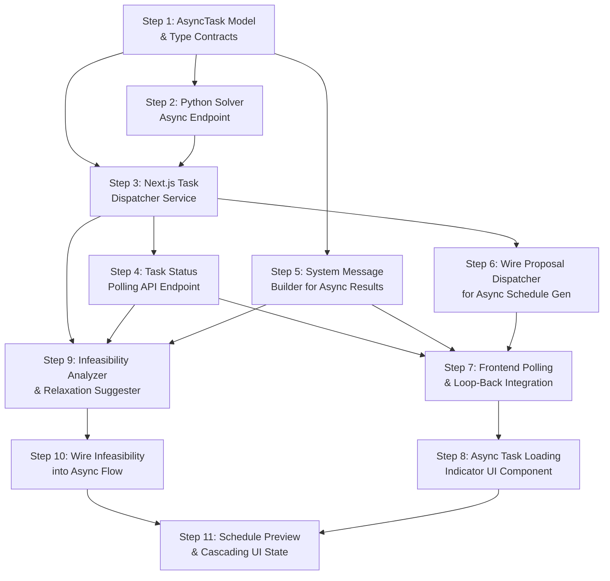

# Phase 4: Asynchronous Task Orchestration — Implementation Steps

**Objective:** Seamlessly integrate the AI conversational flow with long-running, deterministic compute tasks (like the constraint programming solver) without triggering serverless timeouts. Extend the Phase 3 loop-back mechanism for async task completion and graceful failure handling.

**Prerequisites:** Phases 1–3 are fully implemented. The following outputs are importable and functional:
- `src/lib/ai/orchestrator/build-context.ts` — `buildOrchestratorContext()`
- `src/lib/ai/orchestrator/execute-proposal.ts` — `executeProposal()` (returns a placeholder for `propose_schedule_generation`)
- `src/lib/ai/orchestrator/proposal-handler.ts` — `isProposalResult()`, `toClientSafeProposal()`, `persistProposal()`
- `src/hooks/use-ai-chat.ts` — `useAIChat()` with `resolveProposal()` and loop-back mechanism
- `src/app/api/ai/proposals/[proposalId]/resolve/route.ts` — approval/denial endpoint
- `src/server/services/cp-solver.service.ts` — `CPSolverService.solveWeek()` (synchronous HTTP POST, 60s timeout)
- `src/server/actions/schedule-generation.actions.ts` — `generateBaseSchedule()`, `acceptGeneratedSchedule()`
- `src/server/models/Conversation.ts` — conversation persistence

> [!NOTE]
> These steps produce the **async task orchestration layer** that bridges the AI chat experience with long-running compute. Phase 5 (Telemetry & Audit Logging) will instrument the async task lifecycle with audit trail entries.

---

## Step 1: Define the Async Task Mongoose Model and Type Contracts

### 1. The Objective & Scope Boundary (The "Stop" Rule)

**Goal:** Create the Mongoose model and TypeScript interfaces for tracking asynchronous tasks (solver runs). This model stores the task status, payload, result, timing, and links back to the originating conversation/proposal.

**Boundary:** Do NOT build any dispatch logic, polling endpoints, or webhook handlers. Do NOT modify the proposal execution dispatcher. Only define the data contract and database model for async task tracking.

### 2. File Context & Target Architecture

**Files to Modify/Create:**
- `[NEW] src/types/async-task.ts` — TypeScript interfaces for async task lifecycle
- `[NEW] src/server/models/AsyncTask.ts` — Mongoose model for persistent task tracking

**Assumed Existing Files:**
- `src/types/conversation.ts` (Phase 3 — `StoredProposal`)
- `mongoose` package

### 3. Data Contracts (Inputs & Outputs)

**Inputs Expected:**
```typescript
// In src/types/async-task.ts

export type AsyncTaskStatus =
  | "pending"      // Task created, not yet dispatched
  | "running"      // Dispatched to solver, awaiting result
  | "completed"    // Solver returned a successful result
  | "failed"       // Solver returned an error or crashed
  | "infeasible"   // Solver returned INFEASIBLE status
  | "timed_out";   // No response within the deadline

export type AsyncTaskType = "schedule_generation";

export interface AsyncTaskDocument {
  _id: string;
  /** The type of async task */
  taskType: AsyncTaskType;
  /** Current lifecycle status */
  status: AsyncTaskStatus;
  /** Link back to the originating conversation */
  conversationId: string;
  /** Link back to the originating proposal */
  proposalId: string;
  /** Organization and location scoping */
  orgId: string;
  locationId: string;
  /** The user who initiated the task */
  clerkUserId: string;

  /** Input payload sent to the solver (serialized WeekSolverInput subset) */
  inputPayload: Record<string, unknown>;
  /** The schedule ID being generated */
  scheduleId: string;
  /** The week start date (ISO string) */
  weekStartDate: string;

  /** Result from the solver (only on completed/infeasible) */
  result?: AsyncTaskResult;
  /** Error details (only on failed/timed_out) */
  error?: {
    message: string;
    code?: string;
    details?: unknown;
  };

  /** Timing metadata */
  dispatchedAt: Date | null;
  completedAt: Date | null;
  /** Hard deadline for the task (used for timeout detection) */
  deadline: Date;

  createdAt: Date;
  updatedAt: Date;
}
```

```typescript
export interface AsyncTaskResult {
  /** Solver status string (e.g., "OPTIMAL", "FEASIBLE") */
  solverStatus: string;
  /** Objective function value */
  objectiveValue: number;
  /** Solver execution time in milliseconds */
  solveTimeMs: number;
  /** Total estimated labor cost in cents */
  totalCostCents: number;
  /** Whether fallback hourly rates were used */
  fallbackRatesUsed: boolean;
  /** Overtime summary: staffId → total overtime hours */
  overtimeSummary: Record<string, number>;
  /** The generated schedule data (GeneratedDaySchedule[]) */
  generatedDays: unknown[];  // Stored as Mixed, typed on extraction
  /** Human-readable summary for the LLM */
  summary: string;
}
```

**Outputs Required:**
```typescript
// In src/server/models/AsyncTask.ts
// Mongoose schema matching AsyncTaskDocument
// Must have indexes on:
//   { orgId: 1, conversationId: 1, status: 1 }
//   { status: 1, deadline: 1 }  (for timeout polling)
//   { proposalId: 1 }           (for proposal → task lookup)
```

### 4. Security & Error Handling Guardrails

**Resilience Rules:**
- All queries against the `AsyncTask` collection must be scoped by `orgId` and `clerkUserId` — a user must never see another user's tasks.
- The `deadline` field must be set at task creation time (e.g., `now + 120_000ms`) to allow the timeout detector to work without relying on dispatch timestamps.
- The `inputPayload` is stored for debugging/retry but must never be returned to the frontend — it may contain internal data references.
- The `result.generatedDays` field is stored as Mongoose `Mixed` to accommodate the solver's raw output shape.

**Required Error Messages:**
- None at this step (model only).

### 5. The "Definition of Done" (Verification)

**Testing Requirement:**
```typescript
// /tmp/test-async-task-model.ts
import AsyncTask from "@/server/models/AsyncTask";

const task = new AsyncTask({
  taskType: "schedule_generation",
  status: "pending",
  conversationId: "conv_test",
  proposalId: "prop_test",
  orgId: "org_1",
  locationId: "loc_1",
  clerkUserId: "user_1",
  inputPayload: { weekStartDate: "2026-03-16" },
  scheduleId: "sched_1",
  weekStartDate: "2026-03-16",
  deadline: new Date(Date.now() + 120_000),
});

await task.validate(); // Should not throw
console.assert(task.status === "pending");
console.assert(task.dispatchedAt === null);
console.log("✅ AsyncTask model validates correctly");
```

Build check: `npx tsc --noEmit`

---

## Step 2: Extend the Python Solver Microservice with an Async Endpoint

### 1. The Objective & Scope Boundary (The "Stop" Rule)

**Goal:** Add a new `POST /solve-async` endpoint to the Python FastAPI solver microservice. This endpoint: (1) accepts the solver input payload **plus a `taskId` and `mongoUri`**, (2) queues the solve operation in FastAPI's native `BackgroundTasks`, (3) immediately returns `HTTP 202 Accepted` to the caller (Next.js), and (4) when the solve completes, **Python directly updates the `AsyncTask` document in MongoDB** with the result/status.

**Boundary:** Do NOT modify the existing synchronous `POST /solve` endpoint. Do NOT build the Next.js dispatcher service (that is Step 3). Do NOT build any Next.js polling endpoints. Only add the new async endpoint and background task handler to the Python microservice.

> [!CAUTION]
> **Why not a detached promise in Next.js?** Vercel Serverless Functions have hard execution timeouts (10-15s Hobby, 60s Pro). `waitUntil()` does **not** bypass this limit — it only keeps the function alive *up to* the timeout. If the CP-SAT solver takes 80+ seconds (e.g., complex 50-staff kitchen), Vercel kills the Node.js process mid-execution. The solver finishes, but Next.js never updates MongoDB. The frontend polls forever until the lazy timeout fires. By shifting background execution to the Python Docker container (which runs indefinitely), we guarantee completion regardless of solve time.

### 2. File Context & Target Architecture

**Files to Modify/Create:**
- `solver/main.py` — add `POST /solve-async` endpoint with `BackgroundTasks` integration
- `solver/requirements.txt` — add `pymongo` dependency for direct MongoDB access

**Assumed Existing Files:**
- `solver/main.py` (existing — has `POST /solve` synchronous endpoint, `_solve_schedule()` function)
- `solver/Dockerfile`

### 3. Data Contracts (Inputs & Outputs)

**Inputs Expected:**
```python
# New Pydantic model in solver/main.py

class SolveAsyncRequest(BaseModel):
    """Extended request for async solving. Includes the standard
    SolveRequest fields plus metadata for MongoDB write-back."""
    # All fields from SolveRequest
    days: list[DayInput]
    maxHoursLookup: dict[str, float]
    minHoursLookup: dict[str, float]
    existingWeekHours: dict[str, float]
    settings: Optional[ScheduleSettings] = None

    # Async metadata — passed by Next.js, used for MongoDB write-back
    taskId: str           # The AsyncTask._id from MongoDB
    mongoUri: str         # MongoDB connection string (from env/config)
    mongoDbName: str      # Database name
```

**Outputs Required:**
```python
# Immediate HTTP response (202 Accepted)
class SolveAsyncResponse(BaseModel):
    accepted: bool = True
    taskId: str
    message: str = "Solve job queued for background execution."

# The endpoint returns this immediately:
@app.post("/solve-async", response_model=SolveAsyncResponse, status_code=202)
async def solve_async(
    req: SolveAsyncRequest,
    background_tasks: BackgroundTasks
) -> SolveAsyncResponse:
    background_tasks.add_task(_solve_and_update_task, req)
    return SolveAsyncResponse(taskId=req.taskId)
```

The background task function `_solve_and_update_task(req)` must:
1. Connect to MongoDB using `pymongo.MongoClient(req.mongoUri)`.
2. Update the `AsyncTask` document to `status: "running"`, `dispatchedAt: now`.
3. Build a standard `SolveRequest` from the `SolveAsyncRequest` fields and call `_solve_schedule()`.
4. On OPTIMAL/FEASIBLE: update the task to `status: "completed"` with the full result.
5. On INFEASIBLE: update the task to `status: "infeasible"` with the solver response.
6. On exception: update the task to `status: "failed"` with the error message.
7. Always set `completedAt: now` on terminal states.

### 4. Security & Error Handling Guardrails

**Resilience Rules:**
- The `mongoUri` must be passed from Next.js (sourced from the same `MONGODB_URI` env var). Do NOT hardcode it in the Python service — it must remain configurable per environment.
- The `pymongo` connection must be created **inside** the background task function (not at module level) to avoid connection pool exhaustion and ensure each solve gets a fresh connection.
- The `pymongo` client must connect with a `serverSelectionTimeoutMS` of `5000` and be closed in a `finally` block.
- The background task must wrap the entire body in a try/except that catches `Exception` broadly — if *anything* fails (including the MongoDB write-back), log it. A task must never silently hang.
- The `_solve_schedule()` call must use the existing `SOLVER_TIME_LIMIT_SECONDS` constant. No separate timeout is needed — the Docker container runs indefinitely.
- The existing `POST /solve` synchronous endpoint must remain unchanged — it is still used by the current schedule generation UI, and Phase 4 is additive.

**Required Error Messages (stored in MongoDB `AsyncTask.error.message`):**
- `"Solver returned INFEASIBLE: No solution exists for the given constraints."` — when solver returns INFEASIBLE
- `"Solver execution error: ${str(e)}"` — when `_solve_schedule()` throws
- `"Failed to update task in database: ${str(e)}"` — logged to console, not stored (since DB is the problem)

### 5. The "Definition of Done" (Verification)

**Testing Requirement:**

Start the solver with `pymongo` installed:
```bash
cd solver && pip install pymongo && uvicorn main:app --port 8000
```

Test the async endpoint:
```bash
# Fire an async solve request
curl -X POST http://localhost:8000/solve-async \
  -H "Content-Type: application/json" \
  -d '{
    "taskId": "test_task_001",
    "mongoUri": "mongodb://localhost:27017",
    "mongoDbName": "sous_dev",
    "days": [],
    "maxHoursLookup": {},
    "minHoursLookup": {},
    "existingWeekHours": {}
  }'

# Expected: HTTP 202 { "accepted": true, "taskId": "test_task_001", "message": "..." }
```

Verify the background task completes:
```bash
# After a few seconds, check MongoDB directly
mongosh sous_dev --eval "db.asynctasks.findOne({ _id: 'test_task_001' })"

# Expected: status: "completed" (or "infeasible" if no slots were provided)
```

Also verify the existing sync endpoint still works:
```bash
curl -X POST http://localhost:8000/solve \
  -H "Content-Type: application/json" \
  -d '{"days": [], "maxHoursLookup": {}, "minHoursLookup": {}, "existingWeekHours": {}}'

# Expected: Synchronous SolveResponse
```

---

## Step 3: Build the Next.js Async Task Dispatcher Service

### 1. The Objective & Scope Boundary (The "Stop" Rule)

**Goal:** Create the Next.js async task dispatcher service that: (1) creates an `AsyncTask` document with `status: "pending"` in MongoDB, (2) prepares the solver input payload by calling the existing `CandidateService` / `SchedulingAgentService`, (3) sends an `HTTP POST` to the Python solver's new `/solve-async` endpoint (passing the `taskId` and `mongoUri`), (4) verifies the `202 Accepted` response, and (5) immediately returns the `taskId` to the caller. **Next.js does NOT wait for the solve to complete.**

**Boundary:** Do NOT build the task status polling endpoint (that is Step 4). Do NOT modify the chat route or the proposal execution dispatcher yet (that is Step 6). Only build the dispatch service.

### 2. File Context & Target Architecture

**Files to Modify/Create:**
- `[NEW] src/server/services/async-task.service.ts` — the dispatch service

**Assumed Existing Files:**
- `src/server/models/AsyncTask.ts` (Step 1)
- `src/types/async-task.ts` (Step 1)
- `src/server/services/candidate.service.ts` (existing — builds `WeekSolverInput`)
- `src/server/services/ai/scheduling-agent.service.ts` (existing — `buildSchedulingContext()`)
- `src/server/services/schedule.service.ts`
- `solver/main.py` (Step 2 — has `POST /solve-async`)

### 3. Data Contracts (Inputs & Outputs)

**Inputs Expected:**
```typescript
// In src/server/services/async-task.service.ts

export interface DispatchScheduleGenerationInput {
  /** The approved proposal containing schedule parameters */
  proposalId: string;
  conversationId: string;
  /** Organization/location context */
  orgId: string;
  locationId: string;
  clerkUserId: string;
  /** The schedule to generate for */
  scheduleId: string;
  /** The Monday date of the target week */
  weekStartDate: string;
  /** Optional: a prior schedule to use as template */
  templateScheduleId?: string;
}

export interface DispatchResult {
  /** The created async task ID */
  taskId: string;
  /** The estimated deadline for the task */
  deadline: Date;
  /** Whether the dispatch was successful (task created + solver accepted the job) */
  dispatched: boolean;
  /** Error message if dispatch failed */
  error?: string;
}
```

**Outputs Required:**
```typescript
export const AsyncTaskService = {
  /**
   * Create an async task record and dispatch the solver request.
   *
   * Sequence:
   * 1. Build WeekSolverInput via CandidateService/SchedulingAgentService.
   * 2. Create AsyncTask document (status: "pending").
   * 3. POST to Python /solve-async with the payload + taskId + mongoUri.
   * 4. Verify 202 Accepted response.
   * 5. Return { dispatched: true, taskId, deadline }.
   *
   * Python handles the rest: it updates the task to "running", solves,
   * and updates to "completed"/"infeasible"/"failed" directly in MongoDB.
   */
  async dispatchScheduleGeneration(
    input: DispatchScheduleGenerationInput
  ): Promise<DispatchResult>,

  /**
   * Get the current status of an async task.
   * Returns null if not found or not owned by the user.
   */
  async getTaskStatus(
    taskId: string,
    orgId: string,
    clerkUserId: string
  ): Promise<AsyncTaskDocument | null>,
};
```

The HTTP POST to `/solve-async` includes:
```typescript
const solverPayload = {
  // Standard solver input fields (serialized from WeekSolverInput)
  days: serializedDays,
  maxHoursLookup: { ... },
  minHoursLookup: { ... },
  existingWeekHours: { ... },
  settings: { ... },
  // Async metadata for Python write-back
  taskId: task._id.toString(),
  mongoUri: process.env.MONGODB_URI,
  mongoDbName: process.env.MONGODB_DB_NAME ?? "sous",
};
```

### 4. Security & Error Handling Guardrails

**Resilience Rules:**
- If creating the `AsyncTask` document fails, return `{ dispatched: false, error }` — do not fire the solver request.
- If the `POST /solve-async` returns anything other than `202`, mark the task as `"failed"` and return `{ dispatched: false, error }`.
- The HTTP POST to the solver must have a short timeout (e.g., `5000ms`) since we only need to verify the solver *accepted* the job — we're not waiting for the solve itself.
- The `mongoUri` must be sourced from `process.env.MONGODB_URI`. If it is missing, fail immediately with a clear error.
- The solver input must be built and serialized the same way as `CPSolverService.solveWeek()` to ensure consistency.
- The `getTaskStatus()` query must be scoped to `orgId` and `clerkUserId`.
- The `deadline` must be set generously (e.g., `now + 180_000ms` / 3 minutes) to account for complex schedules that take longer to solve.

**Required Error Messages:**
- `"Failed to create async task: ${error}"` — when task document creation fails
- `"Solver rejected the async job: HTTP ${status} — ${body}"` — when `/solve-async` returns non-202
- `"Failed to reach solver service: ${error}"` — when the HTTP POST itself fails
- `"MONGODB_URI environment variable is not set. Cannot dispatch async task."` — when mongoUri is missing

### 5. The "Definition of Done" (Verification)

**Testing Requirement:**

This test requires both the solver microservice (`docker compose up solver`) and a dev MongoDB to be running:
```typescript
// /tmp/test-dispatch.ts
import { AsyncTaskService } from "@/server/services/async-task.service";
import AsyncTask from "@/server/models/AsyncTask";

const result = await AsyncTaskService.dispatchScheduleGeneration({
  proposalId: "prop_test",
  conversationId: "conv_test",
  orgId: "<ORG_ID>",
  locationId: "<LOC_ID>",
  clerkUserId: "user_test",
  scheduleId: "<SCHEDULE_ID>",
  weekStartDate: "2026-03-16",
});

console.assert(result.dispatched === true, "Task should be dispatched");
console.assert(typeof result.taskId === "string", "Should return taskId");
console.log("✅ Dispatch result:", result);

// Wait for the Python solver to finish + update MongoDB
await new Promise(r => setTimeout(r, 15000));
const task = await AsyncTask.findById(result.taskId);
console.assert(
  ["completed", "infeasible", "failed"].includes(task?.status ?? ""),
  `Task should be in a terminal state, got: ${task?.status}`
);
console.log(`✅ Task status after solver completion: ${task?.status}`);
```

Build check: `npx tsc --noEmit`

---

## Step 4: Build the Task Status Polling API Endpoint

### 1. The Objective & Scope Boundary (The "Stop" Rule)

**Goal:** Create the `GET /api/ai/tasks/[taskId]/status` API endpoint that the frontend polls to check whether an async task has completed, failed, or timed out. The endpoint returns the current task status and, on terminal states, includes the result or error payload.

**Boundary:** Do NOT build the frontend polling logic (that is Step 7). Do NOT build any webhook infrastructure. Do NOT modify the chat route. Only build the status-checking API endpoint.

### 2. File Context & Target Architecture

**Files to Modify/Create:**
- `[NEW] src/app/api/ai/tasks/[taskId]/status/route.ts` — GET endpoint for task status polling

**Assumed Existing Files:**
- `src/server/services/async-task.service.ts` (Step 3 — `AsyncTaskService.getTaskStatus()`)
- `src/types/async-task.ts` (Step 1)
- `@clerk/nextjs` (`auth()`)

### 3. Data Contracts (Inputs & Outputs)

**Inputs Expected:**
```typescript
// GET /api/ai/tasks/[taskId]/status
// Path param: taskId (string)
// Headers: Clerk auth session token
```

**Outputs Required:**
```typescript
// Pending/Running response:
{
  taskId: string;
  status: "pending" | "running";
  /** Elapsed time since dispatch in milliseconds */
  elapsedMs: number;
  /** Deadline timestamp (ISO) for timeout detection */
  deadline: string;
}

// Completed response:
{
  taskId: string;
  status: "completed";
  result: {
    solverStatus: string;
    totalCostCents: number;
    totalCostFormatted: string;  // e.g., "$4,200.00"
    solveTimeMs: number;
    fallbackRatesUsed: boolean;
    /** Human-readable summary for the system message */
    summary: string;
    /** Number of shifts generated */
    totalShiftsGenerated: number;
    /** Number of unfilled slots */
    totalUnfilledSlots: number;
    /** Overtime warnings (if any) */
    overtimeWarnings: { staffName: string; hours: number }[];
  };
  elapsedMs: number;
}

// Infeasible response:
{
  taskId: string;
  status: "infeasible";
  result: {
    /** Human-readable explanation of why the solver couldn't find a solution */
    summary: string;
    /** Specific constraints the user might relax */
    suggestedRelaxations: string[];
  };
  elapsedMs: number;
}

// Failed/Timed-out response:
{
  taskId: string;
  status: "failed" | "timed_out";
  error: {
    message: string;
    /** Whether a retry is recommended */
    retryable: boolean;
  };
  elapsedMs: number;
}
```

### 4. Security & Error Handling Guardrails

**Resilience Rules:**
- The endpoint must authenticate the user via `auth()` and verify they own the task (`clerkUserId` match). Return `404` for tasks the user doesn't own.
- If the task's `deadline` has passed and the status is still `"pending"` or `"running"`, the endpoint should automatically transition the task to `"timed_out"` before returning the response. This acts as a lazy timeout detector — no background cron required.
- The `result` payload returned to the frontend must NOT include the raw `generatedDays` data — only aggregated summaries. The full schedule data is consumed server-side when accepting the schedule.
- Rate limit consideration: polling should be at most every 2 seconds. The endpoint should include a `Retry-After` header (in seconds) for `"pending"` and `"running"` states.

**Required Error Messages:**
- `401`: `{ error: "Authentication required." }`
- `404`: `{ error: "Task not found." }`

### 5. The "Definition of Done" (Verification)

**Testing Requirement:**

After dispatching a task (Step 3), poll for status:
```bash
# Check status (replace <TASK_ID> from Step 3's dispatch result)
curl http://localhost:3000/api/ai/tasks/<TASK_ID>/status \
  -H "Authorization: Bearer <TOKEN>"

# Expected (while running): { taskId: "...", status: "running", elapsedMs: 3500, deadline: "..." }
# Expected (after completion): { taskId: "...", status: "completed", result: { ... } }
```

```bash
# Test 404 for unknown task
curl http://localhost:3000/api/ai/tasks/nonexistent_id/status \
  -H "Authorization: Bearer <TOKEN>"

# Expected: 404 { error: "Task not found." }
```

Build check: `npx tsc --noEmit`

---

## Step 5: Build the System Message Builder for Async Task Results

### 1. The Objective & Scope Boundary (The "Stop" Rule)

**Goal:** Create a utility that takes an async task's terminal status (completed, infeasible, failed, timed_out) and builds the structured system message string that the frontend injects into the chat to wake the LLM. The message must provide enough context for the LLM to generate a natural-language summary for the user.

**Boundary:** Do NOT build the frontend polling or injection logic (that is Step 7). Do NOT modify the chat hook. Only build the pure function that maps task results to system message strings.

### 2. File Context & Target Architecture

**Files to Modify/Create:**
- `[NEW] src/lib/ai/orchestrator/async-system-message.ts` — system message builder for async task results

**Assumed Existing Files:**
- `src/types/async-task.ts` (Step 1 — `AsyncTaskDocument`, `AsyncTaskResult`, `AsyncTaskStatus`)

### 3. Data Contracts (Inputs & Outputs)

**Inputs Expected:**
```typescript
// In src/lib/ai/orchestrator/async-system-message.ts

export interface AsyncTaskCompletionContext {
  /** The terminal status of the task */
  status: "completed" | "infeasible" | "failed" | "timed_out";
  /** The task type */
  taskType: AsyncTaskType;
  /** Result data (for completed/infeasible) */
  result?: {
    solverStatus: string;
    totalCostCents: number;
    solveTimeMs: number;
    fallbackRatesUsed: boolean;
    overtimeWarnings: { staffName: string; hours: number }[];
    totalShiftsGenerated: number;
    totalUnfilledSlots: number;
    summary: string;
    suggestedRelaxations?: string[];
  };
  /** Error data (for failed/timed_out) */
  error?: {
    message: string;
    retryable: boolean;
  };
  /** Elapsed time in milliseconds */
  elapsedMs: number;
}
```

**Outputs Required:**
```typescript
/**
 * Build a system message string that the frontend appends to the chat
 * to wake the LLM and provide async task results.
 *
 * Examples:
 *
 * SUCCESS:
 *   "[SYSTEM: The schedule solver completed successfully in 8.2 seconds.
 *    Solver status: OPTIMAL. Generated 42 shifts across 7 days.
 *    Estimated labor cost: $4,200.00.
 *    3 unfilled slots. 2 overtime warnings: Alice (42.5 hrs), Bob (41.0 hrs).
 *    The generated schedule is ready for preview.
 *    Please summarize these results for the user in a natural, conversational tone.]"
 *
 * INFEASIBLE:
 *   "[SYSTEM: The schedule solver was unable to find a feasible solution.
 *    This means the current constraints are too restrictive to produce valid schedule.
 *    Suggested relaxations: 1) Increase the overtime threshold from 40 to 45 hours.
 *    2) Allow clopening shifts. 3) Reduce minimum staff requirements on Wednesday.
 *    Please empathize with the user and suggest these specific constraint
 *    relaxations they could make to allow a schedule to be generated.]"
 *
 * FAILED:
 *   "[SYSTEM: The schedule solver encountered an error: Connection timed out.
 *    This issue is retryable. Please apologize to the user and suggest
 *    trying again in a few minutes.]"
 */
export function buildAsyncTaskSystemMessage(
  context: AsyncTaskCompletionContext
): string;
```

### 4. Security & Error Handling Guardrails

**Resilience Rules:**
- The system message must never include raw JSON payloads or technical stack traces — only human-readable summaries.
- Cost values must be formatted as currency strings (e.g., "$4,200.00") before inclusion.
- The message must always end with a clear instruction telling the LLM how to respond (summarize, empathize, suggest, etc.) to maintain conversational UX.
- If the `result` or `error` fields are missing when expected (e.g., `status: "completed"` but no `result`), the function must return a safe fallback message rather than crashing.

**Required Error Messages:**
- Fallback: `"[SYSTEM: An async task completed but the result details are unavailable. Please let the user know the task finished and suggest they check the schedule page for details.]"` — when result data is missing.

### 5. The "Definition of Done" (Verification)

**Testing Requirement:**
```typescript
// /tmp/test-system-message.ts
import { buildAsyncTaskSystemMessage } from "@/lib/ai/orchestrator/async-system-message";

// Test: completed successfully
const successMsg = buildAsyncTaskSystemMessage({
  status: "completed",
  taskType: "schedule_generation",
  result: {
    solverStatus: "OPTIMAL",
    totalCostCents: 420000,
    solveTimeMs: 8200,
    fallbackRatesUsed: false,
    overtimeWarnings: [
      { staffName: "Alice", hours: 42.5 },
      { staffName: "Bob", hours: 41.0 },
    ],
    totalShiftsGenerated: 42,
    totalUnfilledSlots: 3,
    summary: "Schedule generated successfully",
  },
  elapsedMs: 9500,
});
console.assert(successMsg.includes("[SYSTEM:"), "Must start with system tag");
console.assert(successMsg.includes("$4,200.00"), "Must format cost");
console.assert(successMsg.includes("Alice"), "Must include overtime names");
console.assert(successMsg.includes("summarize"), "Must instruct LLM to summarize");

// Test: infeasible
const infeasibleMsg = buildAsyncTaskSystemMessage({
  status: "infeasible",
  taskType: "schedule_generation",
  result: {
    solverStatus: "INFEASIBLE",
    totalCostCents: 0,
    solveTimeMs: 2000,
    fallbackRatesUsed: false,
    overtimeWarnings: [],
    totalShiftsGenerated: 0,
    totalUnfilledSlots: 0,
    summary: "No feasible solution found",
    suggestedRelaxations: [
      "Increase overtime threshold from 40 to 45 hours",
      "Allow clopening shifts",
    ],
  },
  elapsedMs: 3000,
});
console.assert(infeasibleMsg.includes("infeasible") || infeasibleMsg.includes("INFEASIBLE"));
console.assert(infeasibleMsg.includes("overtime threshold"));
console.assert(infeasibleMsg.includes("empathize") || infeasibleMsg.includes("suggest"));

// Test: failed
const failedMsg = buildAsyncTaskSystemMessage({
  status: "failed",
  taskType: "schedule_generation",
  error: { message: "Connection timed out", retryable: true },
  elapsedMs: 60000,
});
console.assert(failedMsg.includes("error") || failedMsg.includes("failed"));
console.assert(failedMsg.includes("retryable") || failedMsg.includes("try again"));

// Test: missing result fallback
const fallbackMsg = buildAsyncTaskSystemMessage({
  status: "completed",
  taskType: "schedule_generation",
  elapsedMs: 5000,
});
console.assert(fallbackMsg.includes("[SYSTEM:"));
console.assert(fallbackMsg.includes("unavailable") || fallbackMsg.includes("details"));

console.log("✅ All system message builder assertions passed");
```

Build check: `npx tsc --noEmit`

---

## Step 6: Wire the Proposal Execution Dispatcher for Async Schedule Generation

### 1. The Objective & Scope Boundary (The "Stop" Rule)

**Goal:** Update the Phase 3 proposal execution dispatcher (`execute-proposal.ts`) to handle `propose_schedule_generation` by calling `AsyncTaskService.dispatchScheduleGeneration()` instead of executing synchronously. The dispatcher returns an `ExecuteProposalResult` with a new `asyncTaskId` field, indicating the task was dispatched, and a special `executionSummary` that triggers the frontend's polling behavior.

**Boundary:** Do NOT modify the chat hook or frontend polling logic (that is Step 7). Do NOT modify the approval API route beyond consuming the new `asyncTaskId` field. Only update the dispatcher mapping for `propose_schedule_generation`.

### 2. File Context & Target Architecture

**Files to Modify/Create:**
- `src/lib/ai/orchestrator/execute-proposal.ts` — update the `propose_schedule_generation` case from placeholder to async dispatch
- `src/app/api/ai/proposals/[proposalId]/resolve/route.ts` — pass the `asyncTaskId` in the approval response so the frontend knows to start polling

**Assumed Existing Files:**
- `src/lib/ai/orchestrator/execute-proposal.ts` (Phase 3 Step 6 — has placeholder for schedule generation)
- `src/server/services/async-task.service.ts` (Step 3 — `AsyncTaskService.dispatchScheduleGeneration()`)
- `src/app/api/ai/proposals/[proposalId]/resolve/route.ts` (Phase 3 Step 5)

### 3. Data Contracts (Inputs & Outputs)

**Inputs Expected:**
No new inputs — the existing `ExecuteProposalInput` interface already provides `proposal`, `orgId`, `locationId`, and `clerkUserId`.

**Outputs Required:**

Extend the existing `ExecuteProposalResult`:
```typescript
// In src/lib/ai/orchestrator/execute-proposal.ts
export interface ExecuteProposalResult {
  success: boolean;
  executionSummary: string;
  data?: unknown;
  error?: string;
  /** NEW: If this was an async task, the task ID for polling */
  asyncTaskId?: string;
  /** NEW: If this was an async task, the polling deadline */
  asyncDeadline?: string;
}
```

The approval API response also gains the async fields:
```typescript
// Success response (async task dispatched):
{
  success: true,
  proposalId: string,
  action: "approved",
  /** Indicates this is an async operation — frontend should start polling */
  async: true,
  asyncTaskId: string,
  asyncDeadline: string,  // ISO timestamp
  executionSummary: "Schedule generation has been dispatched to the solver. This typically takes 10-30 seconds."
}
```

### 4. Security & Error Handling Guardrails

**Resilience Rules:**
- If `AsyncTaskService.dispatchScheduleGeneration()` returns `{ dispatched: false }`, the dispatcher must return `{ success: false, error }` — do NOT mark the proposal as approved.
- The proposal status should be set to `"approved"` only after the dispatch succeeds (task created + solver request fired). If the dispatch fails, the proposal should remain `"pending"` so the user can retry.
- The `executionSummary` for async tasks must clearly indicate the async nature: `"Schedule generation has been dispatched. Estimated completion: 10-30 seconds."`.
- The `weekStartDate` and `scheduleId` must be extracted from the proposal's stored `payload` — do not accept them from the frontend.

**Required Error Messages:**
- `"Failed to dispatch schedule generation: ${error}"` — when dispatch fails
- `"Schedule generation has been dispatched to the solver. This typically takes 10-30 seconds."` — success summary

### 5. The "Definition of Done" (Verification)

**Testing Requirement:**

1. Create a `propose_schedule_generation` proposal via the chat endpoint.
2. Approve it:
```bash
curl -X POST http://localhost:3000/api/ai/proposals/<PROPOSAL_ID>/resolve \
  -H "Content-Type: application/json" \
  -H "Authorization: Bearer <TOKEN>" \
  -d '{ "action": "approve" }'

# Expected:
# {
#   "success": true,
#   "proposalId": "...",
#   "action": "approved",
#   "async": true,
#   "asyncTaskId": "...",
#   "asyncDeadline": "2026-03-16T02:10:00Z",
#   "executionSummary": "Schedule generation has been dispatched..."
# }
```

3. Verify the task was created in the database:
```bash
# Use the asyncTaskId from the response
curl http://localhost:3000/api/ai/tasks/<TASK_ID>/status \
  -H "Authorization: Bearer <TOKEN>"

# Expected: { status: "running" | "completed", ... }
```

Build check: `npx tsc --noEmit`

---

## Step 7: Build the Frontend Async Task Polling and Loop-Back Integration

### 1. The Objective & Scope Boundary (The "Stop" Rule)

**Goal:** Extend the `useAIChat` hook to handle async task results. When the proposal resolve API returns `async: true`, the hook starts polling `GET /api/ai/tasks/[taskId]/status` at a regular interval. On terminal status (completed, infeasible, failed, timed_out), it stops polling and injects the appropriate system message (built by `buildAsyncTaskSystemMessage`) into the chat via `append()`, waking the LLM to summarize the results.

**Boundary:** Do NOT build the loading indicator UI (that is Step 8). Do NOT modify the backend task status endpoint. Only extend the chat hook with polling logic and system message injection.

### 2. File Context & Target Architecture

**Files to Modify/Create:**
- `src/hooks/use-ai-chat.ts` — extend `resolveProposal()` to handle async responses, add polling logic
- `[NEW] src/lib/ai/client/poll-task-status.ts` — the polling utility (extracted for testability)

**Assumed Existing Files:**
- `src/hooks/use-ai-chat.ts` (Phase 3 Step 7)
- `src/lib/ai/orchestrator/async-system-message.ts` (Step 5 — `buildAsyncTaskSystemMessage()`)
- `src/types/async-task.ts` (Step 1)

### 3. Data Contracts (Inputs & Outputs)

**Inputs Expected:**
```typescript
// In src/lib/ai/client/poll-task-status.ts

export interface PollTaskStatusOptions {
  /** The task ID to poll */
  taskId: string;
  /** Polling interval in milliseconds (default: 3000) */
  intervalMs?: number;
  /** Maximum polling duration before client-side timeout (default: 150000) */
  maxDurationMs?: number;
  /** Callback fired on each poll with the current status */
  onStatusUpdate?: (status: AsyncTaskStatus, elapsedMs: number) => void;
  /** AbortSignal to cancel polling (e.g., when user navigates away) */
  signal?: AbortSignal;
}

export interface PollTaskResult {
  /** The terminal status */
  status: AsyncTaskStatus;
  /** The full status response from the API */
  data: unknown;
}

/**
 * Poll the task status endpoint until a terminal state is reached.
 * Returns when the task is completed, infeasible, failed, or timed_out.
 */
export async function pollTaskStatus(
  options: PollTaskStatusOptions
): Promise<PollTaskResult>;
```

**Outputs Required:**

The `useAIChat` hook extends its behavior:

```typescript
// Updated UseAIChatReturn (additions only)
export interface UseAIChatReturn {
  // ... existing fields ...

  /** The currently active async task, if any */
  activeTask: {
    taskId: string;
    status: AsyncTaskStatus;
    elapsedMs: number;
    /** Progress message for the UI (e.g., "Generating schedule... (8s)") */
    progressMessage: string;
  } | null;
}
```

The flow:
1. `resolveProposal("prop_1", "approve")` calls the resolve API.
2. If the response contains `async: true`, start polling:
   ```typescript
   const pollResult = await pollTaskStatus({
     taskId: response.asyncTaskId,
     intervalMs: 3000,
     onStatusUpdate: (status, elapsed) => {
       setActiveTask({ taskId, status, elapsedMs: elapsed, progressMessage: `Generating schedule... (${Math.round(elapsed/1000)}s)` });
     },
   });
   ```
3. On terminal status, build the system message and inject:
   ```typescript
   const systemMessage = buildAsyncTaskSystemMessage(pollResult.data);
   append({
     role: "user",  // or system role if supported
     content: systemMessage,
   });
   setActiveTask(null);
   ```
4. The LLM receives the system message and generates a natural-language response.

### 4. Security & Error Handling Guardrails

**Resilience Rules:**
- Polling must be cancelled if the user navigates away from the chat (use `AbortController`). Attach cleanup to the hook's `useEffect` teardown.
- If polling itself fails (network error), retry up to 3 times with exponential backoff before treating it as a failure.
- The client-side `maxDurationMs` must be slightly longer than the server-side deadline to account for network latency. Default: 150s (server deadline is 120s).
- If the user closes and re-opens the chat while a task is still running, the hook must detect the active task from the conversation state and resume polling.
- The `progressMessage` must be updated on every poll to show real-time elapsed time, keeping the user informed.
- Do not poll faster than every 2 seconds to avoid rate limiting.

**Required Error Messages:**
- `"Lost connection while waiting for schedule generation. Retrying..."` — when a poll request fails
- `"Schedule generation timed out. Please try again."` — when client-side max duration is exceeded
- `"Schedule generation timed out on the server. Please try again."` — when server returns `"timed_out"`

### 5. The "Definition of Done" (Verification)

**Testing Requirement:**

Using the test page from Phase 3 Step 7, extended:
1. Send a message that triggers `propose_schedule_generation` (e.g., "Generate a schedule for next week").
2. Click "Approve" on the proposal card.
3. Verify:
   - The `activeTask` state is set and shows a progress message ("Generating schedule... (3s)").
   - The progress updates every 3 seconds.
   - On completion, the system message is injected and the LLM responds naturally (e.g., "The schedule is ready! It includes 42 shifts with an estimated cost of $4,200.").
4. Verify abort: navigate away during polling, return — polling should stop cleanly without errors.
5. Verify infeasible: manually set a task to `"infeasible"` in the DB, then poll — the LLM should empathize and suggest constraint relaxations.

Build check: `npx tsc --noEmit`

---

## Step 8: Build the Async Task Loading Indicator UI Component

### 1. The Objective & Scope Boundary (The "Stop" Rule)

**Goal:** Build the `AsyncTaskIndicator` React component that renders inside the chat message list while an async task is in progress. It shows a visual loading animation, the elapsed time, and a progress message. On completion, it transitions to show the task result summary before the LLM's natural language response streams in.

**Boundary:** Do NOT modify the chat hook or polling logic. Do NOT modify the chat API route. Only build the UI component and integrate it into the `ChatShell` message renderer (from Phase 3 Step 10).

### 2. File Context & Target Architecture

**Files to Modify/Create:**
- `[NEW] src/components/ai-chat/AsyncTaskIndicator.tsx` — the loading/result indicator component
- `src/components/ai-chat/ChatShell.tsx` — integrate the `AsyncTaskIndicator` into the message list

**Assumed Existing Files:**
- `src/hooks/use-ai-chat.ts` (Step 7 — `activeTask` state)
- `src/components/ai-chat/ChatShell.tsx` (Phase 3 Step 10)
- Existing UI primitives (Button, Card, etc.)
- `tailwindcss`

### 3. Data Contracts (Inputs & Outputs)

**Inputs Expected:**
```typescript
// AsyncTaskIndicator props
export interface AsyncTaskIndicatorProps {
  /** The active task state from the chat hook */
  task: {
    taskId: string;
    status: AsyncTaskStatus;
    elapsedMs: number;
    progressMessage: string;
  };
}
```

**Outputs Required:**

The component renders differently based on `task.status`:

| Status | Visual Treatment |
|---|---|
| `"pending"` | Pulsing dot + "Preparing schedule generation..." |
| `"running"` | Animated progress bar (indeterminate) + elapsed timer + `progressMessage` |
| `"completed"` | Green success icon + "Schedule generated!" (brief flash before LLM response) |
| `"infeasible"` | Amber warning icon + "The solver couldn't find a feasible solution." |
| `"failed"` / `"timed_out"` | Red error icon + error message |

The indicator sits in the message list between the "Approved" confirmation card and the LLM's follow-up response, providing visual continuity during the async wait.

### 4. Security & Error Handling Guardrails

**Resilience Rules:**
- The elapsed timer must update every second using a local `setInterval`, not dependent on polling updates, so the UI feels alive even between polls.
- The component must handle all `AsyncTaskStatus` values, including unexpected ones (render a generic "Processing..." for unknown statuses).
- The component must be keyboard-accessible with an `aria-live="polite"` region so screen readers announce status changes.
- The transition from "running" to "completed" should have a brief animation (e.g., 500ms scale + fade) before the LLM response streams in.

**Required Error Messages:**
- Running state: `"Generating your schedule... This typically takes 10-30 seconds."` (with elapsed timer below)
- Completed state: `"Schedule generated successfully!"` (shown briefly)
- Infeasible state: `"The solver couldn't find a feasible schedule with the current constraints."`
- Failed state: `"Schedule generation failed. The AI assistant will help you troubleshoot."`
- Timed out state: `"Schedule generation took too long. Please try again."`

### 5. The "Definition of Done" (Verification)

**Testing Requirement:**

Render the component in all states using a test page:
```typescript
// /tmp/test-async-indicator.tsx
"use client";
import { AsyncTaskIndicator } from "@/components/ai-chat/AsyncTaskIndicator";

export default function TestAsyncIndicator() {
  return (
    <div style={{ display: "flex", flexDirection: "column", gap: 16, maxWidth: 480, margin: "auto" }}>
      <AsyncTaskIndicator task={{ taskId: "t1", status: "pending", elapsedMs: 0, progressMessage: "Preparing..." }} />
      <AsyncTaskIndicator task={{ taskId: "t2", status: "running", elapsedMs: 8200, progressMessage: "Generating schedule... (8s)" }} />
      <AsyncTaskIndicator task={{ taskId: "t3", status: "completed", elapsedMs: 15000, progressMessage: "Done!" }} />
      <AsyncTaskIndicator task={{ taskId: "t4", status: "infeasible", elapsedMs: 3000, progressMessage: "Infeasible" }} />
      <AsyncTaskIndicator task={{ taskId: "t5", status: "failed", elapsedMs: 60000, progressMessage: "Failed" }} />
      <AsyncTaskIndicator task={{ taskId: "t6", status: "timed_out", elapsedMs: 120000, progressMessage: "Timed out" }} />
    </div>
  );
}
```

Verify:
1. Pending state shows a pulsing animation.
2. Running state shows an animated progress bar with live elapsed timer.
3. Completed state shows a green success icon.
4. Infeasible state shows an amber warning.
5. Failed/timed out states show red error icons.
6. The component is accessible (check with screen reader or `aria-live`).

Build check: `npx tsc --noEmit`

---

## Step 9: Build the Infeasibility Analysis Utility and Constraint Relaxation Suggester

### 1. The Objective & Scope Boundary (The "Stop" Rule)

**Goal:** Create a server-side utility that analyzes an infeasible solver result and generates specific, actionable constraint relaxation suggestions. When the solver returns `INFEASIBLE`, this utility examines the input constraints (overtime thresholds, clopening rules, minimum staffing requirements, staff availability coverage) and produces prioritized suggestions the LLM can relay to the user.

**Boundary:** Do NOT modify the solver microservice itself. Do NOT build any frontend UI for constraint editing. Only build the analysis utility that produces the `suggestedRelaxations` array consumed by the system message builder (Step 5).

### 2. File Context & Target Architecture

**Files to Modify/Create:**
- `[NEW] src/lib/ai/orchestrator/infeasibility-analyzer.ts` — analysis utility

**Assumed Existing Files:**
- `src/types/async-task.ts` (Step 1 — `AsyncTaskDocument`)
- `src/server/services/kitchen-config.service.ts` — `KitchenConfigService.getByLocation()`
- `src/server/services/staff.service.ts` — `StaffService.list()`
- `src/server/services/labor-requirement.service.ts` — `LaborRequirementService.list()`
- `src/server/services/staff-availability.service.ts` — `StaffAvailabilityService.list()`

### 3. Data Contracts (Inputs & Outputs)

**Inputs Expected:**
```typescript
// In src/lib/ai/orchestrator/infeasibility-analyzer.ts

export interface InfeasibilityAnalysisInput {
  /** The input payload that was sent to the solver */
  inputPayload: Record<string, unknown>;
  /** Organization/location for fetching current config */
  orgId: string;
  locationId: string;
}
```

**Outputs Required:**
```typescript
export interface InfeasibilityAnalysis {
  /** Prioritized list of constraint relaxation suggestions */
  suggestedRelaxations: ConstraintRelaxationSuggestion[];
  /** High-level explanation of likely causes */
  likelyCauses: string[];
}

export interface ConstraintRelaxationSuggestion {
  /** Priority rank (1 = most impactful) */
  priority: number;
  /** The constraint category */
  category: "overtime" | "clopening" | "staffing" | "availability" | "hours";
  /** Human-readable suggestion */
  suggestion: string;
  /** Current value of the constraint */
  currentValue: string;
  /** Recommended new value */
  recommendedValue: string;
}

export async function analyzeInfeasibility(
  input: InfeasibilityAnalysisInput
): Promise<InfeasibilityAnalysis>;
```

The analyzer should check:
1. **Overtime threshold**: If it's strict (e.g., 40hrs), suggest relaxing to 45hrs.
2. **Clopening**: If clopening is disabled, suggest enabling it.
3. **Minimum staffing requirements**: If total required staff-hours exceed available staff-hours, suggest reducing minimum staff per shift.
4. **Availability gaps**: If certain days have very few available staff vs. required, flag those specific days.
5. **Min/max hours**: If staff `minHoursPerWeek` constraints are too tight relative to available shifts, suggest relaxing them.

### 4. Security & Error Handling Guardrails

**Resilience Rules:**
- The analyzer must not throw — if any data fetch fails, return partial results with whatever analysis was possible.
- All suggestions must be phrased in user-friendly language, not technical jargon (e.g., "Allow back-to-back closing and opening shifts" instead of "Enable clopening").
- The `currentValue` and `recommendedValue` must be specific (e.g., "40 hours" → "45 hours") to give the user confidence in the suggestion.
- Suggestions must be ordered by likely impact (staffing > overtime > clopening > hours > availability).

**Required Error Messages:**
- None user-facing. Console warning: `"[InfeasibilityAnalyzer] Failed to fetch config for analysis: ${error}"` — non-blocking.

### 5. The "Definition of Done" (Verification)

**Testing Requirement:**
```typescript
// /tmp/test-infeasibility.ts
import { analyzeInfeasibility } from "@/lib/ai/orchestrator/infeasibility-analyzer";

const analysis = await analyzeInfeasibility({
  inputPayload: {
    settings: {
      overtimeThresholdHours: 40,
      allowClopening: false,
      overtimePolicy: "strict",
    },
  },
  orgId: "<ORG_ID>",
  locationId: "<LOC_ID>",
});

console.assert(Array.isArray(analysis.suggestedRelaxations));
console.assert(analysis.suggestedRelaxations.length > 0, "Should have at least one suggestion");
console.assert(typeof analysis.suggestedRelaxations[0].suggestion === "string");
console.assert(typeof analysis.suggestedRelaxations[0].currentValue === "string");
console.assert(Array.isArray(analysis.likelyCauses));
console.log("✅ Infeasibility analysis:", JSON.stringify(analysis, null, 2));
```

Build check: `npx tsc --noEmit`

---

## Step 10: Wire the Infeasibility Analyzer into the Async Task Completion Flow

### 1. The Objective & Scope Boundary (The "Stop" Rule)

**Goal:** Integrate the infeasibility analyzer (Step 9) into the async task completion handling so that when the solver returns `INFEASIBLE`, the task record is enriched with `suggestedRelaxations`. The analyzer is called lazily by the Next.js task status endpoint (Step 4) the *first time* an infeasible task is polled — the result is cached on the task document to avoid re-analysis. Also integrate it into the system message builder (Step 5) so the LLM receives specific suggestions.

**Boundary:** Do NOT modify the solver microservice. Do NOT build any constraint editing UI. Only wire the analyzer into the existing async task lifecycle.

### 2. File Context & Target Architecture

**Files to Modify/Create:**
- `src/app/api/ai/tasks/[taskId]/status/route.ts` — on first poll of an infeasible task, call `analyzeInfeasibility()`, cache the result on the task document, and include `suggestedRelaxations` in the response
- `src/lib/ai/orchestrator/async-system-message.ts` — use `suggestedRelaxations` if present in result

**Assumed Existing Files:**
- `src/server/services/async-task.service.ts` (Step 3)
- `src/lib/ai/orchestrator/infeasibility-analyzer.ts` (Step 9)
- `src/lib/ai/orchestrator/async-system-message.ts` (Step 5)
- `src/app/api/ai/tasks/[taskId]/status/route.ts` (Step 4)

### 3. Data Contracts (Inputs & Outputs)

**Inputs Expected:**
No new inputs. This step wires existing inputs/outputs together.

**Outputs Required:**

The `AsyncTaskResult` (from Step 1) gains a new field:
```typescript
// In the stored task result (for infeasible status)
export interface AsyncTaskResult {
  // ... existing fields ...
  /** Constraint relaxation suggestions (only for infeasible) */
  suggestedRelaxations?: ConstraintRelaxationSuggestion[];
  likelyCauses?: string[];
}
```

The task status endpoint's infeasible response includes:
```typescript
{
  taskId: string;
  status: "infeasible";
  result: {
    summary: string;
    suggestedRelaxations: {
      priority: number;
      category: string;
      suggestion: string;
      currentValue: string;
      recommendedValue: string;
    }[];
    likelyCauses: string[];
  };
  elapsedMs: number;
}
```

### 4. Security & Error Handling Guardrails

**Resilience Rules:**
- If the infeasibility analyzer fails (network error fetching config, etc.), the task should still be marked as `"infeasible"` with a generic suggestion: `"The solver could not find a feasible solution. Please review your constraints and try again."`.
- The analyzer is a Next.js server-side utility, called lazily by the task status endpoint (Step 4) the *first time* an infeasible task is polled. The result is cached on the task document to avoid re-analysis on subsequent polls. This adds minor latency to the first poll (~200ms) but avoids adding MongoDB dependencies to the Python solver.
- The `suggestedRelaxations` array must not include raw config values or internal IDs.

**Required Error Messages:**
- Console warning: `"[AsyncTask] Infeasibility analysis failed, storing generic suggestion: ${error}"` — non-blocking.

### 5. The "Definition of Done" (Verification)

**Testing Requirement:**

To test, you need to trigger an infeasible solver result. The easiest way:
1. Set the overtime threshold to an impossibly low value (e.g., 5 hours) in the kitchen config.
2. Dispatch a schedule generation via the chat.
3. Approve the proposal.
4. Poll the task status:
```bash
curl http://localhost:3000/api/ai/tasks/<TASK_ID>/status \
  -H "Authorization: Bearer <TOKEN>"

# Expected: status: "infeasible" with suggestedRelaxations array
```

5. Verify the LLM receives the system message with suggestions and responds empathetically (e.g., "I wasn't able to generate a schedule because the overtime limit of 5 hours is too restrictive. Here are some changes that could help: ...").

Build check: `npx tsc --noEmit`

---

## Step 11: Build the Schedule Preview Integration Hook and Cascading UI State

### 1. The Objective & Scope Boundary (The "Stop" Rule)

**Goal:** Create a utility hook and API endpoint that allows the user to preview and accept a generated schedule after the solver completes, **and** implement the cascading UI state transition that cleans up the original generation card and async indicator. When the async task completes successfully, the frontend needs a way to let the AI (or the user directly) accept the generated schedule — converting the solver's output into actual persisted Shift documents. After acceptance, the original `propose_schedule_generation` card and `AsyncTaskIndicator` must visually collapse into a single "Schedule Accepted" badge.

**Boundary:** Do NOT rebuild the schedule generation solver integration. Do NOT modify the solver microservice. Do NOT build a full schedule preview page — only build the bridge between the async task result and the existing `acceptGeneratedSchedule()` action, plus the cascading UI state cleanup.

### 2. File Context & Target Architecture

**Files to Modify/Create:**
- `[NEW] src/lib/ai/tools/definitions/propose-accept-generated-schedule.schema.ts` — Zod schema for the accept proposal
- `[NEW] src/lib/ai/tools/definitions/propose-accept-generated-schedule.handler.ts` — handler that extracts the solver result from the AsyncTask and builds a proposal
- `src/lib/ai/orchestrator/execute-proposal.ts` — add dispatch entry for `propose_accept_generated_schedule`
- `src/lib/ai/tools/tool-registry.ts` — register the new tool
- `src/hooks/use-ai-chat.ts` — extend `resolveProposal()` to cascade UI state on schedule acceptance
- `src/components/ai-chat/AsyncTaskIndicator.tsx` — add `collapsed` state with "Schedule Accepted" badge
- `src/components/ai-chat/ConfirmationCard.tsx` — add `collapsedMessage` prop for cascading state

**Assumed Existing Files:**
- `src/server/actions/schedule-generation.actions.ts` (existing — `acceptGeneratedSchedule()`)
- `src/server/models/AsyncTask.ts` (Step 1)
- `src/lib/ai/tools/tool-registry.ts` (Phase 2)
- `src/lib/ai/orchestrator/execute-proposal.ts` (Step 6)
- `src/hooks/use-ai-chat.ts` (Step 7, Phase 3)
- `src/components/ai-chat/AsyncTaskIndicator.tsx` (Step 8)
- `src/components/ai-chat/ConfirmationCard.tsx` (Phase 3 Step 8)

### 3. Data Contracts (Inputs & Outputs)

**Inputs Expected:**
```typescript
// propose-accept-generated-schedule.schema.ts
import { z } from "zod";

export const proposeAcceptGeneratedScheduleParamsSchema = z.object({
  /** The async task ID that produced the schedule */
  taskId: z.string().min(1, "taskId is required"),
});

export type ProposeAcceptGeneratedScheduleParams = z.infer<
  typeof proposeAcceptGeneratedScheduleParamsSchema
>;
```

**Outputs Required:**

The handler:
1. Fetches the `AsyncTask` by `taskId`.
2. Verifies it has `status: "completed"`.
3. Extracts the `generatedDays` from the result.
4. Builds a `ToolProposal` with a description like: "Accept the generated schedule for the week of March 16, 2026 (42 shifts, $4,200 estimated cost)."
5. The `payload` contains the extracted shifts in the format expected by `acceptGeneratedSchedule()`.
6. The `payload` also contains the `originatingProposalId` (the `propose_schedule_generation` proposal) so the frontend can locate the original card for cascading.

The proposal dispatcher (Step 6) maps `propose_accept_generated_schedule` to calling `acceptGeneratedSchedule()` with the shifts from the payload.

**Cascading UI State:**

The approval response for `propose_accept_generated_schedule` includes a `cascadeState` field:
```typescript
{
  success: true,
  proposalId: "accept_prop_001",
  action: "approved",
  executionSummary: "Schedule saved: 42 shifts created for the week of March 16.",
  /** Instructs the frontend to collapse related UI elements */
  cascadeState: {
    /** The original generation proposal to collapse */
    collapseProposalId: "gen_prop_001",
    /** The async task indicator to collapse */
    collapseTaskId: "task_001",
    /** The badge message to display on collapsed elements */
    collapsedMessage: "✅ Schedule Accepted — 42 shifts saved"
  }
}
```

The `useAIChat` hook's `resolveProposal()` must:
1. On successful approval of `propose_accept_generated_schedule`, read the `cascadeState`.
2. Find the original `propose_schedule_generation` card in the `proposals` map and set its status to a new `"collapsed"` state.
3. Set the `activeTask` (or the matching completed task) to a `"collapsed"` state.
4. Both components render a compact "Schedule Accepted" badge instead of their full content.

### 4. Security & Error Handling Guardrails

**Resilience Rules:**
- The handler must verify the `AsyncTask` belongs to the same `orgId`, `locationId`, and `clerkUserId` — a user cannot accept another user's generated schedule.
- If the task is not `"completed"`, return a validation error: `"This task has not completed successfully. Cannot accept a schedule that hasn't been generated yet."`.
- If the task result's `generatedDays` is empty, return a clear error instead of accepting an empty schedule.
- The acceptance proposal goes through the same OCC/HITL flow as other Write Tools — the user must click "Approve" on the confirmation card.
- The cascading UI state is a **frontend-only concern**. If the `cascadeState` is missing from the response (e.g., due to a server bug), the original card and indicator should remain in their current state — no crash, just visual clutter.
- The `"collapsed"` status must be added to the `ProposalStatus` type (extend with `| "collapsed"`).

**Required Error Messages:**
- `"Task not found or not accessible."` — when task doesn't belong to user
- `"Cannot accept schedule: task status is '${status}', expected 'completed'."` — when task isn't completed
- `"Cannot accept schedule: no shifts were generated."` — when generatedDays is empty

### 5. The "Definition of Done" (Verification)

**Testing Requirement:**

End-to-end test:
1. Send a chat message: "Generate a schedule for next week."
2. Approve the generation proposal → solver dispatches async.
3. Wait for completion → LLM summarizes results.
4. The LLM should offer to accept the schedule (calling `propose_accept_generated_schedule`).
5. A new Confirmation Card should appear: "Accept the generated schedule for the week of March 16 (42 shifts, $4,200)."
6. Click Approve → shifts are created in the database.
7. **The original generation card and async indicator collapse into a compact "✅ Schedule Accepted — 42 shifts saved" badge.**
8. The LLM confirms: "The schedule has been saved. You can view it on the schedule page."

Verify the cascading UI state:
- The original `propose_schedule_generation` card no longer shows "Approved" with full details — it shows the compact badge.
- The `AsyncTaskIndicator` no longer shows "Schedule generated successfully!" — it shows the compact badge.
- The new `propose_accept_generated_schedule` card shows "Approved" with a green checkmark.
- The overall chat feed looks clean: just the compact badge, the acceptance card, and the LLM's confirmation.

Verify shifts exist:
```bash
# Check shifts for the schedule
curl http://localhost:3000/api/schedules/<SCHEDULE_ID>/shifts \
  -H "Authorization: Bearer <TOKEN>"

# Expected: Array of Shift documents matching the generated schedule
```

Build check: `npx tsc --noEmit`

---

## Summary: Step Dependency Graph



> [!IMPORTANT]
> **Step numbering shift:** The addition of the Python async endpoint (Step 2) shifted the original Steps 2-10 to Steps 3-11. All cross-references within each step's body have been updated accordingly.

**Key architectural decisions in this phase:**
- **Python-side background execution** (Steps 2, 3): The solver runs as a FastAPI `BackgroundTask` in a Docker container with no execution time limit. Next.js only creates the task record and fires a fire-and-forget HTTP POST — it never waits for the solve. Python updates MongoDB directly on completion/failure. This avoids the Vercel serverless hard timeout (10-60s) that would kill a detached Node.js promise mid-execution.
- **Lazy timeout detection** (Step 4): Instead of a background cron, the polling endpoint auto-transitions overdue tasks to `"timed_out"` when polled, eliminating infrastructure overhead.
- **Reuse of the Phase 3 loop-back pattern** (Steps 5, 7): The same `append()` mechanism used for proposal approvals powers the async task completion flow — a system message wakes the LLM to summarize results.
- **Infeasibility analysis** (Steps 9, 10): Rather than returning a generic error, the system analyzes why the solver failed and generates specific, actionable constraint relaxation suggestions the LLM can relay conversationally.
- **Cascading UI state** (Step 11): When a generated schedule is accepted, the original generation card and async indicator collapse into a compact badge, preventing visual clutter from the two-stage proposal flow (generate → accept).

**Phase 4 → Phase 5 handoff:** Phase 5 will:
1. Instrument the async task lifecycle with audit trail entries (task created, dispatched, completed/failed, accepted).
2. Add telemetry for solver performance (solve time, objective value, infeasibility rate).
3. Log the step-limit failure path if the orchestrator hits `maxSteps` during the async loop-back flow.
