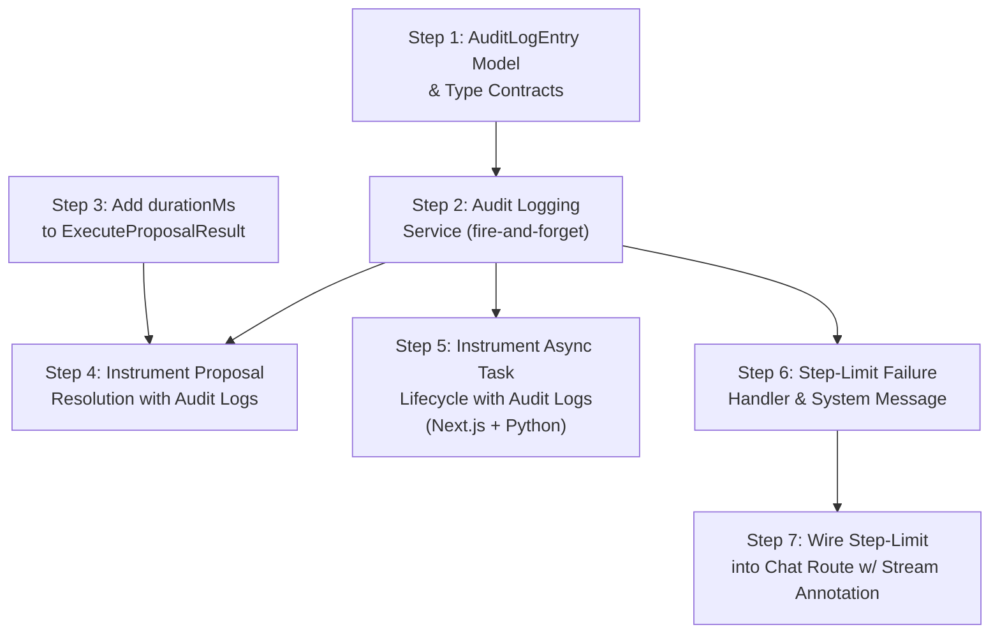

# Phase 5: Telemetry, Observability, and Audit Logging — Implementation Steps

**Objective:** Create an immutable paper trail of every action the AI proposes and the user approves, instrument the orchestrator with step-limit failure logging, and surface telemetry for solver performance — a hard requirement for enterprise workforce management software.

**Prerequisites:** Phases 1–4 are fully implemented. The following outputs are importable and functional:
- `src/lib/ai/orchestrator/build-context.ts` — `buildOrchestratorContext()`
- `src/lib/ai/orchestrator/execute-proposal.ts` — `executeProposal()`
- `src/lib/ai/orchestrator/proposal-handler.ts` — `isProposalResult()`, `toClientSafeProposal()`, `persistProposal()`
- `src/lib/ai/orchestrator/async-system-message.ts` — `buildAsyncTaskSystemMessage()`
- `src/app/api/ai/chat/route.ts` — streaming chat endpoint with `maxSteps`
- `src/app/api/ai/proposals/[proposalId]/resolve/route.ts` — approval/denial endpoint
- `src/server/services/async-task.service.ts` — `AsyncTaskService.dispatchScheduleGeneration()`
- `src/server/models/AsyncTask.ts` — async task model
- `src/server/models/Conversation.ts` — conversation persistence
- `src/hooks/use-ai-chat.ts` — `useAIChat()` with `resolveProposal()` and loop-back mechanism

> [!NOTE]
> These steps produce the **audit, telemetry, and resilience layer** that sits beneath the existing orchestrator. Nothing in this phase changes user-facing behavior — it instruments, logs, and hardens the existing Phases 1–4 infrastructure.

---

## Step 1: Define the `AuditLogEntry` Mongoose Model and Type Contracts

### 1. The Objective & Scope Boundary (The "Stop" Rule)

**Goal:** Create the Mongoose model and TypeScript interfaces for the immutable AI audit log. Each entry records a single Write Tool execution event — who approved it, which tool, the exact payload, the conversation context, and the outcome.

**Boundary:** Do NOT build any logging middleware or integrate with the proposal execution flow. Do NOT build any query/search endpoints. Only define the data contract and the database model.

### 2. File Context & Target Architecture

**Files to Modify/Create:**
- `[NEW] src/types/audit-log.ts` — TypeScript interfaces for audit log entries
- `[NEW] src/server/models/AuditLog.ts` — Mongoose model for immutable audit trail

**Assumed Existing Files:**
- `src/types/conversation.ts` (Phase 3 — `StoredProposal`, `ProposalStatus`)
- `src/types/async-task.ts` (Phase 4 — `AsyncTaskType`)
- `mongoose` package

### 3. Data Contracts (Inputs & Outputs)

**Inputs Expected:**
```typescript
// In src/types/audit-log.ts

export type AuditAction =
  | "proposal_approved"     // User clicked Approve on a Confirmation Card
  | "proposal_denied"       // User clicked Deny
  | "proposal_stale"        // OCC check failed (data changed since card rendered)
  | "proposal_expired"      // Card expired before user acted
  | "execution_success"     // Write Tool mutation completed successfully
  | "execution_failed"      // Write Tool mutation threw an error
  | "async_task_dispatched"  // Async task (solver) was dispatched
  | "async_task_completed"  // Async task finished successfully
  | "async_task_failed"     // Async task failed or timed out
  | "step_limit_reached";   // Orchestrator hit maxSteps limit

export interface AuditLogEntryDocument {
  _id: string;

  /** The action that occurred */
  action: AuditAction;

  /** Organization and location scoping */
  orgId: string;
  locationId: string;

  /** The user who triggered or approved the action */
  clerkUserId: string;

  /** The conversation this action originated from */
  conversationId: string;

  /** The proposal that was acted upon (if applicable) */
  proposalId?: string;
  /** The Write Tool that was invoked */
  toolName?: string;
  /** The exact JSON payload that was executed (immutable snapshot) */
  executedPayload?: Record<string, unknown>;
  /** The data version hash at time of execution (OCC reference) */
  dataVersion?: string;

  /** For async tasks: the task ID */
  asyncTaskId?: string;

  /** The outcome of the action */
  outcome: {
    success: boolean;
    /** Human-readable summary of what happened */
    summary: string;
    /** Error details if the action failed */
    error?: string;
    /** Duration in milliseconds (for execution timing) */
    durationMs?: number;
  };

  /** Additional metadata for debugging/compliance */
  metadata?: Record<string, unknown>;

  /** Immutable creation timestamp — no updatedAt on audit logs */
  createdAt: Date;
}
```

**Outputs Required:**
```typescript
// In src/server/models/AuditLog.ts
// Mongoose schema matching AuditLogEntryDocument
// Must have indexes on:
//   { orgId: 1, createdAt: -1 }            (org-scoped queries, newest first)
//   { orgId: 1, conversationId: 1 }        (find all audit events in a conversation)
//   { orgId: 1, clerkUserId: 1, createdAt: -1 }  (user activity history)
//   { orgId: 1, action: 1, createdAt: -1 }        (filter by action type)
//   { proposalId: 1 }                      (proposal → audit event lookup)
//
// CRITICAL: The schema must NOT have an updatedAt field.
//   Audit logs are APPEND-ONLY. Set timestamps: { createdAt: true, updatedAt: false }
//   in the Mongoose schema options.
```

### 4. Security & Error Handling Guardrails

**Resilience Rules:**
- The schema must use `timestamps: { createdAt: true, updatedAt: false }` — audit logs are immutable. No document may be updated after creation.
- The `executedPayload` is stored as Mongoose `Mixed` to accommodate any tool's payload shape, but note that this field may contain sensitive data (e.g., staff IDs, schedule parameters). It must never be returned directly to the frontend in queries — only to authenticated admin users (Phase 5 does not build any query endpoints, but this rule must be documented for future phases).
- The `createdAt` must be set server-side (not client-provided) to prevent timestamp spoofing.
- All queries against this collection must be scoped by `orgId` — a user must never see another organization's audit trail.

**Required Error Messages:**
- None at this step (model only).

### 5. The "Definition of Done" (Verification)

**Testing Requirement:**
```typescript
// /tmp/test-audit-model.ts
import AuditLog from "@/server/models/AuditLog";

const entry = new AuditLog({
  action: "proposal_approved",
  orgId: "org_1",
  locationId: "loc_1",
  clerkUserId: "user_1",
  conversationId: "conv_1",
  proposalId: "prop_1",
  toolName: "propose_shift_swap",
  executedPayload: { shiftId: "shift_1", targetStaffId: "staff_2" },
  dataVersion: "2026-03-16T01:00:00.000Z",
  outcome: {
    success: true,
    summary: "Shift reassigned from Alice to Bob for Monday morning grill.",
    durationMs: 45,
  },
});

await entry.validate(); // Should not throw
console.assert(entry.action === "proposal_approved");
console.assert(entry.createdAt !== undefined);
console.log("✅ AuditLog model validates correctly");

// Verify immutability: the model should NOT have an updatedAt field
const schemaObj = AuditLog.schema.obj;
console.assert(!("updatedAt" in entry.toObject()), "No updatedAt on audit logs");
console.log("✅ AuditLog is immutable (no updatedAt)");
```

Build check: `npx tsc --noEmit`

---

## Step 2: Build the Audit Logging Service

### 1. The Objective & Scope Boundary (The "Stop" Rule)

**Goal:** Create a centralized `AuditLogService` with dedicated logging methods for each audit action type. Each method accepts the minimum required arguments, constructs the `AuditLogEntryDocument`, and persists it. All methods are **fire-and-forget** — they never throw and never block the calling flow.

**Boundary:** Do NOT integrate the service into the proposal execution flow yet (that is Step 4). Do NOT build any query/retrieval methods (those are a future concern). Only build the write methods.

### 2. File Context & Target Architecture

**Files to Modify/Create:**
- `[NEW] src/server/services/audit-log.service.ts` — the centralized audit logging service

**Assumed Existing Files:**
- `src/server/models/AuditLog.ts` (Step 1)
- `src/types/audit-log.ts` (Step 1 — `AuditAction`, `AuditLogEntryDocument`)
- `src/types/conversation.ts` (Phase 3 — `StoredProposal`)

### 3. Data Contracts (Inputs & Outputs)

**Inputs Expected:**
```typescript
// In src/server/services/audit-log.service.ts

/** Shared context for all audit log methods */
export interface AuditContext {
  orgId: string;
  locationId: string;
  clerkUserId: string;
  conversationId: string;
}

/** Input for logging a proposal resolution (approve/deny) */
export interface LogProposalResolutionInput extends AuditContext {
  proposalId: string;
  toolName: string;
  action: "approved" | "denied";
  /** The full payload that was executed (only present on approval) */
  executedPayload?: Record<string, unknown>;
  dataVersion?: string;
}

/** Input for logging the outcome of a Write Tool execution */
export interface LogExecutionOutcomeInput extends AuditContext {
  proposalId: string;
  toolName: string;
  executedPayload: Record<string, unknown>;
  success: boolean;
  summary: string;
  error?: string;
  durationMs: number;
}

/** Input for logging OCC stale data rejection */
export interface LogStaleRejectionInput extends AuditContext {
  proposalId: string;
  toolName: string;
  dataVersion: string;
  staleReason: string;
}

/** Input for logging async task lifecycle events */
export interface LogAsyncTaskEventInput extends AuditContext {
  asyncTaskId: string;
  action: "async_task_dispatched" | "async_task_completed" | "async_task_failed";
  toolName?: string;
  summary: string;
  error?: string;
  durationMs?: number;
  metadata?: Record<string, unknown>;
}

/** Input for logging step-limit failures */
export interface LogStepLimitInput extends AuditContext {
  /** The number of steps that were executed before hitting the limit */
  stepsExecuted: number;
  /** The maximum allowed steps */
  maxSteps: number;
  /** Summary of what tools were called in the loop */
  toolCallHistory: string[];
}
```

**Outputs Required:**
```typescript
export const AuditLogService = {
  /**
   * Log a proposal resolution (approve or deny).
   * Fire-and-forget — never throws.
   */
  async logProposalResolution(input: LogProposalResolutionInput): Promise<void>,

  /**
   * Log the outcome of a Write Tool execution (success or failure).
   * Fire-and-forget — never throws.
   */
  async logExecutionOutcome(input: LogExecutionOutcomeInput): Promise<void>,

  /**
   * Log an OCC stale data rejection.
   * Fire-and-forget — never throws.
   */
  async logStaleRejection(input: LogStaleRejectionInput): Promise<void>,

  /**
   * Log an async task lifecycle event (dispatched, completed, failed).
   * Fire-and-forget — never throws.
   */
  async logAsyncTaskEvent(input: LogAsyncTaskEventInput): Promise<void>,

  /**
   * Log a step-limit failure (orchestrator hit maxSteps).
   * Fire-and-forget — never throws.
   */
  async logStepLimitReached(input: LogStepLimitInput): Promise<void>,
};
```

### 4. Security & Error Handling Guardrails

**Resilience Rules:**
- **Every method must wrap its entire body in a `try/catch`.** If the database write fails, log a `console.error` but NEVER throw. Audit logging must never crash the calling flow — it is observability, not business logic.
- All methods must validate that required fields (`orgId`, `clerkUserId`, `conversationId`) are non-empty strings before attempting to write. If any are missing, log a warning and return silently.
- The `executedPayload` must be deep-cloned before persisting to prevent mutation by the caller after logging.
- Each method must set `createdAt` automatically via the Mongoose schema — callers must not provide it.

**Required Error Messages (console only — never user-facing):**
- `"[AuditLog] Failed to log '${action}': ${error}"` — when any audit log write fails
- `"[AuditLog] Skipping log for '${action}': missing required field '${field}'"` — when a required field is empty

### 5. The "Definition of Done" (Verification)

**Testing Requirement:**
```typescript
// /tmp/test-audit-service.ts
import { AuditLogService } from "@/server/services/audit-log.service";
import AuditLog from "@/server/models/AuditLog";

const ctx = {
  orgId: "org_test",
  locationId: "loc_test",
  clerkUserId: "user_test",
  conversationId: "conv_test",
};

// Test proposal approval log
await AuditLogService.logProposalResolution({
  ...ctx,
  proposalId: "prop_1",
  toolName: "propose_shift_swap",
  action: "approved",
  executedPayload: { shiftId: "s1", targetStaffId: "s2" },
  dataVersion: "2026-03-16T01:00:00Z",
});

const approvalLog = await AuditLog.findOne({
  proposalId: "prop_1",
  action: "proposal_approved",
});
console.assert(approvalLog !== null, "Approval should be logged");
console.assert(approvalLog!.outcome.success === true);

// Test execution outcome log
await AuditLogService.logExecutionOutcome({
  ...ctx,
  proposalId: "prop_1",
  toolName: "propose_shift_swap",
  executedPayload: { shiftId: "s1", targetStaffId: "s2" },
  success: true,
  summary: "Shift reassigned successfully.",
  durationMs: 42,
});

const execLog = await AuditLog.findOne({
  proposalId: "prop_1",
  action: "execution_success",
});
console.assert(execLog !== null, "Execution should be logged");
console.assert(execLog!.outcome.durationMs === 42);

// Test step-limit log
await AuditLogService.logStepLimitReached({
  ...ctx,
  stepsExecuted: 5,
  maxSteps: 5,
  toolCallHistory: ["get_schedule_health", "get_shift_roster", "get_staff_summary", "get_schedule_health", "get_shift_roster"],
});

const stepLog = await AuditLog.findOne({
  conversationId: "conv_test",
  action: "step_limit_reached",
});
console.assert(stepLog !== null, "Step limit should be logged");

// Test fire-and-forget resilience: missing required field should NOT throw
await AuditLogService.logProposalResolution({
  orgId: "",  // Invalid — but should not throw
  locationId: "loc_test",
  clerkUserId: "user_test",
  conversationId: "conv_test",
  proposalId: "prop_bad",
  toolName: "propose_shift_swap",
  action: "approved",
});
console.log("✅ AuditLogService did not throw on invalid input");

// Cleanup test data
await AuditLog.deleteMany({ orgId: "org_test" });
console.log("✅ All AuditLogService assertions passed");
```

Build check: `npx tsc --noEmit`

---

## Step 3: Add the `ExecuteProposalResult.durationMs` Field and Timing to the Dispatcher

### 1. The Objective & Scope Boundary (The "Stop" Rule)

**Goal:** Extend the `ExecuteProposalResult` interface to include a `durationMs` field, and wrap the execution logic in `executeProposal()` with `performance.now()` timing. This is required by Step 4's audit logging (which needs the execution duration) and must be built first.

**Boundary:** Do NOT add any audit logging calls here (that is Step 4). Do NOT change the execution logic. Only add the timing wrapper and the new field.

### 2. File Context & Target Architecture

**Files to Modify/Create:**
- `src/lib/ai/orchestrator/execute-proposal.ts` — add `durationMs` to `ExecuteProposalResult` and wrap execution with `performance.now()`

**Assumed Existing Files:**
- `src/lib/ai/orchestrator/execute-proposal.ts` (Phase 3 Step 6, extended in Phase 4 Step 6)

### 3. Data Contracts (Inputs & Outputs)

**Inputs Expected:**
No new inputs.

**Outputs Required:**
```typescript
// Extend the existing ExecuteProposalResult:
export interface ExecuteProposalResult {
  success: boolean;
  executionSummary: string;
  data?: unknown;
  error?: string;
  asyncTaskId?: string;      // Existing from Phase 4
  asyncDeadline?: string;    // Existing from Phase 4
  /** NEW: Execution duration in milliseconds */
  durationMs: number;
}
```

Implementation:
```typescript
export async function executeProposal(
  input: ExecuteProposalInput
): Promise<ExecuteProposalResult> {
  const startTime = performance.now();
  try {
    // ... existing dispatch logic (unchanged) ...
    const durationMs = Math.round(performance.now() - startTime);
    return { ...result, durationMs };
  } catch (error) {
    const durationMs = Math.round(performance.now() - startTime);
    return {
      success: false,
      executionSummary: "",
      error: error instanceof Error ? error.message : "Unknown error",
      durationMs,
    };
  }
}
```

### 4. Security & Error Handling Guardrails

**Resilience Rules:**
- `durationMs` must be set in both success and error paths — `performance.now()` is called in a `finally`-like pattern.
- `durationMs` must be rounded to the nearest integer (no floating-point precision noise in audit logs).
- This is a backward-compatible additive change — existing callers that ignore `durationMs` will not break.

**Required Error Messages:**
- None.

### 5. The "Definition of Done" (Verification)

**Testing Requirement:**
```typescript
// /tmp/test-duration.ts
import { executeProposal } from "@/lib/ai/orchestrator/execute-proposal";

const result = await executeProposal({
  proposal: {
    proposalId: "test-timing",
    toolName: "propose_shift_swap",
    description: "Test timing",
    payload: { shiftId: "<SHIFT_ID>", targetStaffId: "<STAFF_ID>" },
    dataVersion: "x",
    status: "pending",
    createdAt: new Date(),
    resolvedAt: null,
    resolvedBy: null,
  },
  orgId: "<ORG_ID>",
  locationId: "<LOC_ID>",
  clerkUserId: "user_test",
});

console.assert(typeof result.durationMs === "number", "durationMs must be a number");
console.assert(result.durationMs >= 0, "durationMs must be non-negative");
console.assert(Number.isInteger(result.durationMs), "durationMs must be an integer");
console.log(`✅ Execution took ${result.durationMs}ms`);
```

Build check: `npx tsc --noEmit`

---

## Step 4: Instrument the Proposal Resolution Endpoint with Audit Logging

### 1. The Objective & Scope Boundary (The "Stop" Rule)

**Goal:** Wire the `AuditLogService` into the existing proposal resolution flow (`POST /api/ai/proposals/[proposalId]/resolve`). Log three audit events: (1) proposal approved/denied, (2) execution success/failure (on approval), and (3) stale data rejection (on OCC failure). All logging is fire-and-forget.

**Boundary:** Do NOT modify the execution logic itself. Do NOT change the API response shape. Do NOT build any new endpoints. Only add `AuditLogService` calls at the appropriate points in the existing flow.

### 2. File Context & Target Architecture

**Files to Modify/Create:**
- `src/app/api/ai/proposals/[proposalId]/resolve/route.ts` — add audit log calls

**Assumed Existing Files:**
- `src/app/api/ai/proposals/[proposalId]/resolve/route.ts` (Phase 3 Step 5)
- `src/lib/ai/orchestrator/execute-proposal.ts` (Step 3 — now returns `durationMs`)
- `src/server/services/audit-log.service.ts` (Step 2)

### 3. Data Contracts (Inputs & Outputs)

**Inputs Expected:**
No new inputs. The existing proposal resolution endpoint already provides:
- `clerkUserId` from `auth()`
- `proposal` from the Conversation model (`StoredProposal`)
- The `orgId`, `locationId` from the conversation document
- The `conversationId` from the URL/conversation lookup

**Outputs Required:**
No changes to the API response. The logging is transparent to the caller.

The following audit events are emitted **within** the existing resolution flow:

| Event Point | Audit Action | Emitted After |
|---|---|---|
| User clicks Approve | `proposal_approved` | After the resolve API validates the proposal but before executing |
| User clicks Deny | `proposal_denied` | After marking the proposal as denied |
| Execution succeeds | `execution_success` | After `executeProposal()` returns `{ success: true }` |
| Execution fails | `execution_failed` | After `executeProposal()` returns `{ success: false }` |
| OCC check fails | `proposal_stale` | After `findOneAndUpdate` returns null (atomic OCC failure) |

The `durationMs` field from `executeProposal()` (Step 3) is passed directly to `AuditLogService.logExecutionOutcome()`.

### 4. Security & Error Handling Guardrails

**Resilience Rules:**
- All `AuditLogService` calls must be `await`ed but wrapped in fire-and-forget semantics — use `AuditLogService.logX(...).catch(() => {})` pattern OR rely on the service's internal try/catch (built in Step 2). Either way, an audit log failure must never prevent the approval/denial from completing.
- The `executedPayload` logged must be the **exact** payload that was sent to the service layer — not a modified or partial version. This is the immutable record.
- The approval audit event (`proposal_approved`) should be logged BEFORE execution starts so that even if the process crashes mid-execution, there is a record that the user clicked approve. The execution outcome is logged separately.

**Required Error Messages:**
- None new user-facing. Console: `"[AuditLog] Audit logging failed for proposal '${proposalId}' — proceeding without audit trail"` — non-blocking.

### 5. The "Definition of Done" (Verification)

**Testing Requirement:**

Trigger the full approval flow and verify audit logs are created:
```bash
# 1. Send a chat message that triggers a Write Tool proposal
curl -X POST http://localhost:3000/api/ai/chat \
  -H "Content-Type: application/json" \
  -H "Authorization: Bearer <TOKEN>" \
  -d '{
    "message": "Swap the Monday morning grill shift from Alice to Bob",
    "viewportContext": {
      "locationId": "<LOC_ID>",
      "scheduleId": "<SCHED_ID>",
      "activeView": "schedule"
    }
  }'

# 2. Note the proposalId from the streamed tool invocation result

# 3. Approve the proposal
curl -X POST http://localhost:3000/api/ai/proposals/<PROPOSAL_ID>/resolve \
  -H "Content-Type: application/json" \
  -H "Authorization: Bearer <TOKEN>" \
  -d '{ "action": "approve" }'
```

Verify in MongoDB:
```javascript
// mongosh
db.auditlogs.find({ proposalId: "<PROPOSAL_ID>" }).sort({ createdAt: 1 }).toArray()

// Expected: 2 entries:
// 1. { action: "proposal_approved", ... }
// 2. { action: "execution_success", outcome: { durationMs: ..., summary: ... } }
```

Also test the OCC failure path: modify the shift's `updatedAt` in the database, then attempt to approve — verify a `proposal_stale` audit entry is created:
```javascript
db.auditlogs.find({ action: "proposal_stale" }).toArray()
// Expected: 1 entry with staleReason in outcome.summary
```

Build check: `npx tsc --noEmit`

---

## Step 5: Instrument the Async Task Lifecycle with Audit Logging

### 1. The Objective & Scope Boundary (The "Stop" Rule)

**Goal:** Wire `AuditLogService.logAsyncTaskEvent()` into the async task lifecycle. Log three events: (1) when a schedule generation task is dispatched (logged by Next.js), (2) when it completes successfully (logged by Python), and (3) when it fails or times out (logged by Python). The dispatch event is logged by the Next.js dispatcher service. The completion/failure events are logged **by the Python solver microservice** immediately after it updates the `AsyncTask` document to a terminal state.

**Boundary:** Do NOT build any new Next.js endpoints for this step. Do NOT modify the Next.js task status polling endpoint for audit logging. Only add the dispatch audit call to the Next.js dispatcher service and the terminal state audit logging to the Python solver's background task function.

> [!CAUTION]
> **The "Closed Laptop" Problem:** The original plan relied on the Next.js frontend polling endpoint to write the `async_task_completed` audit log when it detected the task had finished. This is fundamentally broken: if a manager clicks "Generate Schedule" and then closes their laptop, the Python solver still finishes and updates MongoDB, but the completion audit log would never be written because the frontend stopped polling. By having Python write the audit log directly (it already has `pymongo` access from Phase 4 Step 2), the audit trail is guaranteed regardless of what the user's browser is doing.

### 2. File Context & Target Architecture

**Files to Modify/Create:**
- `src/server/services/async-task.service.ts` — add audit log call in `dispatchScheduleGeneration()`
- `solver/main.py` — add audit log write to `_solve_and_update_task()` after updating the `AsyncTask` to a terminal state

**Assumed Existing Files:**
- `src/server/services/async-task.service.ts` (Phase 4 Step 3)
- `solver/main.py` (Phase 4 Step 2 — has `_solve_and_update_task()` with `pymongo` access)
- `src/server/services/audit-log.service.ts` (Step 2)
- `src/server/models/AuditLog.ts` (Step 1)

### 3. Data Contracts (Inputs & Outputs)

**Inputs Expected:**
No new inputs. The existing async task service and Python solver already have all the required data available:
- `orgId`, `locationId`, `clerkUserId`, `conversationId` from the `AsyncTask` document
- `taskId` from the async task
- Success/failure status and timing from the task result

**Outputs Required:**
No changes to existing API responses. The logging is transparent.

| Event Point | Audit Action | Data Source | Written By |
|---|---|---|---|
| `dispatchScheduleGeneration()` succeeds | `async_task_dispatched` | The dispatch result (taskId, deadline) | **Next.js** (existing service) |
| `_solve_and_update_task()` completes with OPTIMAL/FEASIBLE | `async_task_completed` | Solver result (status, cost, time) | **Python** (pymongo insert into `auditlogs`) |
| `_solve_and_update_task()` returns INFEASIBLE | `async_task_failed` | Solver status | **Python** (pymongo insert into `auditlogs`) |
| `_solve_and_update_task()` throws exception | `async_task_failed` | Exception details | **Python** (pymongo insert into `auditlogs`) |

**Python audit log write (in `_solve_and_update_task()`):**

The Python background task already connects to MongoDB via `pymongo` to update the `AsyncTask` document. After the terminal status update, it must also insert a document into the `auditlogs` collection:

```python
# In solver/main.py — inside _solve_and_update_task(), after updating AsyncTask

def _write_audit_log(
    db,
    task_doc: dict,
    action: str,
    success: bool,
    summary: str,
    error: str | None = None,
    duration_ms: int | None = None,
    metadata: dict | None = None,
):
    """Insert an audit log entry directly into MongoDB.
    Fire-and-forget — exceptions are caught and logged."""
    try:
        db.auditlogs.insert_one({
            "action": action,
            "orgId": task_doc["orgId"],
            "locationId": task_doc["locationId"],
            "clerkUserId": task_doc["clerkUserId"],
            "conversationId": task_doc["conversationId"],
            "asyncTaskId": str(task_doc["_id"]),
            "outcome": {
                "success": success,
                "summary": summary,
                "error": error,
                "durationMs": duration_ms,
            },
            "metadata": metadata,
            "createdAt": datetime.utcnow(),
        })
    except Exception as e:
        print(f"[AuditLog] Failed to write audit log: {e}")
```

Called in the terminal state branches:
```python
# On OPTIMAL/FEASIBLE:
_write_audit_log(
    db, task_doc,
    action="async_task_completed",
    success=True,
    summary=f"Schedule generation completed: {solver_status}, {total_shifts} shifts, ${total_cost_cents / 100:.2f} cost.",
    duration_ms=solve_time_ms,
    metadata={
        "solverStatus": solver_status,
        "totalCostCents": total_cost_cents,
        "solveTimeMs": solve_time_ms,
        "totalShiftsGenerated": total_shifts,
        "fallbackRatesUsed": fallback_rates_used,
    },
)

# On INFEASIBLE:
_write_audit_log(
    db, task_doc,
    action="async_task_failed",
    success=False,
    summary="Solver returned INFEASIBLE: No solution exists for the given constraints.",
    duration_ms=solve_time_ms,
    metadata={"solverStatus": "INFEASIBLE"},
)

# On exception:
_write_audit_log(
    db, task_doc,
    action="async_task_failed",
    success=False,
    summary=f"Solver execution error: {str(e)}",
    error=str(e),
    duration_ms=solve_time_ms if solve_time_ms else None,
)
```

**Next.js dispatch audit logging remains unchanged** — it is called in `AsyncTaskService.dispatchScheduleGeneration()` after the task is created and the solver accepts the job.

### 4. Security & Error Handling Guardrails

**Resilience Rules:**
- The Python `_write_audit_log()` function must wrap its entire body in a `try/except Exception`. If the audit log insert fails (e.g., MongoDB connection dropped between the task update and the audit write), it must `print()` the error but NEVER re-raise. The task status update (which already succeeded) must not be rolled back.
- The Python function must read the `orgId`, `locationId`, `clerkUserId`, and `conversationId` from the `AsyncTask` document that was just updated — these fields were stored when Next.js created the task in Phase 4 Step 3.
- The `createdAt` in the Python insert must use `datetime.utcnow()` — not any client-provided timestamp.
- The `auditlogs` collection name must match the Mongoose model's collection name exactly (lowercase, pluralized by Mongoose convention).
- The Next.js dispatch audit log call must remain fire-and-forget. If it fails, the dispatch must still succeed.
- **Deduplication is no longer needed** on the polling side — the completion audit log is now written exactly once by Python, at the source. The `auditLogged` flag from the original plan is unnecessary and should NOT be added to the `AsyncTask` model.

**Required Error Messages:**
- Python console: `"[AuditLog] Failed to write audit log: ${error}"` — non-blocking.
- Next.js console: `"[AuditLog] Failed to log async task dispatch for task '${taskId}': ${error}"` — non-blocking.

### 5. The "Definition of Done" (Verification)

**Testing Requirement:**

Trigger a full async schedule generation flow:
1. Send a chat message requesting schedule generation.
2. Approve the proposal → solver dispatches async.
3. Wait for completion (do NOT poll — to prove the audit log is written by Python).

Verify in MongoDB:
```javascript
// mongosh
db.auditlogs.find({ asyncTaskId: "<TASK_ID>" }).sort({ createdAt: 1 }).toArray()

// Expected: 2 entries:
// 1. { action: "async_task_dispatched", outcome: { summary: "Schedule generation dispatched..." } }
// 2. { action: "async_task_completed", outcome: { summary: "...", durationMs: ... }, metadata: { solverStatus: "OPTIMAL", ... } }
```

"Closed laptop" test: dispatch a solve, immediately kill the Next.js dev server (simulating laptop close), wait for the solver to finish, restart Next.js:
```javascript
// After restarting, check MongoDB for the audit log
db.auditlogs.find({ asyncTaskId: "<TASK_ID>", action: "async_task_completed" }).count()
// Expected: 1 (Python wrote it even though Next.js was down)
```

Also verify the existing sync endpoint still works:
```bash
curl -X POST http://localhost:8000/solve \
  -H "Content-Type: application/json" \
  -d '{"days": [], "maxHoursLookup": {}, "minHoursLookup": {}, "existingWeekHours": {}}'
# Expected: Synchronous SolveResponse (unchanged)
```

Build check: `npx tsc --noEmit` (for Next.js changes)

---

## Step 6: Build the Step-Limit Failure Handler and System Message

### 1. The Objective & Scope Boundary (The "Stop" Rule)

**Goal:** Create the step-limit failure handler that is invoked when the AI SDK's `maxSteps` limit is reached during orchestration. The handler: (1) logs a `step_limit_reached` audit entry with the full tool call history, and (2) returns a system instruction string that forces the LLM to apologize and ask the user for clarification, preventing a silent failure.

**Boundary:** Do NOT modify the chat route itself yet (that is Step 7). Do NOT change the `maxSteps` value. Only build the handler function and the system message template.

### 2. File Context & Target Architecture

**Files to Modify/Create:**
- `[NEW] src/lib/ai/orchestrator/step-limit-handler.ts` — the step-limit failure handler

**Assumed Existing Files:**
- `src/server/services/audit-log.service.ts` (Step 2 — `AuditLogService.logStepLimitReached()`)
- `src/types/audit-log.ts` (Step 1)

### 3. Data Contracts (Inputs & Outputs)

**Inputs Expected:**
```typescript
// In src/lib/ai/orchestrator/step-limit-handler.ts

export interface StepLimitContext {
  /** Organization/location/user context for audit logging */
  orgId: string;
  locationId: string;
  clerkUserId: string;
  conversationId: string;
  /** The tool calls that were made during the conversation turn */
  toolCallHistory: {
    toolName: string;
    /** Whether the call succeeded */
    success: boolean;
  }[];
  /** The maximum steps allowed */
  maxSteps: number;
}
```

**Outputs Required:**
```typescript
export interface StepLimitResult {
  /** Whether a step-limit condition was detected */
  limitReached: boolean;
  /**
   * The system message to persist to the conversation for the next turn.
   * This forces the LLM to apologize on the next request.
   *
   * Example:
   * "[SYSTEM: STEP LIMIT REACHED. You have made 5 consecutive tool calls
   *  without producing a final response. This usually means you are stuck in a
   *  loop or are unable to find the information needed. Tools called:
   *  get_schedule_health → get_shift_roster → get_schedule_health →
   *  get_shift_roster → get_schedule_health.
   *  You MUST now stop calling tools and apologize to the user. Explain that
   *  you were unable to fully complete the request and ask them to provide more
   *  specific details or break their request into smaller parts.]"
   */
  systemMessage: string;
  /**
   * A structured payload for the frontend data stream annotation.
   * This enables IMMEDIATE visual feedback in the current stream,
   * rather than waiting for the next user message.
   */
  streamAnnotation: {
    type: "error";
    code: "STEP_LIMIT_REACHED";
    message: string;
  };
}

/**
 * Handle a step-limit breach: log the event and build both the
 * persistent system message and the immediate stream annotation.
 * This function is called when the AI SDK reports that maxSteps was reached.
 */
export async function handleStepLimitReached(
  context: StepLimitContext
): Promise<StepLimitResult>;

/**
 * Check if a set of tool invocations shows signs of a loop pattern.
 * A loop is detected when the same tool is called >= 3 times in a row or
 * the same two-tool alternating pattern repeats >= 2 times.
 * This is a diagnostic utility — it enriches the audit log entry, not a blocker.
 */
export function detectLoopPattern(
  toolCallHistory: { toolName: string }[]
): { loopDetected: boolean; pattern: string };
```

### 4. Security & Error Handling Guardrails

**Resilience Rules:**
- `handleStepLimitReached()` must never throw — even if the audit log write fails, it must return both the system message and the stream annotation so the user gets feedback.
- The system message must be deterministic and must always include the instruction to stop calling tools and apologize. The LLM must not be able to ignore this instruction (enforce with strong language: "You MUST now stop" / "Do NOT make any more tool calls").
- The `toolCallHistory` must be truncated to the last 10 entries before inclusion in the system message to avoid excessive token usage.
- If `toolCallHistory` is empty (unlikely edge case), the system message and stream annotation should still be generated with a generic apology instruction.
- The `streamAnnotation.message` must be a user-friendly string (e.g., "I'm having trouble pulling all that information together at once. Could you break that request into smaller parts?") — NOT a technical error message.

**Required Error Messages:**
- `streamAnnotation.message`: `"I'm having trouble completing your request in one go. Could you try breaking it into smaller, more specific questions?"` — user-facing, displayed immediately in the chat UI.
- System message (persisted, for LLM on next turn):
  ```
  "[SYSTEM: STEP LIMIT REACHED. You have made ${stepsExecuted} consecutive tool calls
   without producing a final response. Tools called: ${toolNames}.
   ${loopPatternNote}
   You MUST now stop calling tools and respond to the user directly. Apologize that
   you were unable to fully complete their request. Suggest they provide more
   specific details or break their request into smaller parts so you can help more
   effectively.]"
  ```
- Console: `"[StepLimit] Step limit reached in conversation '${conversationId}': ${stepsExecuted}/${maxSteps} steps"` — always logged.

### 5. The "Definition of Done" (Verification)

**Testing Requirement:**
```typescript
// /tmp/test-step-limit.ts
import { handleStepLimitReached, detectLoopPattern } from "@/lib/ai/orchestrator/step-limit-handler";

// Test: basic step-limit handling
const result = await handleStepLimitReached({
  orgId: "org_test",
  locationId: "loc_test",
  clerkUserId: "user_test",
  conversationId: "conv_test",
  toolCallHistory: [
    { toolName: "get_schedule_health", success: true },
    { toolName: "get_shift_roster", success: true },
    { toolName: "get_schedule_health", success: true },
    { toolName: "get_shift_roster", success: true },
    { toolName: "get_schedule_health", success: true },
  ],
  maxSteps: 5,
});

console.assert(result.limitReached === true);
console.assert(result.systemMessage.includes("[SYSTEM:"));
console.assert(result.systemMessage.includes("STEP LIMIT"));
console.assert(result.systemMessage.includes("MUST"));
console.assert(result.systemMessage.includes("apologize") || result.systemMessage.includes("Apologize"));
console.assert(result.systemMessage.includes("get_schedule_health"));

// NEW: verify stream annotation
console.assert(result.streamAnnotation.type === "error");
console.assert(result.streamAnnotation.code === "STEP_LIMIT_REACHED");
console.assert(typeof result.streamAnnotation.message === "string");
console.assert(result.streamAnnotation.message.length > 0);

// Test: loop pattern detection
const loop1 = detectLoopPattern([
  { toolName: "a" }, { toolName: "a" }, { toolName: "a" },
]);
console.assert(loop1.loopDetected === true, "3 same calls = loop");

const loop2 = detectLoopPattern([
  { toolName: "a" }, { toolName: "b" },
  { toolName: "a" }, { toolName: "b" },
]);
console.assert(loop2.loopDetected === true, "Alternating pattern = loop");

const noLoop = detectLoopPattern([
  { toolName: "a" }, { toolName: "b" }, { toolName: "c" },
]);
console.assert(noLoop.loopDetected === false, "No repeating pattern");

// Test: empty history edge case
const emptyResult = await handleStepLimitReached({
  orgId: "org_test",
  locationId: "loc_test",
  clerkUserId: "user_test",
  conversationId: "conv_test",
  toolCallHistory: [],
  maxSteps: 5,
});
console.assert(emptyResult.systemMessage.includes("[SYSTEM:"), "Still generates system message");
console.assert(emptyResult.streamAnnotation.code === "STEP_LIMIT_REACHED", "Still generates annotation");

console.log("✅ All step-limit handler assertions passed");
```

Build check: `npx tsc --noEmit`

---

## Step 7: Wire the Step-Limit Handler into the Chat Route with Immediate Frontend Feedback

### 1. The Objective & Scope Boundary (The "Stop" Rule)

**Goal:** Integrate the step-limit handler (Step 6) into the `POST /api/ai/chat` route with a **dual delivery mechanism**: (1) push a data stream annotation to the frontend **during the current stream** so the user sees immediate feedback, and (2) persist the system message to the conversation so the LLM apologizes gracefully on the next turn. This prevents the "silent dead stream" UX problem.

**Boundary:** Do NOT change the `maxSteps` constant. Only add the step-limit detection, the data stream annotation, and the system message persistence in the chat route.

> [!CAUTION]
> **Why both annotation AND persistence?** The data stream annotation solves the immediate UX problem: the user sees "I'm having trouble completing your request..." in real-time, not a dead stream. The persisted system message solves the LLM awareness problem: when the user sends a follow-up message, the LLM knows it hit a limit and can apologize + suggest alternatives. Without the annotation, the user stares at a dead stream. Without the persistence, the LLM doesn't know it failed and may try the same loop again.

### 2. File Context & Target Architecture

**Files to Modify/Create:**
- `src/app/api/ai/chat/route.ts` — switch from `streamText().toDataStreamResponse()` to `createDataStream()` wrapper, add step-limit detection and annotation
- `src/hooks/use-ai-chat.ts` — add handler for `STEP_LIMIT_REACHED` data stream annotations

**Assumed Existing Files:**
- `src/app/api/ai/chat/route.ts` (Phase 3 Step 2, extended in Phase 3 Step 3)
- `src/lib/ai/orchestrator/step-limit-handler.ts` (Step 6)
- `src/server/models/Conversation.ts` (Phase 3 Step 1)
- `src/hooks/use-ai-chat.ts` (Phase 3 Step 7)

### 3. Data Contracts (Inputs & Outputs)

**Inputs Expected:**

The chat route must switch from `streamText().toDataStreamResponse()` to using `createDataStream()` so it can append custom data annotations after the stream completes. The step-limit detection logic:

```typescript
// In the chat route:
import { createDataStream } from "ai";

// Instead of:
//   return result.toDataStreamResponse();
//
// Use:
return createDataStream({
  execute: async (dataStream) => {
    // Merge the streamText result into the data stream
    const result = streamText({
      model: openai("gpt-4o"),
      system: systemPrompt,
      messages: conversationHistory,
      tools: aiSdkTools,
      maxSteps: MAX_STEPS,
      onFinish: async ({ steps }) => {
        const lastStep = steps[steps.length - 1];
        const hitStepLimit =
          steps.length >= MAX_STEPS &&
          lastStep?.finishReason === "tool-calls";

        if (hitStepLimit) {
          const toolCallHistory = steps
            .flatMap(step => step.toolCalls ?? [])
            .map(tc => ({ toolName: tc.toolName, success: true }));

          const { systemMessage, streamAnnotation } =
            await handleStepLimitReached({
              orgId, locationId, clerkUserId, conversationId,
              toolCallHistory, maxSteps: MAX_STEPS,
            });

          // 1. Push annotation to the CURRENT stream → immediate UI feedback
          dataStream.writeMessageAnnotation(streamAnnotation);

          // 2. Persist system message for the NEXT turn → LLM awareness
          await Conversation.findByIdAndUpdate(conversationId, {
            $push: {
              messages: {
                role: "system",
                content: systemMessage,
                timestamp: new Date(),
              },
            },
          }).catch(err =>
            console.error(`[ChatRoute] Failed to persist step-limit message: ${err}`)
          );
        }
      },
    });

    result.mergeIntoDataStream(dataStream);
  },
}).toResponse();
```

**Frontend handling (in `useAIChat` hook):**

```typescript
// In src/hooks/use-ai-chat.ts
// The useChat hook provides onDataStreamAnnotation callback:

const { messages, append, ... } = useChat({
  api: "/api/ai/chat",
  // ... existing config ...
  onDataStreamAnnotation: (annotation) => {
    if (
      typeof annotation === "object" &&
      annotation !== null &&
      "type" in annotation &&
      annotation.type === "error" &&
      "code" in annotation &&
      annotation.code === "STEP_LIMIT_REACHED"
    ) {
      // Render a local apology message immediately in the chat UI
      setStepLimitError(annotation.message as string);
    }
  },
});
```

The `stepLimitError` state drives a hardcoded error message card in the chat UI (rendered by the `ChatShell` component), displaying the user-friendly apology immediately — no need to wait for the next message round-trip.

**Outputs Required:**
- The streaming response now includes a `messageAnnotation` with the step-limit error when triggered.
- The conversation gets a persisted system message for the next turn.
- The frontend displays the apology immediately in the current chat view.

### 4. Security & Error Handling Guardrails

**Resilience Rules:**
- The step-limit detection must only fire if BOTH conditions are true: (1) all `maxSteps` were consumed AND (2) the last step's `finishReason` is `"tool-calls"` (meaning the LLM wanted to continue but was stopped). If the LLM naturally finished with a text response within `maxSteps`, do NOT trigger the handler.
- The `dataStream.writeMessageAnnotation()` call must happen before the stream ends. If `onFinish` fires after the stream has already been flushed, the annotation will not reach the frontend. Verify that the `createDataStream` pattern keeps the stream open until `onFinish` completes.
- If `handleStepLimitReached()` throws (it shouldn't — it has internal try/catch), the chat response must still complete normally. Wrap the entire step-limit block in a try/catch.
- The conversation persistence failure must be caught and logged — it should not crash the stream.
- The frontend must handle the annotation gracefully — if the annotation shape is unexpected (e.g., a future code sends a different format), ignore it silently.
- If the conversation ID is not available (new conversation), skip the persistence but still send the stream annotation.

**Required Error Messages:**
- Frontend UI: `"I'm having trouble completing your request in one go. Could you try breaking it into smaller, more specific questions?"` — rendered immediately in the chat as a local error card.
- Console: `"[ChatRoute] Step limit reached — annotation sent and system message persisted for conversation '${conversationId}'"` — informational.
- Console: `"[ChatRoute] Failed to persist step-limit system message: ${error}"` — non-blocking error.

### 5. The "Definition of Done" (Verification)

**Testing Requirement:**

Trigger the step limit by sending a message that forces the LLM into a tool-call loop. The easiest way is to temporarily set `MAX_STEPS = 2` and send a complex request:

```bash
# With MAX_STEPS temporarily set to 2 in the chat route:
curl -X POST http://localhost:3000/api/ai/chat \
  -H "Content-Type: application/json" \
  -H "Authorization: Bearer <TOKEN>" \
  -d '{
    "message": "Give me a complete summary of everything about next week — schedule health, shift roster, staff summary, and time off requests",
    "viewportContext": {
      "locationId": "<LOC_ID>",
      "scheduleId": "<SCHED_ID>",
      "activeView": "schedule"
    },
    "conversationId": "<CONV_ID>"
  }'
```

Verify:

1. **Immediate frontend feedback:** The streamed response includes a `messageAnnotation` with `{ type: "error", code: "STEP_LIMIT_REACHED", message: "..." }`. The chat UI renders the apology message immediately — the user does NOT see a dead stream.

2. **Persisted system message:** The conversation has a new system message containing `"STEP LIMIT REACHED"`:
```javascript
// mongosh
db.conversations.findOne({ _id: ObjectId("<CONV_ID>") }).messages
  .filter(m => m.role === "system" && m.content.includes("STEP LIMIT"))
  .length === 1
```

3. **Audit log entry:**
```javascript
db.auditlogs.findOne({ conversationId: "<CONV_ID>", action: "step_limit_reached" })
// Expected: { action: "step_limit_reached", metadata: { stepsExecuted: 2, maxSteps: 2, toolCallHistory: [...] } }
```

4. **Follow-up resilience:** Send a follow-up message in the same conversation — the LLM should apologize and ask for clarification rather than trying more tool calls (because the system message is in its context).

Reset `MAX_STEPS` to the production value (e.g., 5) after testing.

Build check: `npx tsc --noEmit`

---

## Summary: Step Dependency Graph



> [!IMPORTANT]
> **Steps 4, 5, and 6 can be implemented in parallel** once their respective dependencies are met. Steps 4 and 5 both depend on Step 2 (the audit service). Step 7 depends on Step 6. Step 3 is a small preparatory step that Step 4 depends on.

**Recommended implementation order:** Step 1 → Step 2 + Step 3 (parallel) → Step 4 + Step 5 + Step 6 (parallel) → Step 7

**Key architectural decisions in this phase:**
- **Append-only audit logs** (Steps 1, 2): Audit log entries are immutable — no `updatedAt`, no document modification after creation. This is a compliance requirement for workforce management software.
- **Fire-and-forget logging** (Steps 2–5, 7): All audit writes are best-effort. A database failure in the audit collection must never crash a user-facing flow (proposal approval, schedule generation, chat response).
- **Python-side completion audit logging** (Step 5): The async task completion/failure audit log is written by the Python solver microservice directly via `pymongo`, not by the Next.js polling endpoint. This eliminates the "closed laptop" audit gap — the audit trail is guaranteed even if the user's browser disconnects after dispatching the solver. This is consistent with the Phase 4 architectural decision to let Python manage the full async task lifecycle.
- **Dual-delivery step-limit handling** (Steps 6, 7): The step-limit failure uses both (a) a real-time data stream annotation for immediate UI feedback and (b) a persisted system message for LLM awareness on the next turn. This eliminates the "silent dead stream" UX problem where the user would have to send another message just to trigger the apology.
- **Execution timing** (Step 3): By wrapping `executeProposal()` with `performance.now()`, the audit trail captures how long each mutation took — useful for performance monitoring and identifying slow service calls. Moved ahead of audit logging instrumentation to satisfy the dependency.

**Phase 5 completion criteria:**
1. Every `propose_*` tool approval/denial creates an audit trail entry with user ID, tool name, payload, timestamp, and outcome.
2. Every async task dispatch/completion/failure creates an audit trail entry with solver metrics — **even if the user's browser disconnects**.
3. Hitting `maxSteps` logs the event, sends an **immediate** error annotation to the frontend, and appends an LLM instruction to apologize.
4. No audit log failure can crash any user-facing flow.
