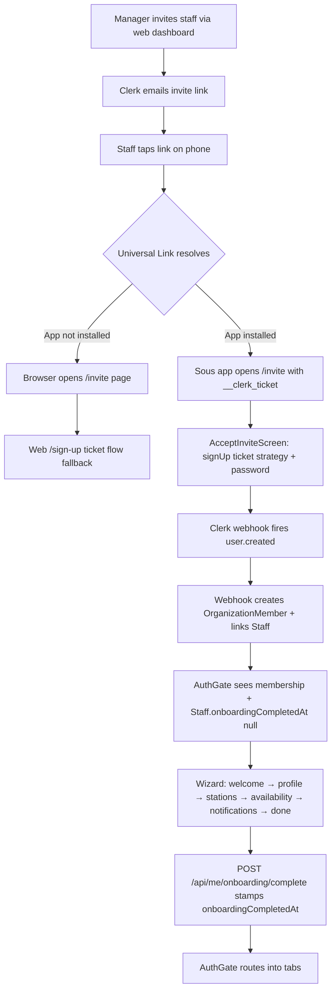

# 12 — Mobile Staff Onboarding

This document defines the canonical staff onboarding flow for the
mobile app, from the moment a manager taps "Invite" on the web
dashboard to the moment the staff member lands on the home tab with
a usable account.

For the owner-side onboarding flow that runs on the web, see
[11-onboarding.md](./11-onboarding.md). Staff and owners are separate
journeys: staff arrive via an invitation link; owners self-serve
through the web `/onboarding` wizard.

## Purpose

Move the entire staff-side account creation + first-time setup into
the native app so the invitee never has to bounce through a browser.
This eliminates the previous failure mode where a staff member would
set up their account in mobile Safari and then have to discover the
companion app separately.

## High-level flow



## Invite redirect URL

`inviteStaffToApp` and `inviteManager` in
`apps/web/src/server/actions/invitation.actions.ts` both set
`redirectUrl` to `${NEXT_PUBLIC_APP_URL}/invite`. Clerk appends
`?__clerk_ticket=<token>` to that URL when it sends the email.

The `/invite` URL is a Universal Link target on iOS and an App Link
target on Android — both platforms hijack the URL at the OS level
when the app is installed. Without the app, the request reaches the
Next.js server and renders a fallback page (mobile UA) or redirects
to the existing `/sign-up` ticket flow (desktop UA).

## Deep linking setup

Three pieces of glue make the Universal Link work end-to-end. Each is
required; missing any one degrades the flow to the web fallback.

1. **iOS — `apps/web/public/.well-known/apple-app-site-association`**
   declares which `paths` on the public domain belong to which native
   `appID` (`TEAMID.com.sous.mobile`). Apple validates this on first
   launch and caches the result.
2. **Android — `apps/web/public/.well-known/assetlinks.json`**
   declares the package name + SHA-256 signing cert fingerprint that
   Android verifies before allowing it to intercept URLs.
3. **`apps/mobile/app.json`** — registers the corresponding hostname
   under `ios.associatedDomains` and `android.intentFilters`. Both
   reference the same `APP_DOMAIN`.

Both `.well-known` files are served with `Content-Type:
application/json` via the `headers()` block in
`apps/web/next.config.ts`.

### Open configuration values

The committed files carry placeholders that must be filled before
shipping:

| File | Placeholder | Source |
|------|-------------|--------|
| `apple-app-site-association` | `TEAMID` | Apple Developer portal → "Membership" → "Team ID" |
| `assetlinks.json` | `<EAS SHA-256>` | `eas credentials` → Android → keystore SHA-256 |
| `app.json` (`associatedDomains`, `intentFilters.host`) | `sous.example.com` | match `NEXT_PUBLIC_APP_URL` |

## AuthGate routing

`apps/mobile/app/_layout.tsx` is the single source of truth for
post-auth routing. After the existing membership lookup it now also
reads `Staff.onboardingCompletedAt` via `useMyStaff` and picks one
of three terminal states:

```mermaid
flowchart LR
    A[isSignedIn?] -->|no| B[/auth/sign-in]
    A -->|invite route| C[passthrough to /invite]
    A -->|yes| D[membership loaded?]
    D -->|404| E[sign out with error]
    D -->|ok| F{Staff row?}
    F -->|null| G[/tabs]
    F -->|present| H{onboardingCompletedAt}
    H -->|null| I[/onboarding/welcome]
    H -->|set| G
```

The `/invite` route is exempt from the redirect logic so an
unauthenticated invitee can reach `AcceptInviteScreen` and consume
the ticket.

The wizard gate fires whenever `useMyStaff` returns a record with
`onboardingCompletedAt === null` — it is **not** filtered by
`membership.role`. That detail matters because the schedule
generator counts manager-level coverage as a hard constraint: any
location with manager-level shift slots will give those managers a
`Staff` row so the optimiser can assign them. Those managers (and
shift leads, and the occasional owner who works the line) must go
through the wizard the first time they sign in to the app, just
like a pure staff member. Only roles with **no** `Staff` row —
typically owners, plus managers who don't take shifts — skip the
wizard and land on the tabs directly.

## Wizard step contracts

Each step in `apps/mobile/app/(onboarding)/` is a thin route file
that mounts a screen from `features/onboarding/screens/`. No
wizard-level state store exists — every step writes its data to the
server directly so a mid-flow crash never loses progress.

| Step | Endpoint(s) hit | Required to advance |
|------|-----------------|---------------------|
| `welcome` | none | tap "Get started" |
| `profile` | Clerk `user.update` (name) + `PATCH /me/staff` (phone) | first name + last name + valid phone |
| `stations` | `PATCH /me/staff` (`preferredStations`) | always (empty selection allowed) |
| `availability` | `PATCH /me/staff` (`min/max hours`) + `PUT /me/availability` | `max >= min`; availability can be empty |
| `notifications` | `expo-notifications` permission + `PATCH /me/notifications/preferences` | tap "Enable" or "Not now" |
| `done` | `POST /me/onboarding/complete` | tap "Get started" |

## Completion contract

`POST /api/me/onboarding/complete` (handled by
`apps/web/src/app/api/me/onboarding/complete/route.ts`) is the
**only** code path that stamps `Staff.onboardingCompletedAt`.
Service-layer logic in `StaffService.markOnboardingComplete` is
idempotent — re-calling after the timestamp is set returns the
existing record unchanged, so a double-tap on the done screen or a
network retry never overwrites the original completion time.

The route returns the updated `StaffDTO`, which the mobile
`useCompleteOnboarding` hook writes straight into the
`useMyStaff` cache. AuthGate then sees the new value on the next
render and routes the user into the tabs.

## Resume logic

`apps/mobile/app/(onboarding)/_layout.tsx` inspects the user's
`Staff` record + availability rows on mount and routes to the
highest unfinished step **only when the user lands on `welcome`**.
Deeper deep-links are respected so a user can revisit earlier
steps from the per-screen back button.

Ordering of the "next unfinished step" check:

1. `phone` unset → stay on `welcome` (user advances manually).
2. Skills approved but `preferredStations` empty → `stations`.
3. Availability rows empty → `availability`.
4. Otherwise → `notifications`.

## Who skips the wizard

The wizard is skipped exactly when `useMyStaff` resolves to `null`
(the staff route returns 404 when no `Staff` row is linked to the
caller at the active location). In practice that's:

- **Owners** — `OrganizationMember.role === "owner"` and almost
  never scheduled on shifts, so no Staff row.
- **Pure managers** — managers who don't take shifts themselves
  (admin-only roles). No Staff row.

Conversely, **any** user with a Staff row goes through the wizard
the first time, regardless of their `OrganizationMember.role`:

- **Working managers** — managers who also take shifts. The
  scheduler's manager-coverage health check requires at least one
  manager-level staff member on the line at all times, so this is
  a common configuration. Their Staff row is created and linked by
  the same Clerk webhook + invitation flow used for line cooks.
- **Shift leads** — `role === "shift_lead"` with a Staff row.
- **Line staff** — `role === "staff"` with a Staff row.

The role badge rendered on the Profile step (sourced from
`useAuthStore`) makes it clear to the user which role they hold so
"manager who works shifts" doesn't look like a misconfiguration.

## Web fallback

The `/invite` page at `apps/web/src/app/invite/page.tsx` runs a
server-side UA check:

- **Desktop UA** → 307-redirect to `/sign-up?__clerk_ticket=…`. The
  existing web ticket flow (in
  `apps/web/src/app/(auth)/sign-up/[[...sign-up]]/page.tsx`) handles
  it identically to the pre-mobile world.
- **Mobile UA** → render a short bounce page with "Open in Sous"
  (re-fires the Universal Link) and "Continue in browser" (forwards
  to `/sign-up`). The OS will already have tried to intercept once
  before this page renders, so this is a hard fallback for users
  whose email client blocks Universal Links.

## Testing manually

Cannot be fully automated — Universal Links require a signed build
on a real device. Recommended test matrix:

1. **Web fallback**: open the invite link in a desktop browser.
   Should redirect to `/sign-up` with the ticket preserved.
2. **Mobile dev**: simulate the deep link with
   `npx uri-scheme open sous://invite?__clerk_ticket=foo --ios`.
   Tests the in-app screen without the link infrastructure.
3. **Mobile signed build**: install an EAS preview build, send a
   test invite from the dashboard, tap the link in iOS Mail / Android
   Gmail. The app should open directly to `AcceptInviteScreen`.
4. **Resume mid-flow**: kill the app on step 3, reopen. The wizard
   should resume on `stations` (assuming profile + phone were saved).
5. **Manager without a Staff row**: invite a manager whose account
   isn't tied to a Staff record (admin-only). After sign-up they
   should bypass the wizard and land on `/(tabs)`.
6. **Manager with a Staff row**: invite a manager who also takes
   shifts (a Staff row was created for them so the scheduler can
   assign manager-coverage shifts). After sign-up they should be
   routed into the wizard like any other staff member, with their
   role badge on the Profile step showing "Manager".
7. **Already onboarded**: sign out and back in. Should land on
   `/(tabs)` directly.
8. **Permission denied**: deny push permission on step 5. Should
   still advance to `done` and into the tabs.
